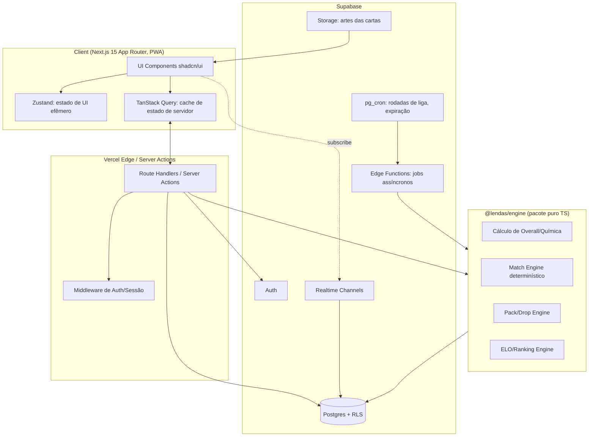

# 01 — Arquitetura Geral

## 1. Visão de Produto

**Lendas da Copa** é um jogo de gestão e simulação de futebol onde o jogador monta elencos com cartas de jogadores históricos de Copas do Mundo, disputa partidas 100% simuladas (texto, estilo Brasfoot) contra a IA ou contra amigos, evolui em ligas e copas sazonais, e coleciona cartas via packs com sistema de raridade (estilo FUT).

Pilares de design:
- **Draft social** (inspirado no 7x0): montar time é parte do jogo, não só colecionar.
- **Cartas como identidade** (inspirado no FUT): raridade, visual, overall, química.
- **Simulação textual rica** (inspirado no Brasfoot): a narrativa minuto a minuto é o "core loop" emocional.
- **Multiplayer assíncrono entre amigos**: ligas e copas privadas, sem exigir os dois jogadores online ao mesmo tempo.

## 2. Princípios Arquiteturais

1. **Servidor é a única fonte de verdade.** Toda regra de jogo (overall, simulação, drop de pack, ranking) é calculada no servidor. O client é uma camada de apresentação — isso evita cheating e permite mudar regras sem forçar update de app.
2. **Determinismo e auditabilidade.** Toda partida simulada guarda o `seed` usado e a lista de eventos. Dado o mesmo seed + os mesmos dois elencos, a simulação é reprodutível — essencial para fairness, replay e suporte a disputas ("ele mandou bug").
3. **Separação Catálogo vs. Instância.** `players` (catálogo histórico, dados "reais") é diferente de `cards` (definição de raridade/edição) que é diferente de `user_cards` (a carta específica que um usuário possui, com seu estado: nível, forma, contratos). Isso permite rebalancear o jogo sem corromper coleções.
4. **Domínios desacoplados em pacotes.** O Match Engine não conhece Supabase; recebe dois `TeamSnapshot` e devolve um `MatchResult`. Isso o torna testável unitariamente, reusável em simulações em lote (ex: copa com 32 times) e portável para um worker/edge function isolado.
5. **Mobile-first, PWA real.** Sem app store obrigatório no MVP — instalável via PWA (manifest + service worker), com possibilidade futura de wrap via Capacitor caso precise de push nativo mais robusto ou IAP.
6. **Custo de infraestrutura previsível.** Supabase (Postgres + Auth + Realtime + Storage) + Vercel cobre 100% do MVP sem microsserviços adicionais. Filas/cron via Supabase Edge Functions + `pg_cron` para processar rodadas de liga em lote.

## 3. Arquitetura de Alto Nível



**Por que Server Actions + Route Handlers e não um backend separado?** Para o tamanho deste produto, separar um backend Node dedicado adiciona custo operacional sem ganho real — o pacote `@lendas/engine` já isola a lógica de domínio, e pode ser extraído para um serviço próprio (ex: um worker rodando simulações em lote para uma copa de 64 times) sem reescrita, apenas trocando o "transporte".

## 4. Stack — papel de cada peça

| Camada | Tecnologia | Responsabilidade |
|---|---|---|
| Framework | Next.js 15 (App Router) | Rotas, Server Components, Server Actions, PWA shell |
| Linguagem | TypeScript (strict) | Tipagem ponta a ponta, tipos gerados do Supabase |
| UI | Tailwind + shadcn/ui | Design system de cartas, formação, telas de partida |
| Estado client | Zustand | Formação sendo editada, modais, abas, estado do "draft em andamento" |
| Estado servidor | TanStack Query | Coleção, partidas, ranking, packs — com cache/invalidation |
| Banco | Supabase Postgres | Fonte única de verdade, RLS por usuário |
| Auth | Supabase Auth | Email/senha, OAuth (Google), sessão via cookies |
| Realtime | Supabase Realtime | Notificação de "partida pronta", chat de liga, presença no draft |
| Jobs | Supabase Edge Functions + `pg_cron` | Processar rodada de liga, expirar packs, fechar temporada |
| Deploy | Vercel | Edge/SSR, previews por PR |
| PWA | `next-pwa` ou Workbox manual | Instalável, cache de assets de cartas, modo offline parcial (visualizar coleção) |
| Monorepo | Turborepo + pnpm workspaces | Build cacheado, pacotes compartilhados |

## 5. Estrutura do Monorepo (item 15)

```
lendas-da-copa/
├── apps/
│   └── web/                       # Next.js 15 app (web + PWA, único client)
│       ├── app/
│       │   ├── (auth)/
│       │   ├── (app)/
│       │   │   ├── inicio/
│       │   │   ├── colecao/
│       │   │   ├── elenco/
│       │   │   ├── draft/
│       │   │   ├── partida/[matchId]/
│       │   │   ├── copas/
│       │   │   ├── ligas/[leagueId]/
│       │   │   ├── ranking/
│       │   │   ├── loja/
│       │   │   └── perfil/
│       │   ├── api/                # route handlers (webhooks, endpoints públicos)
│       │   └── manifest.ts         # PWA manifest
│       ├── components/
│       ├── hooks/
│       ├── stores/                 # zustand stores
│       ├── public/
│       └── next.config.ts
│
├── packages/
│   ├── engine/                     # PURO TS, zero deps de infra
│   │   ├── src/
│   │   │   ├── cards/              # cálculo de overall, química, raridade
│   │   │   ├── match/              # Match Engine (ver doc 05)
│   │   │   ├── packs/              # drop tables, RNG seedado
│   │   │   ├── ranking/            # ELO, temporadas
│   │   │   └── index.ts
│   │   └── tests/                  # testes unitários determinísticos (seed fixo)
│   │
│   ├── db/                         # cliente Supabase tipado + queries reutilizáveis
│   │   ├── src/
│   │   │   ├── client.ts
│   │   │   ├── types.generated.ts  # `supabase gen types typescript`
│   │   │   ├── repositories/       # cards.repo.ts, matches.repo.ts, leagues.repo.ts
│   │   │   └── migrations/         # SQL versionado (ver doc 02)
│   │
│   ├── ui/                         # design system compartilhado (shadcn customizado)
│   │   └── src/components/
│   │       ├── card/                # <PlayerCard />, variações por raridade
│   │       ├── pitch/                # <FormationPitch />
│   │       └── match-feed/           # <MatchTimeline />
│   │
│   ├── types/                       # tipos de domínio compartilhados (DTOs)
│   │
│   └── config/                      # eslint, tsconfig, tailwind preset compartilhados
│
├── data/
│   └── seeds/                       # JSON/CSV de jogadores históricos (ver doc 08)
│
├── supabase/
│   ├── migrations/                  # histórico de migrations SQL
│   ├── functions/                   # Edge Functions (process-league-round, close-season)
│   └── config.toml
│
├── turbo.json
├── pnpm-workspace.yaml
└── package.json
```

**Regra de dependência:** `engine` não importa nada de `db` nem de `apps/web`. `apps/web` importa `engine`, `db`, `ui`, `types`. Isso garante que o motor de simulação possa, no futuro, rodar em qualquer runtime (Edge Function, worker dedicado, até CLI para simular uma copa inteira em batch).

## 6. Roadmap de MVPs (item 14)

### MVP 0 — Fundação (sem valor de jogo ainda)
- Monorepo + CI (lint, typecheck, test) + deploy Vercel + Supabase configurado.
- Auth (cadastro/login) + esquema de banco base (`profiles`, `players`, `cards`).
- Seed inicial de ~150 jogadores históricos (5 seleções, múltiplas copas).
- Design system base: `<PlayerCard />` com as 4 raridades.

### MVP 1 — Coleção + Time + Simulação vs. IA (o "loop sozinho")
- Abertura de pack único gratuito (sem dinheiro real ainda) → coleção pessoal.
- Tela de "Montar Elenco": formação, titulares/reservas, química básica.
- Match Engine v1: simulação minuto a minuto contra um "time da IA" fixo, com narrativa textual.
- Tela de resultado + estatísticas pós-jogo.
- **Critério de saída:** um usuário sozinho consegue abrir pack → montar time → jogar → ver resultado, ponta a ponta.

### MVP 2 — Multiplayer com Amigos (o "loop social")
- Sistema de amigos (convite por código/link).
- Criar Liga Privada (mata-mata ou pontos corridos) entre amigos.
- Draft estilo 7x0 para ligas (pool compartilhado, picks alternados, timer).
- Simulação assíncrona de confrontos da liga (não precisa estar online ao mesmo tempo) + notificação via Realtime quando a partida do oponente termina.

### MVP 3 — Ranking, Temporadas e Copas
- ELO global + ranking de temporada.
- Copa do Mundo simulada (estilo torneio, fase de grupos + mata-mata) contra outros jogadores ou IA.
- Divisões/ligas competitivas com promoção e rebaixamento por temporada.

### MVP 4 — Economia de Packs e Colecionismo
- Moeda soft (créditos por jogar) e eventualmente moeda hard (compra real, com cautela regulatória).
- Múltiplos tipos de pack com drop tables diferentes, álbum de coleção com recompensas de completude.
- Sistema de lesão/cartão/suspensão completo (afeta escolha de elenco entre rodadas).

### MVP 5 — Polimento e Retenção
- Mercado de troca entre usuários (com guard-rails anti-fraude).
- Eventos sazonais (cartas "Copa do Mundo Especial", TOTW histórico).
- Push notifications PWA, conquistas, replays compartilháveis.

> Cada MVP é "shippable" isoladamente — ou seja, o MVP 1 já é um produto jogável sozinho antes de existir qualquer multiplayer.
