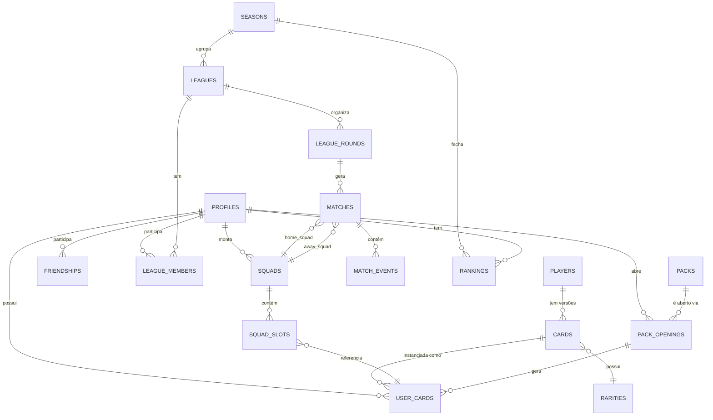

# 02 — Modelagem do Banco de Dados

Postgres via Supabase. Convenções: `snake_case`, chaves primárias `uuid` (default `gen_random_uuid()`), timestamps `timestamptz`, soft-delete onde fizer sentido via `deleted_at`.

## 1. Diagrama ER (visão macro)



## 2. DDL — Identidade e Perfil

```sql
create table profiles (
  id uuid primary key references auth.users(id) on delete cascade,
  username text unique not null,
  display_name text,
  avatar_url text,
  country_code text default 'BR',
  soft_currency bigint not null default 500,   -- moeda "Créditos"
  hard_currency bigint not null default 0,     -- moeda premium (opcional)
  elo_rating int not null default 1000,
  created_at timestamptz not null default now(),
  updated_at timestamptz not null default now()
);

create table friendships (
  id uuid primary key default gen_random_uuid(),
  requester_id uuid not null references profiles(id) on delete cascade,
  addressee_id uuid not null references profiles(id) on delete cascade,
  status text not null check (status in ('pending','accepted','blocked')) default 'pending',
  created_at timestamptz not null default now(),
  unique (requester_id, addressee_id)
);
```

## 3. DDL — Catálogo de Jogadores e Cartas

```sql
-- Catálogo "real": dados históricos de um jogador, independente de raridade/edição
create table players (
  id uuid primary key default gen_random_uuid(),
  full_name text not null,
  known_as text not null,            -- nome de exibição na carta, ex "Pelé"
  birth_year smallint,
  nationality_code text not null,    -- ISO ex: 'BR', 'AR', 'DE'
  primary_position text not null check (primary_position in
    ('GK','CB','LB','RB','LWB','RWB','CDM','CM','CAM','LM','RM','LW','RW','CF','ST')),
  secondary_positions text[] default '{}',
  preferred_foot text check (preferred_foot in ('left','right','both')),
  height_cm smallint,
  era_start smallint,                 -- ano de início de relevância (carreira em copas)
  era_end smallint,
  base_attributes jsonb not null,     -- ver doc 05: { pace, shooting, passing, ... }
  bio_short text,
  source_notes text,                  -- proveniência dos dados, para auditoria/legal
  created_at timestamptz not null default now()
);

create table rarities (
  id smallint primary key,            -- 1 comum, 2 rara, 3 lendária, 4 ultra lendária
  code text unique not null,          -- 'common' | 'rare' | 'legendary' | 'ultra_legendary'
  label text not null,
  overall_floor smallint not null,    -- faixa mínima de overall permitida
  overall_ceiling smallint not null,
  attribute_multiplier numeric not null default 1.0,
  drop_weight numeric not null,       -- peso relativo em packs (ver doc 04/07)
  color_primary text not null,        -- referência visual (hex)
  color_secondary text not null
);

-- "Carta" = uma versão publicável de um jogador (pode haver múltiplas por jogador:
-- base, edição "Copa Especial", edição "Lenda Eterna" etc.)
create table cards (
  id uuid primary key default gen_random_uuid(),
  player_id uuid not null references players(id) on delete cascade,
  rarity_id smallint not null references rarities(id),
  edition_code text not null default 'base',   -- 'base' | 'wc_special_2026' | 'icon'
  overall smallint not null,                   -- calculado e congelado na criação da carta
  attributes jsonb not null,                   -- snapshot final (base * multiplicador + bônus de edição)
  artwork_url text,
  is_active boolean not null default true,     -- permite "remover de circulação" sem deletar histórico
  created_at timestamptz not null default now(),
  unique (player_id, rarity_id, edition_code)
);

-- Instância que um usuário possui de uma carta. Estado mutável vive aqui,
-- nunca em `cards` (que é catálogo).
create table user_cards (
  id uuid primary key default gen_random_uuid(),
  profile_id uuid not null references profiles(id) on delete cascade,
  card_id uuid not null references cards(id),
  level smallint not null default 1,           -- progressão opcional (treino)
  form smallint not null default 0,            -- -2..+2, "fase" recente (ver doc 05/09)
  is_injured boolean not null default false,
  injury_returns_at_round int,                  -- rodada de liga em que volta
  suspended_matches int not null default 0,     -- partidas restantes de suspensão
  yellow_cards_accum smallint not null default 0,
  acquired_via text not null check (acquired_via in ('pack','draft','reward','trade','starter')),
  acquired_at timestamptz not null default now()
);

create index idx_user_cards_profile on user_cards(profile_id);
```

## 4. DDL — Elenco (Squad) e Formação

```sql
create table squads (
  id uuid primary key default gen_random_uuid(),
  profile_id uuid not null references profiles(id) on delete cascade,
  name text not null default 'Meu Time',
  formation text not null default '4-3-3',     -- enum lógico validado em app
  tactic_mentality text not null default 'balanced', -- 'defensive'|'balanced'|'attacking'
  captain_user_card_id uuid references user_cards(id),
  chemistry_score smallint not null default 0,  -- calculado, ver doc 04
  is_active boolean not null default true,
  updated_at timestamptz not null default now()
);

-- Cada posição da formação ocupada por uma carta do usuário
create table squad_slots (
  id uuid primary key default gen_random_uuid(),
  squad_id uuid not null references squads(id) on delete cascade,
  user_card_id uuid not null references user_cards(id) on delete cascade,
  slot_position text not null,        -- 'GK','LB','CB1','CB2','RB','CDM', etc. (grid lógico)
  is_starter boolean not null default true,
  bench_order smallint,               -- ordem no banco se is_starter = false
  unique (squad_id, slot_position)
);
```

## 5. DDL — Competição: Ligas, Temporadas, Copas, Partidas

```sql
create table seasons (
  id uuid primary key default gen_random_uuid(),
  code text unique not null,          -- 'S1-2026'
  starts_at timestamptz not null,
  ends_at timestamptz not null,
  status text not null check (status in ('upcoming','active','closed')) default 'upcoming'
);

create table leagues (
  id uuid primary key default gen_random_uuid(),
  season_id uuid references seasons(id),
  owner_profile_id uuid references profiles(id),  -- null se for liga global de ranking
  name text not null,
  type text not null check (type in ('private_friends','public_ranked','world_cup')),
  format text not null check (format in ('round_robin','knockout','groups_knockout')),
  invite_code text unique,
  max_members smallint not null default 8,
  status text not null check (status in ('draft_phase','in_progress','finished')) default 'draft_phase',
  created_at timestamptz not null default now()
);

create table league_members (
  id uuid primary key default gen_random_uuid(),
  league_id uuid not null references leagues(id) on delete cascade,
  profile_id uuid not null references profiles(id) on delete cascade,
  squad_id uuid references squads(id),  -- elenco "congelado" para esta liga, no draft
  points int not null default 0,
  wins int not null default 0,
  draws int not null default 0,
  losses int not null default 0,
  goals_for int not null default 0,
  goals_against int not null default 0,
  group_label text,                     -- 'A','B' (fase de grupos de copas)
  unique (league_id, profile_id)
);

create table league_rounds (
  id uuid primary key default gen_random_uuid(),
  league_id uuid not null references leagues(id) on delete cascade,
  round_number smallint not null,
  stage text not null default 'regular', -- 'regular'|'round_of_16'|'quarter'|'semi'|'final'
  status text not null check (status in ('scheduled','processing','completed')) default 'scheduled',
  scheduled_at timestamptz,
  processed_at timestamptz
);

create table matches (
  id uuid primary key default gen_random_uuid(),
  league_round_id uuid references league_rounds(id),
  home_profile_id uuid references profiles(id),
  away_profile_id uuid references profiles(id),
  home_squad_id uuid not null references squads(id),
  away_squad_id uuid not null references squads(id),
  home_score smallint,
  away_score smallint,
  rng_seed bigint not null,             -- determinismo (ver doc 05)
  engine_version text not null,         -- permite reprocessar com versão antiga se preciso
  status text not null check (status in ('scheduled','simulated','disputed')) default 'scheduled',
  simulated_at timestamptz,
  created_at timestamptz not null default now()
);

-- Timeline completa da partida, consumida pelo client para "reproduzir" o jogo
create table match_events (
  id bigserial primary key,
  match_id uuid not null references matches(id) on delete cascade,
  minute smallint not null,
  event_type text not null check (event_type in
    ('kickoff','chance','goal','own_goal','penalty_scored','penalty_missed',
     'yellow_card','red_card','injury','substitution','half_time','full_time')),
  team_side text not null check (team_side in ('home','away')),
  primary_user_card_id uuid references user_cards(id),
  secondary_user_card_id uuid references user_cards(id), -- assistência, jogador substituído
  description text not null,           -- texto pronto estilo Brasfoot
  meta jsonb default '{}'::jsonb
);

create index idx_match_events_match on match_events(match_id, minute);
```

## 6. DDL — Ranking e Temporadas

```sql
create table rankings (
  id uuid primary key default gen_random_uuid(),
  season_id uuid not null references seasons(id),
  profile_id uuid not null references profiles(id),
  division smallint not null default 5,   -- 1 = elite, 5 = entrada
  elo_rating int not null,
  matches_played int not null default 0,
  final_position int,
  reward_claimed boolean not null default false,
  unique (season_id, profile_id)
);
```

## 7. DDL — Packs e Colecionismo

```sql
create table packs (
  id uuid primary key default gen_random_uuid(),
  code text unique not null,           -- 'starter_free','bronze','copa_especial'
  name text not null,
  price_soft int,
  price_hard int,
  cards_per_pack smallint not null default 5,
  drop_table jsonb not null,           -- pesos por raridade/edição, ver doc 07
  is_purchasable boolean not null default true,
  available_from timestamptz,
  available_to timestamptz
);

create table pack_openings (
  id uuid primary key default gen_random_uuid(),
  profile_id uuid not null references profiles(id) on delete cascade,
  pack_id uuid not null references packs(id),
  rng_seed bigint not null,
  opened_at timestamptz not null default now()
);

create table pack_opening_cards (
  id bigserial primary key,
  pack_opening_id uuid not null references pack_openings(id) on delete cascade,
  card_id uuid not null references cards(id),
  user_card_id uuid not null references user_cards(id)
);

-- Álbum de coleção: progresso de "sets" (ex: "Seleção Brasil 1970 completa")
create table collection_sets (
  id uuid primary key default gen_random_uuid(),
  code text unique not null,
  name text not null,
  required_card_ids uuid[] not null,
  reward_pack_id uuid references packs(id),
  reward_soft_currency int default 0
);

create table collection_progress (
  profile_id uuid not null references profiles(id) on delete cascade,
  collection_set_id uuid not null references collection_sets(id),
  completed_at timestamptz,
  primary key (profile_id, collection_set_id)
);
```

## 8. Row Level Security — diretrizes

- `profiles`: usuário só atualiza a própria linha; leitura pública de campos não sensíveis via view (`username`, `avatar_url`, `elo_rating`).
- `user_cards`, `squads`, `squad_slots`: `select`/`update`/`delete` restritos a `auth.uid() = profile_id`.
- `players`, `cards`, `rarities`, `packs`, `collection_sets`: somente leitura para usuários autenticados; escrita apenas via service role (admin/seed).
- `matches`/`match_events`: leitura permitida a `home_profile_id`, `away_profile_id` e membros da mesma `league`; nenhuma escrita direta do client — só via função/Server Action que chama o Match Engine com service role.
- `league_members`: leitura para membros da liga; escrita controlada por Server Actions (entrar/sair/draft).

```sql
alter table user_cards enable row level security;
create policy "user reads own cards" on user_cards
  for select using (auth.uid() = profile_id);
create policy "user manages own cards" on user_cards
  for update using (auth.uid() = profile_id);
```

(Repetir padrão análogo para `squads`, `squad_slots`, `pack_openings`.)

## 9. Índices e performance — pontos de atenção

- `match_events(match_id, minute)` — leitura sequencial para "replay" da partida.
- `user_cards(profile_id)` — tela de coleção é a rota mais acessada.
- `league_members(league_id)` — cálculo de tabela de classificação.
- Particionamento futuro de `match_events` por temporada se o volume crescer muito (não necessário no MVP).
