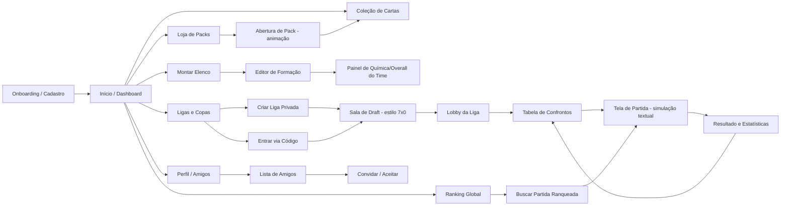

# 03 — Fluxos de Telas

## 1. Mapa de Telas

## 2. Inventário de Telas

| Tela | Objetivo | Dados principais |
|---|---|---|
| Onboarding | Cadastro, escolha de username/avatar, tutorial rápido | `profiles` |
| Início | Hub central: atalhos, notificações, progresso de temporada | `rankings`, `league_rounds` pendentes |
| Coleção | Grid de cartas possuídas, filtros (posição, raridade, nação, lesionado) | `user_cards` + `cards` + `players` |
| Montar Elenco | Drag-and-drop em campo, troca de formação, banco de reservas | `squads`, `squad_slots` |
| Editor de Formação | Escolher formação (4-3-3, 4-4-2...), mentalidade tática | `squads.formation`, `tactic_mentality` |
| Loja de Packs | Vitrine de packs disponíveis, preço, drop rates visíveis | `packs` |
| Abertura de Pack | Animação de reveal, raridade crescente, "novo!" se 1ª cópia | `pack_openings`, `pack_opening_cards` |
| Ligas e Copas | Lista de ligas do usuário + criar/entrar | `leagues`, `league_members` |
| Sala de Draft | Pool de jogadores disponível, pick alternado com timer, picks dos rivais visíveis | estado efêmero (Realtime) + grava em `league_members.squad_id` ao final |
| Lobby da Liga | Classificação atual, próximos confrontos, chat | `league_members`, `league_rounds` |
| Tela de Partida | Reprodução da timeline com texto progressivo, placar ao vivo, escudo dos times | `matches`, `match_events` |
| Resultado | Placar final, melhores em campo, eventos-chave, XP/moedas ganhas | `matches` |
| Ranking Global | Leaderboard por divisão, posição do usuário, recompensas de temporada | `rankings` |
| Perfil/Amigos | Editar perfil, lista de amigos, convites pendentes | `profiles`, `friendships` |

## 3. Jornadas Críticas

### 3.1 Primeiro acesso (ativação)
1. Cadastro → tutorial de 3 passos (o que é uma carta, o que é raridade, como simular).
2. Recebe **pack inicial gratuito** (`acquired_via = 'starter'`) com pelo menos 1 carta Rara garantida.
3. É guiado direto para "Montar Elenco" com sugestão automática de formação preenchida.
4. CTA único: "Jogar partida amistosa contra a IA" → primeira simulação, sem fricção de criar liga.
5. Tela de resultado já oferece "Criar Liga com Amigos" como próximo passo.

### 3.2 Abrir um pack
1. Loja → seleciona pack → confirma custo (soft/hard currency, debitado via Server Action transacional).
2. Servidor roda `PackEngine.open(packId, seed)` → grava `pack_opening` + N `user_cards`.
3. Client recebe lista ordenada por raridade (menor → maior) e anima reveal sequencial (suspense crescente, igual FUT).
4. Cartas novas vão para a Coleção; duplicatas oferecem opção de "converter em moeda" (sink de economia).

### 3.3 Criar liga e fazer draft com amigos
1. Usuário cria liga privada → define formato (pontos corridos / mata-mata) e nº de membros.
2. Compartilha `invite_code` (link profundo abre direto na tela de "Entrar via Código").
3. Quando todos entram, owner inicia o **Draft**: pool compartilhado de cartas (pode ser cartas do próprio acervo de cada um, ou um pool neutro gerado pelo sistema — configurável na criação da liga).
4. Picks alternados (snake draft) com timer (ex: 30s/pick) via canal Realtime; se o tempo esgota, pick automático pelo melhor overall disponível.
5. Ao fim do draft, cada membro tem um `squad` "congelado" específico para aquela liga.
6. Sistema gera o calendário de rodadas (`league_rounds`) automaticamente conforme o formato.

### 3.4 Rodada de liga (assíncrono)
1. Job (`pg_cron` → Edge Function) dispara no horário programado da rodada.
2. Para cada confronto, chama `MatchEngine.simulate(homeSquad, awaySquad, seed)`.
3. Grava `matches` + `match_events`; atualiza `league_members` (pontos, saldo de gols).
4. Envia notificação Realtime/push para os dois jogadores: "Sua partida da Rodada 3 já está disponível".
5. Usuário abre a Tela de Partida quando quiser — a timeline é reproduzida com texto progressivo (não é live, mas a sensação de "acompanhar o jogo" é preservada).

### 3.5 Partida ranqueada (matchmaking)
1. Usuário clica "Buscar Partida" no Ranking → sistema busca oponente de ELO próximo entre os "prontos para ranqueada".
2. Se não há oponente humano disponível em N segundos, oferece partida contra "fantasma" (squad histórico de outro jogador, simulação assíncrona) — evita fila vazia sem inventar bot artificial óbvio.
3. Resultado ajusta ELO de ambos via `RankEngine` (ver doc 06).

## 4. Estados de erro/edge cases a desenhar na UI
- Elenco incompleto (menos de 11 titulares válidos) → bloqueia "iniciar partida" com checklist claro do que falta.
- Carta lesionada/suspensa escalada como titular → aviso bloqueante antes de confirmar escalação.
- Liga com membro que abandonou no meio da temporada → políticas de W.O. (derrota técnica nas rodadas restantes) explicadas na tela de Lobby.
- Draft com timeout de conexão → reconexão ao canal Realtime deve restaurar o estado exato do pick atual.
