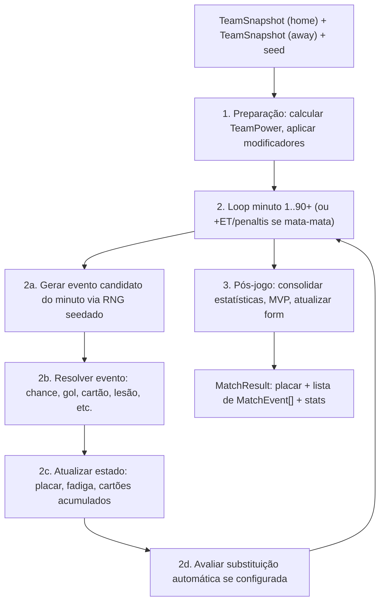

# 05 — Match Engine, Atributos e Simulação

Este é o coração do produto. O Match Engine vive em `packages/engine/src/match/` e é uma função pura: recebe dois `TeamSnapshot` + um seed, devolve um `MatchResult` determinístico. Não acessa banco, não conhece Supabase.

## 1. Sistema de Atributos (item 7)

### 1.1 Atributos de campo (jogadores não-goleiros)

| Atributo | Faixa | Descrição |
|---|---|---|
| `pace` | 1–99 | Velocidade de aceleração/corrida |
| `finishing` | 1–99 | Conversão de chances em gol |
| `shooting_power` | 1–99 | Força/potência de chute |
| `passing` | 1–99 | Precisão de passe curto/longo |
| `vision` | 1–99 | Capacidade de criar chances/passes decisivos |
| `dribbling` | 1–99 | Capacidade de superar marcação |
| `defending` | 1–99 | Desarme, interceptação, marcação |
| `heading` | 1–99 | Jogo aéreo, cabeceio |
| `physical` | 1–99 | Disputa de corpo, resistência, força |
| `mental` | 1–99 | Compostura, decisão, resistência à pressão |

### 1.2 Atributos de goleiro

| Atributo | Faixa | Descrição |
|---|---|---|
| `gk_reflexes` | 1–99 | Reação a finalizações próximas |
| `gk_positioning` | 1–99 | Posicionamento e leitura de jogo |
| `gk_handling` | 1–99 | Segurança em pegar/encaixar a bola |
| `gk_kicking` | 1–99 | Saída de bola/distribuição |

### 1.3 Modificadores aplicados em runtime (não fazem parte do atributo-base)

```ts
interface RuntimeModifiers {
  chemistryBonus: number;     // -5..+5, da química do time (doc 04)
  formBonus: number;          // -2..+2, de user_cards.form
  fatiguePenalty: number;     // cresce conforme o minuto avança, maior sem substituição
  outOfPositionPenalty: number; // -8..0, jogador fora de posição natural
  tacticModifier: number;     // da mentalidade tática escolhida (defensiva/equilibrada/ofensiva)
}

function effectiveAttribute(base: number, mods: RuntimeModifiers): number {
  return clamp(base + mods.chemistryBonus + mods.formBonus
    - mods.fatiguePenalty + mods.outOfPositionPenalty + mods.tacticModifier, 1, 99);
}
```

### 1.4 Agregação em "Forças de Time" (Team Power)

Antes da simulação minuto a minuto, calculamos índices agregados por linha, usados como base probabilística:

```ts
interface TeamPower {
  attack: number;     // média ponderada de finishing/dribbling/pace dos atacantes+meias ofensivos
  midfield: number;   // média ponderada de passing/vision/physical dos meio-campistas
  defense: number;    // média ponderada de defending/physical/heading dos zagueiros+laterais
  goalkeeping: number;// média dos atributos de GK
  overallPower: number; // combinação final, usada para o diferencial de posse/eventos
}
```

## 2. Arquitetura do Match Engine (item 6)



### 2.1 RNG Determinístico

Usamos um PRNG seedado (ex: `mulberry32` ou `xorshift32`, sem dependências externas) — nunca `Math.random()`. O seed é gerado uma vez (`matches.rng_seed`) e persistido, permitindo reprocessar a partida byte-a-byte se necessário (auditoria, debug, "replay" para o usuário).

```ts
function mulberry32(seed: number) {
  return function () {
    seed |= 0; seed = (seed + 0x6D2B79F5) | 0;
    let t = Math.imul(seed ^ (seed >>> 15), 1 | seed);
    t = (t + Math.imul(t ^ (t >>> 7), 61 | t)) ^ t;
    return ((t ^ (t >>> 14)) >>> 0) / 4294967296;
  };
}
```

### 2.2 Interface pública do pacote

```ts
export interface TeamSnapshot {
  squadId: string;
  formation: Formation;            // ex '4-3-3'
  tacticMentality: 'defensive' | 'balanced' | 'attacking';
  starters: PlayerRuntime[];        // 11 jogadores com atributos efetivos já calculados
  bench: PlayerRuntime[];           // até 7 reservas disponíveis para substituição
  chemistryScore: number;
}

export interface PlayerRuntime {
  userCardId: string;
  name: string;
  position: Position;
  attributes: AttributeSet;
  isInjuredEntering: boolean;       // bloqueia escalação antes mesmo de simular (validado fora do engine)
  yellowCardsAccumInLeague: number; // para regra de suspensão automática (doc 09)
}

export function simulateMatch(
  home: TeamSnapshot,
  away: TeamSnapshot,
  seed: number,
  options?: { extraTimeIfDraw?: boolean; penaltiesIfDraw?: boolean }
): MatchResult;

export interface MatchResult {
  homeScore: number;
  awayScore: number;
  penaltyShootout?: { homeScore: number; awayScore: number };
  events: MatchEvent[];
  stats: MatchStats;               // posse estimada, finalizações, escanteios, faltas
  mvpUserCardId: string;
}
```

## 3. Simulação Minuto a Minuto (item 8)

### 3.1 Modelo de posse e geração de eventos

Cada minuto, calculamos qual time está "em vantagem de jogada" usando o diferencial de `midfield` + leve influência de `attack`:

```ts
function possessionAdvantage(home: TeamPower, away: TeamPower): number {
  // retorna probabilidade (0..1) de o minuto favorecer o time da casa
  const diff = (home.midfield - away.midfield) * 0.6
             + (home.overallPower - away.overallPower) * 0.4;
  return clamp(0.5 + diff / 200, 0.15, 0.85); // nunca 100% determinístico
}
```

A cada minuto, um único `roll` decide se **algo relevante acontece** (a maioria dos minutos não gera evento — só "tempo passando", o que o client pode comprimir na UI):

```ts
const EVENT_CHANCE_PER_MINUTE = 0.18; // ~16 eventos relevantes por 90min, calibrável

function simulateMinute(state: MatchState, rng: () => number): MatchEvent | null {
  if (rng() > EVENT_CHANCE_PER_MINUTE) return null;

  const favoredSide = rng() < possessionAdvantage(state.home.power, state.away.power)
    ? 'home' : 'away';

  const eventType = rollEventType(favoredSide, state, rng);
  return resolveEvent(eventType, favoredSide, state, rng);
}
```

### 3.2 Árvore de decisão de tipo de evento

```ts
function rollEventType(side: Side, state: MatchState, rng: () => number): RawEventType {
  const r = rng();
  // pesos calibráveis via config, dependentes de differential ofensivo vs defensivo
  if (r < 0.55) return 'chance';          // chance de gol que pode ou não converter
  if (r < 0.70) return 'foul';            // falta -> pode gerar cartão
  if (r < 0.80) return 'corner';
  if (r < 0.92) return 'midfield_battle'; // disputa sem finalização (estatística)
  return 'set_piece';                     // escanteio/falta perigosa
}
```

### 3.3 Resolução de uma "chance" em gol

```ts
function resolveChance(side: Side, state: MatchState, rng: () => number): MatchEvent {
  const attackTeam = state[side];
  const defendTeam = state[opposite(side)];

  const shooter = pickWeightedPlayer(attackTeam.starters, 'attack', rng);
  const xgBase = (shooter.attributes.finishing * 0.5
                + shooter.attributes.shooting_power * 0.2
                + shooter.attributes.dribbling * 0.15
                + attackTeam.power.attack * 0.15) / 99;

  const defenseFactor = (defendTeam.power.defense * 0.6
                       + defendTeam.goalkeeper.attributes.gk_reflexes * 0.4) / 99;

  const goalProbability = clamp(xgBase * (1 - defenseFactor * 0.7), 0.03, 0.55);

  if (rng() < goalProbability) {
    const assister = maybePickAssister(attackTeam.starters, shooter, rng);
    return buildGoalEvent(side, shooter, assister, state.minute);
  }
  return buildMissedChanceEvent(side, shooter, state.minute);
}
```

### 3.4 Fadiga e tempo de jogo

```ts
function applyFatigue(player: PlayerRuntime, minute: number): number {
  const baseDecay = minute > 60 ? (minute - 60) * 0.15 : 0;
  const physicalResistance = player.attributes.physical / 99; // físico melhor decai mais lento
  return baseDecay * (1 - physicalResistance * 0.5);
}
```
A fadiga acumulada reduz `effectiveAttribute` de todos os jogadores em campo progressivamente após os 60 minutos — pressionando o usuário a planejar substituições (doc 09).

### 3.5 Geração da narrativa textual (estilo Brasfoot)

Cada `MatchEvent` carrega um `description` já pronto, montado a partir de templates parametrizados (não é texto gerado por IA em runtime — é determinístico e barato):

```ts
const GOAL_TEMPLATES = [
  "{minute}' GOL! {shooter} arrisca de fora da área e não dá chances ao goleiro!",
  "{minute}' É GOL! {shooter} aproveita o passe de {assister} e bate cruzado, sem chances!",
  "{minute}' {shooter} cabeceia após cobrança de escanteio e abre o placar!",
];

function renderGoalDescription(event: GoalEvent, rng: () => number): string {
  const template = pick(GOAL_TEMPLATES, rng);
  return template
    .replace('{minute}', String(event.minute))
    .replace('{shooter}', event.shooter.name)
    .replace('{assister}', event.assister?.name ?? '');
}
```
Manter múltiplos templates por tipo de evento (gol, cartão, lesão, chance perdida, defesa difícil) evita repetição perceptível ao longo de uma temporada inteira.

## 4. Lesões, Cartões, Suspensões e Substituições (item 9)

### 4.1 Cartões

```ts
const YELLOW_CARD_BASE_CHANCE_ON_FOUL = 0.28;
const RED_CARD_DIRECT_CHANCE_ON_FOUL = 0.015;
const SECOND_YELLOW_ESCALATION = 1.0; // segundo amarelo no jogo = vermelho automático

function resolveFoul(committer: PlayerRuntime, state: MatchState, rng: () => number): MatchEvent {
  const aggressionFactor = (99 - committer.attributes.mental) / 99; // mental baixo = mais propenso
  if (rng() < RED_CARD_DIRECT_CHANCE_ON_FOUL * (1 + aggressionFactor)) {
    return buildRedCardEvent(committer, state.minute, 'direct');
  }
  const alreadyYellow = state.cardsThisMatch.get(committer.userCardId) === 1;
  if (alreadyYellow) {
    return buildRedCardEvent(committer, state.minute, 'second_yellow');
  }
  if (rng() < YELLOW_CARD_BASE_CHANCE_ON_FOUL * (1 + aggressionFactor * 0.5)) {
    return buildYellowCardEvent(committer, state.minute);
  }
  return buildSimpleFoulEvent(committer, state.minute);
}
```

- **Cartão vermelho** (direto ou 2º amarelo): jogador sai imediatamente, time fica com 10 (ou menos) — `TeamPower` é recalculado a cada evento subsequente sem aquele jogador, e nenhuma substituição pode repor o número (regra real de futebol).
- **Suspensão pós-jogo**: cartão vermelho → 1 partida de suspensão automática na liga (`user_cards.suspended_matches += 1`, validado no momento de montar escalação da próxima rodada). Acúmulo de **3 amarelos** na competição → 1 partida de suspensão (`yellow_cards_accum` resetado após cumprir).

### 4.2 Lesões

```ts
const INJURY_CHANCE_ON_FOUL_VICTIM = 0.04;
const INJURY_CHANCE_ON_HIGH_PHYSICAL_DUEL = 0.015;

function maybeInjure(player: PlayerRuntime, rng: () => number): InjurySeverity | null {
  if (rng() > INJURY_CHANCE_ON_FOUL_VICTIM) return null;
  const r = rng();
  if (r < 0.6) return 'minor';     // 1 rodada de recuperação
  if (r < 0.9) return 'moderate';  // 2-3 rodadas
  return 'severe';                 // 4-6 rodadas
}

const INJURY_RECOVERY_ROUNDS: Record<InjurySeverity, [number, number]> = {
  minor: [1, 1],
  moderate: [2, 3],
  severe: [4, 6],
};
```
Ao ocorrer, grava-se `user_cards.is_injured = true` e `injury_returns_at_round = currentRound + rounds_sorteado`. A UI de escalação bloqueia o slot e sugere automaticamente o reserva da mesma posição.

### 4.3 Substituições

- Limite por padrão real: **5 substituições por partida**, em até 3 "janelas" (paradas) — regra configurável por liga/copa.
- Substituições podem ser:
  - **Planejadas** (definidas pelo usuário antes da partida, ex: "sair aos 70min se estiver vencendo por 2+") — já que a simulação é assíncrona, não há substituição "ao vivo" manual; o usuário define **regras condicionais** pré-jogo.
  - **Forçadas** (lesão ou expulsão) — o engine aplica automaticamente o próximo da mesma posição no banco; se não houver, o time joga numericamente reduzido naquela função (penalidade de `TeamPower`).

```ts
interface SubstitutionRule {
  triggerMinute?: number;             // ex: sair no minuto 70
  triggerCondition?: 'winning' | 'losing' | 'drawing';
  playerOutUserCardId: string;
  playerInUserCardId: string;
}

function evaluateSubstitutions(state: MatchState, rules: SubstitutionRule[], rng: () => number) {
  for (const rule of rules) {
    if (state.substitutionsUsed[state.side] >= 5) continue;
    if (ruleMatches(rule, state)) applySubstitution(state, rule);
  }
}
```

### 4.4 Tabela-resumo de probabilidades-base (calibráveis em config, não hardcoded em produção)

| Evento | Probabilidade base | Depende de |
|---|---|---|
| Evento relevante por minuto | 18% | — |
| Gol dado uma "chance" | 3%–55% | `finishing`, `shooting_power` vs defesa+goleiro |
| Cartão amarelo numa falta | 28% (ajustado por `mental`) | `mental` do faltoso |
| Cartão vermelho direto numa falta | 1.5% (ajustado) | `mental` do faltoso |
| Lesão na vítima de uma falta | 4% | — |
| Lesão em disputa física de alto risco | 1.5% | `physical` de ambos |

## 5. Pós-jogo

- `MatchStats` consolidado: posse estimada (% de minutos favoráveis), finalizações, finalizações certas, escanteios, faltas, cartões.
- `mvpUserCardId`: maior soma ponderada de (gols×3 + assistências×2 + desarmes×0.5 − cartões).
- Atualização de `user_cards.form`: gol/assistência empurra `+1` (cap +2); cartão vermelho empurra `-1`; decaimento natural de 1 por rodada sem jogar.

## 6. Estratégia de Testes

Como o engine é puro e determinístico, a suíte de testes (`packages/engine/tests`) fixa seeds conhecidos e garante:
1. Mesma entrada + mesmo seed → mesmo `MatchResult` (regressão).
2. Distribuição estatística de gols/cartões ao simular 10.000 partidas com times de força idêntica converge para valores plausíveis (ex: média de 2.6 gols/jogo, calibrada contra dados reais de Copas do Mundo).
3. Time visivelmente mais forte vence a maioria das simulações em lote, mas não 100% (upsets devem existir, como no futebol real).
