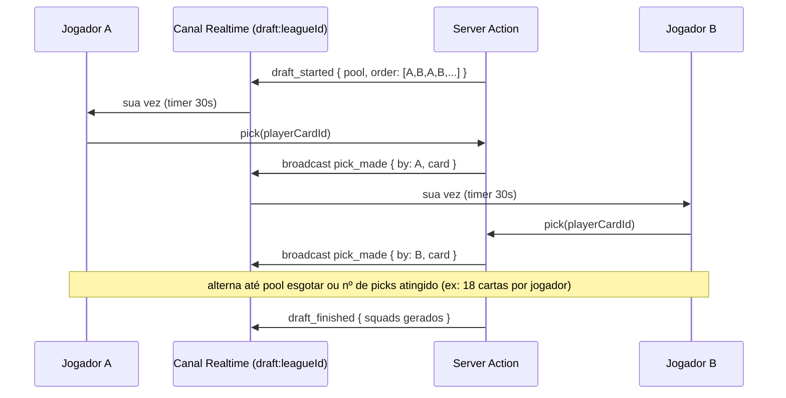

# 06 — Multiplayer entre Amigos, Ranking e Temporadas

## 1. Sistema de Amigos

- Convite por `username`, link profundo (`/perfil/convite/:code`) ou QR (mobile).
- `friendships.status`: `pending` → `accepted`. Bloqueio simples (`blocked`) some da listagem para ambos.
- Presença online via Supabase Realtime (canal `presence:friends`) — usado para indicar "disponível para amistoso agora" sem exigir matchmaking complexo.

## 2. Ligas Privadas e Draft (item 10)

### 2.1 Criação de Liga

`leagues.type = 'private_friends'`, formato escolhido pelo owner: `round_robin` (pontos corridos, ida e volta opcional) ou `knockout`/`groups_knockout` (estilo Copa).

### 2.2 Draft estilo 7x0

O draft é o momento social mais importante — replicar a tensão de escolher antes que o amigo escolha:



- **Pool do draft**: configurável na criação da liga —
  1. *Pool compartilhado neutro*: sistema sorteia um conjunto grande de cartas (ex: 200) só para aquela liga, ninguém tem vantagem de coleção pessoal. Mais fiel ao espírito "7x0".
  2. *Pool dos próprios acervos*: cada membro contribui cartas da sua coleção; bom para quem já investiu em packs.
- Pick automático se o timer expirar (melhor overall disponível na posição mais carente do time do jogador, para não gerar times absurdos).
- Ao final, gera-se um `squads` por membro (vinculado à liga) e grava-se `league_members.squad_id`.
- Reconexão: estado do draft vive em uma tabela leve `draft_sessions` (ou em memória da Edge Function + heartbeat) com snapshot persistido a cada pick, permitindo recarregar a página sem perder o estado.

### 2.3 Calendário de Rodadas

- `round_robin`: gerar confrontos via algoritmo de round-robin clássico (todos contra todos); se ida-e-volta, duplicar invertendo casa/fora.
- `knockout`/`groups_knockout`: fase de grupos (pontos corridos dentro do grupo) seguida de chaveamento eliminatório; empates em mata-mata seguem para prórroga/pênaltis conforme `options.extraTimeIfDraw`/`penaltiesIfDraw` do Match Engine.

### 2.4 Processamento Assíncrono de Rodada

- `pg_cron` dispara uma Edge Function no horário definido (ex: toda rodada processa às 20h).
- A função busca todas as `matches` da `league_round` com status `scheduled`, chama `simulateMatch` para cada par, grava resultado, atualiza tabela de classificação, e dispara notificação.
- Importante: **nenhuma simulação roda na primeira requisição do usuário** — o resultado já está pronto quando ele abre a tela, eliminando latência percebida e dúvidas de "será que travou".

### 2.5 Realtime para Acompanhamento Social

- Canal por liga (`league:{id}`) usado para: chat textual simples, notificação de "X acabou de abrir um pack lendário", atualização de tabela em tempo real quando uma rodada termina.

## 3. Ranking e Temporadas (item 11)

### 3.1 ELO

```ts
const K_FACTOR = 24;

function updateElo(ratingA: number, ratingB: number, result: 'win'|'draw'|'loss'): [number, number] {
  const expectedA = 1 / (1 + Math.pow(10, (ratingB - ratingA) / 400));
  const scoreA = result === 'win' ? 1 : result === 'draw' ? 0.5 : 0;
  const newA = Math.round(ratingA + K_FACTOR * (scoreA - expectedA));
  const newB = Math.round(ratingB + K_FACTOR * ((1 - scoreA) - (1 - expectedA)));
  return [newA, newB];
}
```
- Aplicado apenas em partidas `type = 'public_ranked'`; ligas privadas com amigos não afetam o ELO global (evita "combinar resultado" entre amigos para inflar rating).

### 3.2 Divisões e Temporadas

- `seasons`: ciclo fechado (ex: 6 semanas). Ao fechar (`status = 'closed'`), processa-se:
  1. Ranking final por `elo_rating` dentro de cada `division`.
  2. Top X% sobe de divisão, bottom Y% desce (promoção/rebaixamento clássico).
  3. Recompensas distribuídas (`packs` especiais, moeda) conforme posição final — gravado em `rankings.reward_claimed`.
  4. Nova `season` criada, `rankings` zerados (com leve "regressão à média" no ELO inicial, não reset total, para não punir consistência de longo prazo).
- Copas do Mundo simuladas (formato `world_cup`) podem ser eventos sazonais paralelos ao ranking contínuo — chaveamento completo entre amigos ou contra outros jogadores da mesma divisão.

### 3.3 Matchmaking Ranqueado

- Fila simples: buscar oponente com `|elo_rating_a - elo_rating_b| <= 100`, expandindo a janela a cada 10s de espera.
- Fallback de "fantasma" (squad recente de outro jogador, simulado assincronamente) se não houver par em ~30s, garantindo que a fila nunca fique vazia para o usuário.
