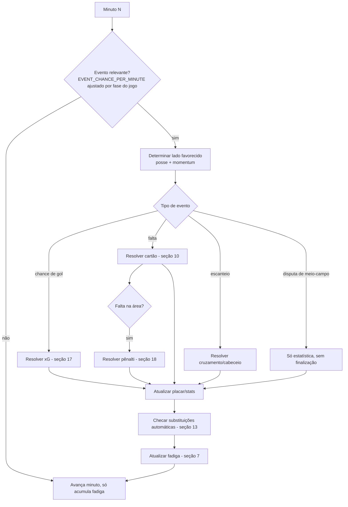
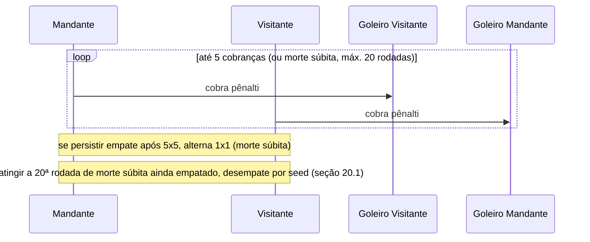

# 09 — Match Engine Master Document (World Legends)

> Este documento substitui e expande a seção 05 (`05-match-engine-simulacao.md`) com o nível de profundidade necessário para uma simulação digna de um Football Manager simplificado. Tudo aqui é **especificação e pseudocódigo**, não implementação real — a tradução para TypeScript em `packages/engine` vem depois, módulo por módulo.

## 0. Princípios não-negociáveis

1. **Função pura e determinística.** `simulateMatch(home, away, matchContext, seed) -> MatchResult`. Mesma entrada + mesmo seed = mesmo resultado, sempre, em qualquer ambiente.
2. **Imprevisibilidade controlada.** Determinismo não é sinônimo de previsibilidade para o jogador: o *seed* é desconhecido até a simulação rodar, e a variância está embutida nas distribuições de probabilidade, não no algoritmo.
3. **Toda decisão é uma probabilidade calibrada**, nunca um "if mágico". Cada sistema (cartão, lesão, clima, etc.) expõe constantes nomeadas e documentadas, ajustáveis por configuração sem tocar no algoritmo.
4. **Camadas independentes.** Atributo de jogador → Força de setor → Força de time → Probabilidade de evento → Resolução de evento → Narração. Cada camada só conhece a saída da anterior, nunca pula etapas.

---

## 1. Sistema de Atributos por Posição

### 1.1 Atributos de campo (consolidado)

| Categoria | Atributo | Código | Usado principalmente por |
|---|---|---|---|
| Físico | Ritmo | `pace` | ST, W, LB/RB |
| Físico | Resistência | `stamina` | todos (consumo de fadiga) |
| Físico | Físico/Disputa | `physical` | CB, CDM, ST |
| Físico | Jogo aéreo | `heading` | CB, ST, ALA cruzando |
| Técnico | Finalização | `finishing` | ST, CAM, W |
| Técnico | Potência de chute | `shot_power` | ST, CM |
| Técnico | Passe | `passing` | CM, CB, GK (saída) |
| Técnico | Visão de jogo | `vision` | CAM, CM |
| Técnico | Drible | `dribbling` | W, CAM, ST |
| Técnico | Cobrança de pênalti | `penalty_kicks` | designado por usuário ou maior `(finishing+composure)/2` |
| Defensivo | Marcação/desarme | `defending` | CB, CDM, LB/RB |
| Mental | Compostura | `composure` | todos — reduz erro sob pressão |
| Mental | Agressividade | `aggression` | usado em faltas/cartões |
| Mental | Liderança | `leadership` | só capitão — efeito em moral (seção 5) |

### 1.2 Atributos de goleiro

| Atributo | Código | Função |
|---|---|---|
| Reflexos | `gk_reflexes` | defesas em finalizações próximas/fortes |
| Posicionamento | `gk_positioning` | reduz ângulo, antecipa cruzamentos |
| Manejo de bola | `gk_handling` | segurança em pegar, evita rebote perigoso |
| Saída de jogo | `gk_kicking` | qualidade da reposição, transição |
| Defesa de pênalti | `gk_penalty_save` | específico para disputas de pênalti |

### 1.3 Tabela de pesos por posição (soma = 1.0)

| Posição | Pesos principais |
|---|---|
| GK | `gk_reflexes` .35, `gk_positioning` .25, `gk_handling` .20, `gk_kicking` .10, `composure` .10 |
| CB | `defending` .35, `physical` .20, `heading` .15, `passing` .10, `pace` .10, `composure` .10 |
| LB/RB | `pace` .20, `defending` .25, `physical` .15, `passing` .15, `dribbling` .10, `heading` .15 |
| LWB/RWB | `pace` .25, `defending` .15, `dribbling` .15, `passing` .20, `physical` .10, `heading` .15 |
| CDM | `defending` .30, `passing` .20, `physical` .20, `composure` .15, `vision` .10, `aggression` .05 |
| CM | `passing` .25, `vision` .20, `defending` .15, `physical` .15, `dribbling` .15, `composure` .10 |
| CAM | `vision` .25, `passing` .20, `dribbling` .20, `finishing` .15, `composure` .15, `pace` .05 |
| LM/RM | `pace` .20, `dribbling` .20, `passing` .20, `finishing` .15, `defending` .15, `physical` .10 |
| LW/RW | `pace` .25, `dribbling` .25, `finishing` .20, `passing` .15, `composure` .15 |
| ST/CF | `finishing` .30, `shot_power` .15, `pace` .20, `dribbling` .10, `heading` .10, `physical` .15 |

> Estas tabelas alimentam diretamente o cálculo de Overall (seção 2) e a contribuição individual de cada jogador para a Força de Setor (seção 3).

---

## 2. Cálculo de Overall

```
ALGORITMO calcularOverall(atributos, posicao):
    pesos = TABELA_PESOS[posicao]
    soma_ponderada = Σ (atributos[chave] * pesos[chave])  para cada chave em pesos
    overall = arredondar(clamp(soma_ponderada, 40, 99))
    RETORNA overall
```

- Calculado **uma única vez** na criação da `card` no catálogo (não em runtime de partida).
- O multiplicador de raridade (doc 04) já foi aplicado aos `atributos` antes desse cálculo — ou seja, raridade infla atributo-base, e o overall é consequência, não causa.
- Jogadores versáteis (com `secondary_positions`) têm overall calculado **na posição primária**; ao jogar fora da posição primária mas dentro de uma secundária, sofrem penalidade leve (seção 4); fora de qualquer posição registrada, penalidade severa.

---

## 3. Cálculo de Força do Time (Team Power)

A força do time **não é** a média dos overalls — é recalculada em runtime a partir dos atributos efetivos (já com modificadores de química/moral/forma/fadiga/clima aplicados), separada por setor.

```
ALGORITMO calcularForcaSetor(jogadoresDoSetor, atributoChave):
    RETORNA média_ponderada(jogadoresDoSetor, atributoChave, pesoPorPosicao)

TeamPower = {
    ataque:     calcularForcaSetor(atacantes_e_meias_ofensivos, foco="finishing/dribbling/pace")
    meio:       calcularForcaSetor(meio_campistas, foco="passing/vision/physical")
    defesa:     calcularForcaSetor(zagueiros_e_laterais, foco="defending/physical/heading")
    goleiro:    atributos_efetivos_do_goleiro
}

ALGORITMO calcularPoderGlobal(TeamPower, contexto):
    base = (ataque*0.30 + meio*0.30 + defesa*0.30 + goleiro*0.10)

    base *= modificadorTatica(contexto.estrategia)        // seção 14
    base *= modificadorFormacao(contexto.formacao)        // seção 15
    base += bonusQuimica(contexto.quimica)                 // seção 4
    base += bonusMoral(contexto.moral)                     // seção 5
    base += bonusMando(contexto.eh_mandante)                // seção 9
    base *= modificadorClima(contexto.clima, base)          // seção 8
    base -= penalidadeFadigaMedia(contexto.jogadores)        // seção 7

    RETORNA clamp(base, 1, 99)
```

A ordem importa: **modificadores estruturais** (tática/formação) multiplicam primeiro, **modificadores de contexto** (química/moral/mando) somam depois, **modificadores ambientais/desgaste** (clima/fadiga) ajustam por último — isso evita que um time já fraco vire "negativo" por acúmulo de penalidades multiplicativas.

---

## 4. Química entre Jogadores

Modelo de **links** (ligações) entre posições adjacentes na formação, como no FUT, mas com regras automáticas (sem precisar o usuário gerenciar manualmente):

```
ALGORITMO calcularLink(jogadorA, jogadorB):
    pontos = 0
    SE jogadorA.nacionalidade == jogadorB.nacionalidade: pontos += 2
    SE eras_se_sobrepoem(jogadorA, jogadorB): pontos += 1
    SE jogadorA.posicao_natural == slot_da_formacao: pontos += 1
    SE jogadorB.posicao_natural == slot_da_formacao: pontos += 1
    RETORNA clamp(pontos, 0, 4)   // 0=sem link, 4=link forte

ALGORITMO calcularQuimicaTime(squad):
    pares_adjacentes = obterParesAdjacentesNaFormacao(squad.formacao)
    total = Σ calcularLink(par.A, par.B)  para cada par em pares_adjacentes
    quimica = clamp(round(total / maximo_possivel * 100), 0, 100)
    RETORNA quimica   // exibido como 0-5 estrelas na UI
```

**Efeitos da química no engine** (não apenas estético):
- `bonusQuimica` na Força de Time: de **-3 (quimica < 20)** a **+4 (quimica > 85)**.
- Reduz a **variância** das jogadas: times com alta química têm desvio padrão menor nos rolls de evento (mais consistentes, menos "apagões"); times com baixa química têm distribuição mais larga (mais chance de blowout para qualquer lado).
- Pares adjacentes com link 4 (ex: ponta + lateral da mesma nação/era) recebem bônus extra de **+5% na chance de assistência** entre os dois quando ambos participam da mesma jogada de gol.

---

## 5. Moral

Moral é um estado **de time**, distinto da forma individual (seção 6) — representa o "momento emocional" coletivo.

| Fator | Efeito na moral (escala -100..+100, recalibrada a cada partida) |
|---|---|
| Sequência de vitórias (3+) | +15 |
| Sequência de derrotas (3+) | -15 |
| Goleada sofrida (diferença ≥ 3) | -10 |
| Goleada aplicada | +10 |
| Vencer um clássico/rival | +8 (extra) |
| Lesão de jogador-chave (maior overall do time) antes da partida | -5 |
| Capitão (`leadership` alto) em campo | atenua quedas de moral em até 30% |
| Gol sofrido nos primeiros 10 min | -4 (curto prazo, dentro da própria partida) |
| Reagir e empatar/virar após sair atrás | +8 (dentro da própria partida) |

```
ALGORITMO aplicarMoral(forcaBase, moral):
    bonus = mapear(moral, de=[-100,100], para=[-6,+6])
    RETORNA forcaBase + bonus
```

Moral também afeta a **probabilidade de "momento decisivo"**: um multiplicador aplicado ao roll de chance de gol nos minutos finais quando o time está em desvantagem e moral é alta (pressão "all-in" recompensada) — e o inverso quando moral é muito baixa (afundar em vez de reagir).

---

## 6. Forma Física (Form)

Forma é o **desempenho recente de um jogador específico** (não confundir com fadiga, que é dentro da partida, nem com moral, que é do time):

```
ALGORITMO atualizarForma(userCard, performanceDaPartida):
    delta = 0
    SE performanceDaPartida.nota >= 8.0: delta += 1
    SE performanceDaPartida.gols + performanceDaPartida.assistencias >= 2: delta += 1
    SE performanceDaPartida.cartao_vermelho: delta -= 1
    SE performanceDaPartida.nota <= 4.5: delta -= 1
    novaForma = clamp(userCard.form + delta, -2, +2)
    // decaimento natural: sem jogar por 1 rodada, forma tende a 0 em 1 ponto
    RETORNA novaForma
```

Efeito em runtime: `effectiveAttribute += form * 1.5` (cada ponto de forma vale ~1.5 de atributo efetivo) — impacto perceptível mas não dominante frente ao atributo-base.

---

## 7. Fadiga

Dois níveis: **fadiga intra-partida** (acumula minuto a minuto) e **fadiga acumulada de calendário** (carrega de partida para partida).

```
ALGORITMO fadigaIntraPartida(jogador, minuto, intensidadeTatica):
    decaimentoBase = SE minuto > 60: (minuto - 60) * 0.15  SENÃO 0
    resistencia = jogador.stamina / 99
    decaimentoBase *= intensidadeTatica   // ultra-ofensivo/ultra-defensivo custam mais (seção 14)
    RETORNA decaimentoBase * (1 - resistencia * 0.5)

ALGORITMO fadigaDeCalendario(diasDeDescanso, minutosJogadosUltimaPartida):
    SE diasDeDescanso >= 5: RETORNA 0
    SE diasDeDescanso >= 3: RETORNA minutosJogadosUltimaPartida * 0.02
    RETORNA minutosJogadosUltimaPartida * 0.05   // pouco descanso, penalidade maior
```

A fadiga de calendário entra como um **modificador inicial negativo** no `effectiveAttribute` do jogador já no minuto 0 da partida seguinte — representa "entrar cansado" por excesso de jogos sem descanso, relevante em ligas com rodadas seguidas e copas com mata-mata apertado.

---

## 8. Clima

Sorteado por partida (seedado, ligado ao estádio/sede do confronto se aplicável) ou fixo por competição (ex: Copa em país de clima quente).

| Condição | Efeitos |
|---|---|
| Ensolarado/Normal | Sem modificador (baseline) |
| Chuva | `passing` e `dribbling` efetivos -8%; chance de evento "erro/bizarro" (escorregão, gol contra, bola travada) +3pp; leve aumento de chance de lesão (+0.5pp) |
| Calor extremo | Acúmulo de fadiga +25% a partir do minuto 45; `pace` efetivo -5% no segundo tempo |
| Frio intenso | `shot_power` e `dribbling` -5%; sem efeito relevante em fadiga |
| Vento forte | Cobranças de longa distância (chutes de fora da área, escanteios) com variância maior no resultado |

```
ALGORITMO modificadorClima(clima, forcaBase):
    tabela = TABELA_EFEITOS_CLIMA[clima]
    RETORNA aplicarFatores(forcaBase, tabela)
```

---

## 9. Vantagem de Mando

```
HOME_ADVANTAGE_POWER_BONUS = +3        // na Força de Time do mandante
HOME_ADVANTAGE_MORALE_BONUS = +5       // moral inicial do mandante
HOME_ADVANTAGE_CARD_LENIENCY = -10%    // chance de cartão para faltas do mandante (efeito "juiz de casa", sutil)
```

- Aplicado apenas quando `matchContext.isNeutralVenue == false`. **Finais em estádio neutro** (ou jogos de ida-e-volta com campo já definido por sorteio) zeram esse bônus para os dois lados.
- Combinado com moral: vitórias em casa têm efeito ligeiramente maior em moral subsequente (+2 extra) — "a torcida empurra".

---

## 10. Cartões Amarelos e Vermelhos

### 10.1 Perfil de árbitro (sorteado por partida via seed)

| Perfil | Peso de sorteio | Multiplicador de chance de cartão em falta |
|---|---|---|
| Permissivo | 25% | 0.7x |
| Normal | 50% | 1.0x |
| Rigoroso | 25% | 1.4x |

### 10.2 Probabilidade

```
ALGORITMO resolverFalta(autorDaFalta, contexto):
    perfilArbitro = contexto.arbitro.multiplicadorCartao
    fatorAgressao = (autorDaFalta.aggression / 99)
    faltasAcumuladasNaPartida = contexto.faltasPorJogador[autorDaFalta] // escalonamento

    chanceVermelhoDireto = 0.015 * perfilArbitro * (1 + fatorAgressao)
    SE roll() < chanceVermelhoDireto: RETORNA VERMELHO_DIRETO

    SE autorDaFalta.cartoesNestaPartida == 1:
        RETORNA VERMELHO_SEGUNDO_AMARELO   // automático, sem novo roll

    chanceAmarelo = 0.28 * perfilArbitro * (1 + fatorAgressao*0.5)
                   * (1 + faltasAcumuladasNaPartida * 0.05)  // reincidência pesa
    SE roll() < chanceAmarelo: RETORNA AMARELO

    RETORNA FALTA_SIMPLES
```

---

## 11. Suspensão por 3 Amarelos

- Contadores **separados por competição** (ex: `yellow_cards_accum_league` e `yellow_cards_accum_cup`), pois é a convenção real do futebol — um cartão na liga não suspende na copa.
- Ao atingir **3 amarelos acumulados** dentro da mesma competição: suspensão automática na próxima partida daquela competição; contador zera após cumprir.
- Cartão vermelho (direto ou 2º amarelo): suspensão de 1 partida **na competição em que ocorreu**, independente do contador de amarelos.

---

## 12. Lesões

```
INJURY_CHANCE_FOUL_VICTIM = 0.04
INJURY_CHANCE_PHYSICAL_DUEL = 0.015
INJURY_RECOVERY_DAYS = {
    leve:     [3, 7],
    moderada: [10, 21],
    grave:    [28, 60]
}

ALGORITMO sortearLesao(jogador, rng):
    SE roll(rng) > probabilidadeBaseDoEvento: RETORNA nenhuma
    severidade = SE roll(rng) < 0.6: "leve"
                 SENÃO SE roll(rng) < 0.9: "moderada"
                 SENÃO "grave"
    fatorDurabilidade = 1 - (jogador.physical / 198)   // físico alto reduz duração um pouco
    dias = sortearIntervalo(INJURY_RECOVERY_DAYS[severidade]) * fatorDurabilidade
    RETORNA { severidade, dias }
```

- **Risco de recaída**: se o jogador retorna a campo antes de cumprir 100% do tempo de recuperação previsto (permitido pelo usuário em situação de emergência), aplica-se `riscoRecaida = 15%` por partida até completar o tempo total — gera nova lesão da mesma região com severidade igual ou maior.

### 12.1 Regra de Interrupção por Insuficiência de Elenco [DD-01]

A cada minuto simulado, o Match Engine verifica o número de jogadores em campo de cada equipe (titulares menos lesionados/expulsos, mais substituições já aplicadas). Se o número de jogadores em campo de qualquer uma das equipes cair abaixo de **7**, a simulação é interrompida imediatamente, no minuto exato em que a condição se verifica. A equipe que permanece com 7 ou mais jogadores é declarada vencedora por **W.O.** (vitória técnica).

Esta regra tem precedência sobre qualquer outro estado de partida — uma partida interrompida por W.O. nunca avança para prorrogação ou disputa de pênaltis, independentemente do placar no momento da interrupção. O evento gerado é do tipo `walkover`, com payload `{ lado_afetado, minuto_da_interrupcao, jogadores_restantes, motivo: "insuficiência de elenco" }`. A timeline da partida termina nesse evento em vez de em `full_time_90`/`penalty_shootout` (ver seção 22, Replay).

> **Nota de borda (não bloqueante):** o cenário em que ambas as equipes caem abaixo de 7 jogadores no mesmo evento simulado é estatisticamente extraordinário e está fora do escopo desta regra conforme aprovada — permanece como item conhecido, candidato a uma futura decisão de design formal (ver `14-design-decisions-open-issues-master.md`, Seção 5), não resolvido aqui.

> **Nota de escopo:** a taxonomia formal de `event_type` na camada de persistência (`02-modelagem-banco-dados.md`, tabela `match_events`) precisará reconhecer o novo valor `walkover` — essa alteração específica não está incluída nesta atualização do Match Engine, que documenta apenas o comportamento de simulação, e deve ser tratada como um passo de sincronização separado quando o documento `02` for revisado.

---

## 13. Substituições Automáticas

```
MAX_SUBSTITUICOES = 5
MAX_JANELAS = 3            // + 1 janela extra automática se for para prorrogação

ALGORITMO avaliarSubstituicoes(estado, regrasDoUsuario, rng):
    PARA cada regra em regrasDoUsuario ORDENADA POR prioridade:
        SE substituicoesUsadas >= MAX_SUBSTITUICOES: PARAR
        SE janelasUsadas >= MAX_JANELAS: PARAR
        SE condicaoSatisfeita(regra, estado): aplicarSubstituicao(estado, regra)

    // fallback: o motor decide automaticamente se o usuário não configurou regra
    // suficiente e existe necessidade óbvia (lesão/expulsão/fadiga crítica)
    SE jogadorComFadigaCritica(estado) E substituicoesUsadas < MAX_SUBSTITUICOES:
        substituirPeloMelhorReservaNaMesmaPosicao(estado, rng)
```

**Gatilhos suportados na configuração do usuário**: minuto fixo, "se estiver vencendo/perdendo/empatando", "se jogador X estiver com fadiga > N%", "se jogador X levar amarelo" (substituição preventiva para evitar expulsão). Substituições **forçadas** (lesão/vermelho) ignoram o limite de janelas (regra real do futebol: parada para lesão não conta como janela formal de substituição em muitas competições — configurável).

---

## 14. Estratégias Táticas

| Estratégia | Modificador ataque | Modificador meio | Modificador defesa | Custo de fadiga | Risco de contra-ataque sofrido |
|---|---|---|---|---|---|
| Ultra defensivo | 0.70x | 0.85x | 1.25x | 0.85x | Muito baixo |
| Defensivo | 0.85x | 0.95x | 1.15x | 0.95x | Baixo |
| Equilibrado | 1.00x | 1.00x | 1.00x | 1.00x | Médio |
| Ofensivo | 1.15x | 0.95x | 0.85x | 1.10x | Alto |
| Ultra ofensivo | 1.30x | 0.85x | 0.65x | 1.25x | Muito alto |

- O modificador de **risco de contra-ataque** se traduz em runtime como um multiplicador na probabilidade de evento `chance` a favor do adversário sempre que o time em postura ofensiva perde a posse (seção 16).
- Estratégias podem ser **fixas para a partida toda** ou **condicionais** (ex: "Equilibrado, mas mudar para Ultra Ofensivo se estiver perdendo após os 75 minutos") — configurado como `SubstitutionRule`-like, mas para tática (`TacticalShiftRule`).

---

## 15. Formações

| Formação | Setor reforçado | Observação tática |
|---|---|---|
| 4-4-2 | Equilíbrio clássico | Boa cobertura lateral, menos criatividade central |
| 4-3-3 | Ataque + largura | Exige pontas com `pace`/`dribbling` altos |
| 4-2-3-1 | Meio-campo + criação | CDM duplo dá solidez para o CAM se soltar |
| 3-5-2 | Meio-campo numérico | Vulnerável a alas adversários rápidos pelos lados |
| 4-1-4-1 | Defesa + transição | CDM único como "escudo", ideal para Defensivo/Ultra defensivo |
| 5-3-2 | Defesa máxima | Usar com Ultra defensivo contra times muito mais fortes |
| 4-3-2-1 ("Árvore de Natal") | Criação central | Dois CAMs, exige zagueiros fortes no 1x1 |

Cada formação define o **mapa de slots** usado pelo cálculo de química (seção 4) e pela ponderação de setor (seção 3) — times montados fora do "padrão natural" da formação (ex: jogar sem ponta de origem num 4-3-3) sofrem penalidade de "encaixe posicional" já descrita na seção 2.

---

## 16. Geração de Eventos Minuto a Minuto



**Fase do jogo afeta a taxa-base de eventos**: minutos 1-15 (ritmo de adaptação, ligeiramente menor), 16-75 (ritmo normal), 76-90 (+ eventos, "desespero ofensivo" de quem está perdendo, aumenta proporcionalmente ao déficit no placar e à estratégia tática ativa).

**Momentum**: um evento de gol ou chance clara nos últimos 3 minutos aumenta levemente (`+0.03`) a chance-base do **mesmo time** gerar outro evento no minuto seguinte (efeito "time embalado") — decai exponencialmente em 4-5 minutos se nada mais acontecer.

---

## 17. Chance de Gol (modelo xG)

```
ALGORITMO calcularProbabilidadeGol(finalizador, goleiro, forcaDefesa, contexto):
    qualidadeFinalizacao = (finalizador.finishing*0.5 + finalizador.shot_power*0.2
                            + finalizador.dribbling*0.15 + contexto.forcaSetorAtaque*0.15) / 99

    qualidadeDefensiva = (forcaDefesa*0.6 + goleiro.gk_reflexes*0.4) / 99

    xg_base = qualidadeFinalizacao * (1 - qualidadeDefensiva*0.7)

    // modificadores de contexto, todos já calculados nas seções anteriores
    xg = xg_base
        * modificadorMomentum(contexto)
        * modificadorMoral(contexto)
        * modificadorClima(contexto, eixo="precisao")
    xg = clamp(xg, 0.03, 0.55)

    contexto.estatisticas.xgAcumulado[ladoDoFinalizador] += xg   // ESTE é o xG real da partida (seção 24)
    RETORNA xg
```

A probabilidade calculada **é** o xG da jogada — não há cálculo retroativo separado de estatística; a estatística de xG (seção 24) é literalmente a soma de todos os `xg` gerados durante a simulação, igual ao conceito real usado em análise de futebol moderna.

---

## 18. Chance de Pênalti

```
ALGORITMO resolverFaltaNaArea(defensor, atacante, contexto):
    chanceDeFaltaNaArea = baseFalta * fatorPosicaoNoCampo("dentro_da_area")
    SE roll() > chanceDeFaltaNaArea: RETORNA sem_penalti

    // árbitro pode "engolir" pênaltis claros com chance inversa ao rigor (raro, dramático)
    SE contexto.arbitro.perfil == "permissivo" E roll() < 0.10: RETORNA falta_nao_marcada

    RETORNA PENALTI_MARCADO

ALGORITMO cobrarPenalti(cobrador, goleiro, rng):
    qualidadeCobranca = (cobrador.penalty_kicks*0.6 + cobrador.composure*0.4) / 99
    qualidadeDefesa = (goleiro.gk_penalty_save*0.7 + goleiro.gk_reflexes*0.3) / 99
    chanceConversao = clamp(0.68 + qualidadeCobranca*0.25 - qualidadeDefesa*0.20, 0.45, 0.93)
    RETORNA roll(rng) < chanceConversao ? GOL : (roll(rng) < 0.5 ? DEFESA : PARA_FORA)
```

- O `cobrador` é definido por configuração do usuário (designar "cobrador oficial" no elenco) ou, na ausência, o jogador em campo com maior `(finishing+composure)/2` no momento.

---

## 19. Prorrogação

- **Não é uma "chance", é uma regra de competição**: aplicável apenas quando `matchContext.requiresWinner == true` (mata-mata) e o placar está empatado ao final dos 90 minutos.
- Simulação continua por **2 tempos de 15 minutos**, reaproveitando todo o estado de fadiga/cartões/substituições acumulado — com **+1 janela extra de substituição** liberada (regra real adotada em competições oficiais).
- Fadiga acumulada nos 90 minutos eleva significativamente a chance-base de evento "erro defensivo" na prorrogação (jogadores cansados cometem mais erros) — efeito dramático intencional ("gol no fim da prorrogação").

---

## 20. Disputa de Pênaltis

```
MAX_RODADAS_MORTE_SUBITA = 20   // [DD-02] teto absoluto, além das 5 cobranças regulares

ALGORITMO disputaDePenaltis(squadA, squadB, rng):
    cobradoresA = selecionarCincoMelhoresCobradores(squadA)
    cobradoresB = selecionarCincoMelhoresCobradores(squadB)
    placarA, placarB = 0, 0
    rodada = 1
    rodadasMorteSubita = 0
    ENQUANTO rodada <= 5 OU placarA == placarB:
        SE rodada <= 5:
            resultadoA = cobrarPenalti(cobradoresA[rodada], goleiroB, rng)
            resultadoB = cobrarPenalti(cobradoresB[rodada], goleiroA, rng)
        SENÃO:  // morte súbita
            rodadasMorteSubita += 1
            SE rodadasMorteSubita > MAX_RODADAS_MORTE_SUBITA:
                RETORNA resolverDesempatePorSeed(squadA, squadB, rng)   // seção 20.1 [DD-02]
            resultadoA = cobrarPenalti(proximoCobradorDisponivel(squadA), goleiroB, rng)
            resultadoB = cobrarPenalti(proximoCobradorDisponivel(squadB), goleiroA, rng)
        placarA += (resultadoA == GOL)
        placarB += (resultadoB == GOL)
        SE rodada >= 5 E placarA != placarB: PARAR
        rodada += 1
    RETORNA { placarA, placarB, rodadasTotais: rodadasMorteSubita, desempatePorSeed: false }
```



### 20.1 Desempate Determinístico via Seed [DD-02]

Caso o teto de 20 rodadas de morte súbita seja atingido sem decisão, o desfecho é resolvido utilizando o stream de RNG já derivado do seed principal da partida (seção 21, `derivarSeedDeStream`), sob o identificador de stream `"penalty_tiebreak"`. Um único valor determinístico é extraído desse stream para declarar o vencedor — **nenhuma 21ª cobrança é simulada**. Esse desfecho é registrado como um evento `penalty_tiebreak_resolved` na timeline, com payload `{ lado_vencedor, rodadas_totais: 20, desempate_por_seed: true }`.

Como o valor deriva do mesmo seed principal já persistido em `matches.rng_seed`, a reprodutibilidade total (seção 21) e a compatibilidade com o Replay (seção 22) são preservadas sem exceção: reexecutar a mesma partida com o mesmo seed produz exatamente o mesmo desfecho de desempate, em qualquer ambiente, em qualquer momento futuro.

---

## 21. Algoritmo Determinístico com Seeds

- Seed principal: `matches.rng_seed` (inteiro de 53 bits, gerado uma vez na criação da partida).
- **Streams independentes derivadas do seed principal** via hash, para que mudanças na ordem de consumo de um subsistema não desincronizem os demais:

```
ALGORITMO derivarSeedDeStream(seedPrincipal, nomeDoStream):
    RETORNA hash32(seedPrincipal + ":" + nomeDoStream)

streams = {
    eventos:    mulberry32(derivarSeedDeStream(seed, "events")),
    clima:      mulberry32(derivarSeedDeStream(seed, "weather")),
    cartoes:    mulberry32(derivarSeedDeStream(seed, "cards")),
    lesoes:     mulberry32(derivarSeedDeStream(seed, "injuries")),
    narracao:   mulberry32(derivarSeedDeStream(seed, "narrative")),
    penalty_tiebreak: mulberry32(derivarSeedDeStream(seed, "penalty_tiebreak")),  // [DD-02]
}
```

- O stream `penalty_tiebreak` só é consumido no caso extremo descrito na seção 20.1 — em mais de 99,9% das partidas ele nunca é tocado, mas sua existência garante que, quando necessário, o desempate seja tão determinístico e auditável quanto qualquer outro evento da partida.

- Essa separação é o que permite, por exemplo, ajustar só os templates de narração (sorteio de frase) sem afetar o resultado esportivo da partida — robustez de engenharia essencial para evoluir o jogo sem invalidar resultados antigos.
- `engine_version` é gravado junto ao seed em `matches` — qualquer alteração de fórmula/constante incrementa a versão, e partidas antigas **nunca** são recalculadas com a versão nova (auditável e justo).

---

## 22. Replay da Partida

- O **replay é, por definição, a lista ordenada de `MatchEvent`** já persistida em `match_events` — não há necessidade de re-simular para "assistir de novo": o client apenas reproduz a timeline.
- **Re-simulação verdadeira** (rodar `simulateMatch` de novo com o mesmo seed) serve para: auditoria/disputa ("o usuário alega bug"), testes de regressão do engine, e validação ao migrar `engine_version`.
- **Feature de valor agregado (pós-MVP): "E se..."** — permitir re-simular a mesma partida com um seed diferente ou com uma tática diferente, gerando um resultado alternativo hipotético, claramente rotulado como "simulação alternativa" e nunca substituindo o resultado oficial já gravado.
- **Partidas encerradas por W.O. [DD-01]**: produzem uma timeline truncada, terminando no evento `walkover` em vez de `full_time_90`/`penalty_shootout`. Nenhuma lógica especial de replay é necessária — `walkover` é apenas mais um tipo de evento reconhecido na timeline append-only já existente; a reprodução simplesmente para no último evento gravado, exatamente como qualquer outra partida.
- **Desempates por seed em pênaltis [DD-02]**: o evento `penalty_tiebreak_resolved` (seção 20.1) é reproduzido normalmente como parte da timeline — como deriva do mesmo seed principal, reexecutar a partida (re-simulação verdadeira) sempre produz o mesmo desfecho de desempate, sem exceção.

---

## 23. Narração Textual Estilo Brasfoot

- Cada tipo de evento tem um **pool de 6-10 templates**, parametrizados por nomes/minuto/placar.
- **Seleção sem repetição imediata**: o motor mantém um pequeno histórico (últimos N templates usados por tipo de evento dentro da mesma partida) e evita repetir até o pool "reciclar".
- **Tom contextual**:
  - Minutos finais + jogo decisivo → frases com maior carga dramática ("AOS 89 MINUTOS...!").
  - Goleada em andamento → frases de "show", tom de exibição.
  - Clássico/rival → frases que mencionam rivalidade.
- Frases usam exclusivamente dados do próprio evento (nomes de jogadores, minuto, placar) — nenhum texto externo é reproduzido, 100% gerado por template interno.

---

## 24. Estatísticas

| Estatística | Como é computada |
|---|---|
| Posse (%) | Proporção de minutos em que o `ladoFavorecido` (seção 16) foi cada time, suavizada por média móvel para não "saltar" visualmente |
| Finalizações | Contagem de todo evento `chance` resolvido (gol ou não) |
| Finalizações certas | Subconjunto de finalizações que teriam acertado o gol mesmo sem o `xg` ter convertido (definido por um segundo roll de "precisão", independente da conversão) |
| xG | Soma acumulada de todo `xg` calculado na seção 17, por time |
| Faltas | Contagem de todo evento `falta` resolvido, independente de gerar cartão |
| Escanteios | Gerados como subtipo de evento (cruzamento defendido para escanteio, ou finalização desviada) |
| Cartões | Contagem direta dos eventos `amarelo`/`vermelho` |

Todas as estatísticas são **subprodutos naturais da simulação event-by-event**, nunca estimadas de forma independente depois — isso garante coerência total entre a narrativa, o placar e os números exibidos no pós-jogo.

---

## 25. Pseudocódigo Completo da Engine (visão integrada)

```
ALGORITMO simulateMatch(home, away, matchContext, seed):

    streams = inicializarStreamsDeRNG(seed)                          // seção 21
    clima = sortearClima(streams.clima, matchContext)                // seção 8
    arbitro = sortearArbitro(streams.eventos)                        // seção 10

    estado = {
        minuto: 0,
        placar: { home: 0, away: 0 },
        moral: { home: HOME_ADVANTAGE_MORALE_BONUS, away: 0 },        // seção 5/9
        fadiga: inicializarFadiga(home, away, matchContext),          // seção 7
        cartoesNaPartida: {},
        faltasPorJogador: {},
        substituicoesUsadas: { home: 0, away: 0 },
        estatisticas: estatisticasVazias(),
        eventos: []
    }

    teamPowerHome = calcularPoderGlobal(home, contexto(estado, "home", clima, arbitro))
    teamPowerAway = calcularPoderGlobal(away, contexto(estado, "away", clima, arbitro))

    PARA minuto DE 1 ATÉ 90:
        estado.minuto = minuto

        SE jogadoresEmCampo(estado, "home") < 7 OU jogadoresEmCampo(estado, "away") < 7:   // seção 12.1 [DD-01]
            registrarEvento(estado, "walkover")
            RETORNA construirResultadoWalkover(estado, seed, ENGINE_VERSION)   // interrompe a simulação imediatamente

        SE minuto == 46: registrarEvento(estado, "half_time")

        SE rollEventoRelevante(streams.eventos, minuto, estado):       // seção 16
            ladoFavorecido = determinarLadoFavorecido(teamPowerHome, teamPowerAway, estado)
            tipoEvento = sortearTipoDeEvento(ladoFavorecido, estado, streams.eventos)

            resultado = CASO tipoEvento:
                "chance"        -> resolverChance(ladoFavorecido, estado, streams)      // seção 17
                "falta"         -> resolverFalta(ladoFavorecido, estado, streams, arbitro) // seção 10
                "falta_na_area" -> resolverPenalti(ladoFavorecido, estado, streams)      // seção 18
                "escanteio"     -> resolverEscanteio(ladoFavorecido, estado, streams)
                "disputa"       -> apenasEstatistica(ladoFavorecido, estado)

            aplicarResultadoAoEstado(estado, resultado)                // placar, stats, cartões, lesão
            atualizarMoralIntraPartida(estado, resultado)              // seção 5
            registrarEvento(estado, resultado, streams.narracao)       // seção 23

        avaliarSubstituicoes(estado, matchContext.regrasDoUsuario, streams.eventos)  // seção 13
        atualizarFadiga(estado, minuto, matchContext)                  // seção 7

    registrarEvento(estado, "full_time_90")

    SE estado.placar.home == estado.placar.away E matchContext.requiresWinner:
        estado = simularProrrogacao(estado, teamPowerHome, teamPowerAway, streams)     // seção 19
        SE estado.placar.home == estado.placar.away:
            disputaPenaltis = disputaDePenaltis(home, away, streams.eventos, streams.penalty_tiebreak)  // seção 20, com teto de 20 rodadas [DD-02]
            estado.penaltyShootout = disputaPenaltis   // inclui rodadasTotais e desempatePorSeed

    estatisticasFinais = consolidarEstatisticas(estado)                // seção 24
    mvp = calcularMVP(estado)
    aplicarAtualizacoesPosJogo(home, away, estado)                     // forma (seção 6), moral persistida, suspensões

    RETORNA {
        homeScore: estado.placar.home,
        awayScore: estado.placar.away,
        penaltyShootout: estado.penaltyShootout,
        events: estado.eventos,
        stats: estatisticasFinais,
        mvpUserCardId: mvp,
        seedUsado: seed,
        engineVersion: ENGINE_VERSION
    }
```

### Notas de implementação para quando formos ao código real
- Cada bloco `CASO tipoEvento -> resolverX` deve virar um módulo isolado e testável (`resolveChance.ts`, `resolveFoul.ts`...), todos recebendo `(estado, streams)` e retornando um objeto de resultado imutável — nunca mutando `estado` diretamente dentro do resolvedor (a mutação acontece só em `aplicarResultadoAoEstado`, num único lugar, para manter o estado auditável e fácil de testar).
- `inicializarStreamsDeRNG` e `calcularPoderGlobal` devem ter testes unitários próprios com seeds fixos antes de qualquer integração — são a fundação de todo o resto.

---

Com este documento, o próximo passo natural é: (1) escrever os testes unitários determinísticos do engine **antes** do código (TDD), começando por `calcularOverall`, `calcularPoderGlobal` e `resolverChance`, que são a base de tudo; depois (2) implementar o loop principal. Quer que eu monte esse plano de testes em seguida, ou já partimos para a estrutura de pastas e os primeiros arquivos de `packages/engine`?

---

**Changelog de sincronização:** Seções 12.1 (nova), 20/20.1, 21 e 22 atualizadas para incorporar `DD-01` e `DD-02`, aprovadas em `14-design-decisions-open-issues-master.md` e especificadas em `15-decision-propagation-master.md`. Nenhuma fórmula, teto de balanceamento ou mecânica não-relacionada foi alterada. Ver `15.1-sync-report-dd01-dd02.md` para o relatório completo desta sincronização.
