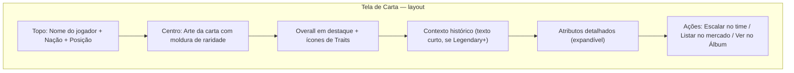
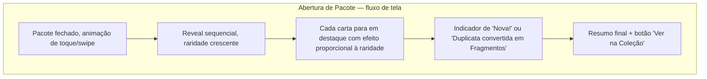
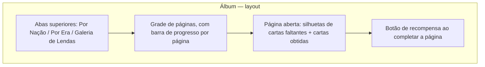
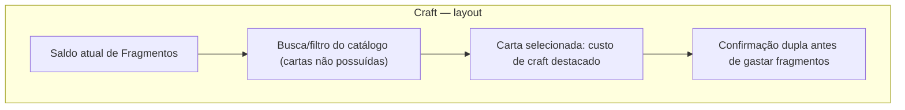
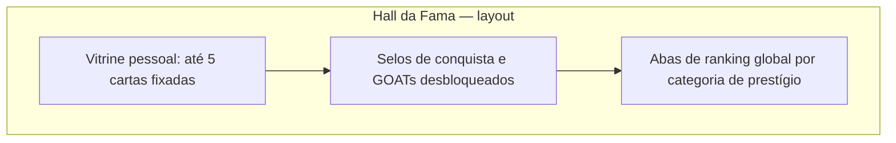

# 10 — Card System Master Document (World Legends)

> Especificação de design — sem código. Define a "alma colecionável" do jogo: como uma carta nasce, o que ela significa, como se torna rara, como se troca, se conserta e se exibe. Este documento referencia e refina os pontos já tocados em `04-sistema-cartas-raridade.md` e `07-packs-colecionismo.md`, elevando-os ao nível de profundidade de um TCG moderno.

## 1. Filosofia do Sistema de Cartas

Cinco pilares guiam toda decisão de design daqui em diante:

**História real como matéria-prima.** Toda carta nasce de um fato histórico verificável (uma campanha de Copa, uma atuação decisiva, uma trajetória de carreira). Raridade não é um número arbitrário — é uma forma de contar uma história com graus de intensidade crescente.

**Raridade é narrativa, não só poder.** Uma carta Lendária não é "apenas mais forte" que uma Comum: ela representa um nível diferente de relevância histórica. O salto de poder existe, mas o salto de *significado* é o que faz o jogador querer aquela carta especificamente.

**Orgulho de coleção é o motor de retenção de longo prazo.** Diferente de um RPG onde itens viram obsoletos, uma carta histórica nunca "envelhece mal" — ela pode ganhar novos contextos (combos, álbuns, eventos) muito depois de deixar de ser competitivamente ideal.

**Justiça competitiva separada de poder de coleção.** Quem coleciona mais não pode simplesmente "comprar" o topo do ranking. O modo competitivo aplica normalização (seção 18); o poder bruto da coleção vale cheio apenas em modos casuais/amistosos/ligas privadas.

**Ciclo de vida eterno.** Nenhuma carta deveria se tornar "lixo de inventário". Duplicatas viram fragmentos (seção 16), fragmentos viram craft (seção 17), e até a carta mais comum tem lugar em algum álbum ou combo (seções 12–13).

## 2. Player vs. Card Version

Reforçando a separação de camadas já definida na modelagem de dados (doc 02), agora com a nuance necessária para um sistema colecionável rico:

- **`Player`** é a entidade histórica real: nome, nação, posição, biografia, intervalo de carreira. Existe uma única vez no catálogo, independente de quantas cartas dele existam.
- **`Card`** (ou "impressão") é uma versão jogável e colecionável daquele jogador — e aqui está o ponto-chave: **uma carta pode representar um recorte específico da carreira**, não a carreira inteira. Uma carta pode ser ancorada a:
  - **Carreira geral** (a versão "padrão" do jogador, usada nas raridades Common/Rare/Elite).
  - **Um momento específico** (uma Copa, uma fase auge, uma final histórica) — usado nas raridades Legendary/Ultra/World Cup Hero e nas edições Prime/Event (seções 9–10).
- Cada `Card` carrega um `tournament_context` opcional (ex: "Copa de determinado ano") que alimenta tanto a fórmula de atributos (seção 6) quanto a arte/narrativa exibida na carta — exatamente como um TCG diferencia "impressões" do mesmo personagem por set/edição, cada uma com ilustração e levemente diferentes atributos/efeitos.
- **`UserCard`** continua sendo a instância possuída, com estado mutável (nível, forma, lesão, fragmentos gerados se for duplicata).

## 3. Até 6 Cartas por Jogador

Regra de design fixa: **cada jogador real pode ter no máximo 6 cartas permanentes no catálogo — exatamente uma por raridade** (Common, Rare, Elite, Legendary, Ultra, World Cup Hero).

- Isso evita inflação de catálogo (sem dezenas de versões redundantes do mesmo jogador) e torna cada raridade um "degrau" claro e colecionável.
- **Nem todo jogador alcança as 6.** A maioria do catálogo histórico cobre apenas Common/Rare/Elite (jogadores relevantes, mas não necessariamente icônicos). Legendary e Ultra são reservados a um subconjunto curado de verdadeiras lendas. World Cup Hero é a mais exclusiva — coberta em detalhe na seção 4 — e existe apenas para um punhado de jogadores cuja atuação específica em uma Copa justifique uma carta-evento permanente.
- **Cartas Prime e Event (seções 9 e 10) não contam nesse limite de 6.** Elas são tratadas como variações temporárias/sazonais "encaixadas" sobre uma das 6 cartas-base (mesma raridade, arte e contexto diferentes, disponibilidade limitada) — preservando o limite de 6 como a estrutura permanente do catálogo.

## 4. Sistema de Raridades

| Raridade | Faixa de Overall | Critério de elegibilidade | Identidade visual | Peso-base em pack |
|---|---|---|---|---|
| Common | 55–72 | Disputou ao menos uma Copa relevante, papel regular no elenco | Borda cinza, fundo liso, sem efeito | 58% |
| Rare | 73–81 | Titular de destaque em sua seleção, boa relevância na campanha | Borda azul/prata, leve brilho estático | 25% |
| Elite | 82–87 | Reconhecido como um dos melhores de sua posição na própria época | Borda violeta, textura metálica, brilho ao inclinar | 11% |
| Legendary | 88–92 | Ícone consagrado de sua geração, presença marcante em múltiplas Copas | Borda dourada, animação de brilho contínuo | 4.5% |
| Ultra | 93–96 | Um dos maiores nomes da história das Copas do Mundo, sem contestação | Borda holográfica multicolor, partículas, nome em relevo | 1.3% |
| World Cup Hero | 95–99 | Vinculada a **um momento específico e real** (final decisiva, atuação histórica) — não é "o jogador", é "o jogo da vida dele" | Arte em estilo "cartaz de época" daquela Copa, numeração de série visível (ex: "Edição 014/500"), animação exclusiva | 0.2% |

A World Cup Hero é deliberadamente tratada como uma categoria narrativa, não apenas estatística: cada carta carrega um pequeno texto de contexto (ex: "atuação decisiva na campanha que definiu o título") e uma identidade visual de "peça de museu" — é a carta que o jogador mostra para os amigos, não necessariamente a que ele usa em todo time competitivo.

## 5. Traits

Traits são habilidades passivas curadas manualmente na criação de cada carta (refletindo o perfil real daquele jogador/momento), não sorteadas. Uma carta carrega de 1 a 3 traits; raridades maiores tendem a ter mais.

| Trait | Efeito mecânico (conecta-se ao Match Engine, doc 09) |
|---|---|
| Matador | Bônus de conversão em chances claras dentro da área (boost direto no xG de finalizações de "frente para o gol") |
| Maestro | Bônus na chance de gerar assistência quando participa de uma jogada com um companheiro em link de química |
| Capitão | Slot exclusivo (1 por time): reduz queda de moral do time e amplia ganhos de moral enquanto em campo |
| Muralha | Bônus defensivo em disputas físicas e desarmes; reduz o xG do adversário nas jogadas em que participa |
| Clutch Player | Bônus de desempenho nos minutos finais (76'+) e em jogos decisivos por pontos/classificação |
| Big Game Player | Bônus em partidas de mata-mata, finais e confrontos diretos de alta relevância (`matchContext.importância` alta) |
| Iron Man | Reduz significativamente o risco de lesão e a taxa de acúmulo de fadiga de calendário |
| Fast Recovery | Reduz a duração de qualquer lesão sofrida (severidade e dias de recuperação) |
| Super Sub | Recebe um bônus temporário de atributos efetivos nos primeiros 15 minutos após entrar como substituto |
| Dead Ball Specialist | Bônus em cobranças de falta direta, escanteio e pênalti |
| Hero Moment | Pequena chance adicional, rara, de gerar um evento de "momento heroico" (finalização espetacular fora do padrão estatístico) sob pressão |
| Gelo nas Veias | Bônus de conversão em disputas de pênaltis e reduz a variância negativa em situações de alta pressão |
| Leader | Versão "passiva e cumulativa" do Capitão — não exclusiva (várias cartas podem ter), efeito menor por carta mas soma um pequeno bônus de consistência/química ao time inteiro |

## 6. Fórmula dos Atributos

A fórmula-base, válida para cartas de carreira geral (Common/Rare/Elite):

> **Atributo Final = clamp( Atributo Base do Jogador × Multiplicador de Raridade + Bônus de Edição + Σ Bônus Passivo de Traits relevantes , 1, 99 )**

| Raridade | Multiplicador |
|---|---|
| Common | 1.00x |
| Rare | 1.06x |
| Elite | 1.12x |
| Legendary | 1.18x |
| Ultra | 1.25x |
| World Cup Hero | 1.30x (aplicado apenas aos atributos centrais ligados ao momento heroico — ver fórmula específica abaixo) |

Para cartas ancoradas a um momento específico (Legendary/Ultra/World Cup Hero e as edições Prime/Event), o atributo-base não vem da média de carreira inteira, e sim de um **recorte de desempenho** daquele período/jogo, combinado com a base de carreira para estabilidade estatística:

> **Atributo de Momento = (Indicador de Desempenho do Recorte × 0.7) + (Atributo Base de Carreira × 0.3)**

Onde "Indicador de Desempenho do Recorte" é derivado de dados factuais daquele período específico (participação em gols decisivos, prêmios daquela campanha, relevância tática) — metodologia documentada junto ao seed de dados (doc 08, seção 2.1), nunca inventada arbitrariamente.

## 7. Química Histórica

Expande o modelo de links da Match Engine (doc 09, seção 4) com granularidade histórica real:

| Relação entre as duas cartas adjacentes na formação | Pontos de link |
|---|---|
| Mesma seleção **e** mesma edição de Copa (jogaram literalmente a mesma campanha) | +4 |
| Mesma seleção, eras sobrepostas mas Copas diferentes | +2 |
| Mesma seleção, eras não sobrepostas | +1 |
| Nações diferentes, eras sobrepostas | 0 |
| Nações diferentes, eras totalmente distintas | -1 (leve penalidade de "estranhamento" entre estilos de época muito diferentes) |

**Bônus de "Time Histórico Completo":** se os 11 titulares corresponderem exatamente ao elenco real de uma campanha de Copa específica (a mesma seleção, a mesma edição), o time recebe um bônus fixo adicional de química e um efeito visual exclusivo ("Onze Histórico Reconhecido") — esse é o gancho mecânico para os Combos Lendários (seção 8).

## 8. Combos Lendários

Conjuntos pré-curados de cartas que, quando reunidas no mesmo time, ativam um bônus especial além da química normal — curadoria manual, não algorítmica, garantindo que cada combo tenha uma justificativa histórica real:

- **Combos de Dupla/Trio:** duas ou três cartas específicas (ex: uma dupla de ataque historicamente associada) ativam um pequeno bônus de atributo cruzado quando ambas estão em campo e adjacentes na formação.
- **Combo "Onze Campeão Completo":** escalar literalmente os 11 jogadores reais de uma final específica de Copa — o maior bônus possível do jogo, mais um emblema visual permanente no perfil do usuário ("Recriou a Final de [ano]") e uma conquista associada (seção 22).
- **Regra de não-sobreposição:** um time só pode ativar um combo "grande" (Onze Completo) por vez; combos pequenos (dupla/trio) podem coexistir entre si desde que não compartilhem jogadores com um combo grande já ativo, evitando empilhamento abusivo de bônus.

## 9. Cartas Prime

"Prime" é um eixo de **edição**, não uma 7ª raridade — pode existir em Rare, Elite ou Legendary. Representa a janela estatisticamente mais forte da carreira do jogador (seu auge real e verificável), com:

- Atributos +2 a +4 acima da versão padrão daquela mesma raridade, concentrados nos atributos centrais da posição.
- Arte com tratamento visual distinto (paleta e moldura específicas de "Prime"), reconhecível à distância.
- Obtida via **Pacotes Prime** dedicados ou como alvo de Craft (seção 17) a partir de uma raridade-base já possuída do mesmo jogador.

## 10. Cartas Event

Cartas sazonais ligadas a eventos ao vivo (live-ops) — calendário detalhado na seção 23. Características:

- Disponibilidade **estritamente limitada no tempo**, vinculada a um evento específico (ex: aniversário de uma campanha histórica, evento comunitário).
- Arte exclusiva daquele evento; pode receber um pequeno bônus de atributo "de ocasião" válido apenas durante a janela do evento em modos casuais (a normalização competitiva da seção 18 sempre se aplica em ranqueada).
- Obtida apenas via **Pacotes de Evento** ou cumprindo objetivos específicos do evento — nunca via craft direto enquanto o evento está ativo.
- Política de transparência: se uma carta Event puder retornar em uma rotação futura, isso é comunicado claramente com antecedência — nunca removida "silenciosamente" nem reapresentada como "nova" enganosamente.

## 11. Cartas GOAT

O topo absoluto da pirâmide — acima até de Ultra e World Cup Hero em prestígio (embora estatisticamente próximas do teto de Ultra, o valor real é de status, não de poder bruto adicional). Regras:

- Catálogo extremamente curado: um número fixo e pequeno de jogadores "GOAT" em todo o jogo (algo como 10–20 no total), cada um com uma única carta GOAT possível.
- **Não tradeable, não craftable, não disponível em nenhum pack pago.** Único caminho de obtenção: conquistas de Hall da Fama (seção 21) de altíssimo esforço — ex: completar 100% de um álbum de seleção inteiro, ou alcançar marcos de temporada consistentes ao longo de múltiplos ciclos.
- Visual: numeração de série exibida no perfil ("GOAT Nº 014 desbloqueado"), animação máxima reservada exclusivamente a essa categoria.
- Função de design: é a recompensa que prova dedicação e habilidade, não poder de compra — o contrapeso simbólico mais forte da filosofia de justiça competitiva (seção 1).

## 12. Sistema de Coleção

- Progresso de coleção medido em múltiplas dimensões simultâneas: percentual geral, por nação, por era/Copa, e por raridade.
- Marcos de completude (25% / 50% / 75% / 100%) concedem recompensas crescentes (pacotes, fragmentos, cosméticos de perfil).
- **Vitrine pessoal ("Showcase"):** o usuário fixa até 5 cartas no topo do próprio perfil, vistas por amigos e na liga — reforço social de orgulho de coleção sem exigir um Hall da Fama formal para isso.

## 13. Álbum das Seleções Históricas

Estrutura do álbum: uma página por combinação **nação + edição de Copa**, espelhando o elenco real daquela campanha (reaproveitando o conceito de `collection_sets` do doc 07, agora com estrutura de exibição definida):

- Completar uma página de álbum concede um pacote temático exclusivo daquela nação/época e um cosmético de bandeira dourada visível na vitrine do perfil.
- Uma **Galeria de Lendas** transversal reúne, em uma página separada, uma cópia de cada carta Ultra/World Cup Hero que o usuário já possuiu — funciona como o "salão principal" do álbum, independente de nação.

## 14. Packs

Estrutura de slots ao estilo de booster de TCG (não apenas "sorteio solto"), com pelo menos um slot garantido de qualidade mínima por pacote:

| Pacote | Slots | Garantia |
|---|---|---|
| Pacote Clássico | 5 cartas | mínimo 1 Rare-ou-melhor |
| Pacote Elite | 5 cartas | mínimo 2 Elite-ou-melhor |
| Pacote Lenda | 3 cartas | mínimo 1 Legendary-ou-melhor (slot de "hit" garantido) |
| Pacote Prime | 3 cartas | mínimo 1 carta em edição Prime |
| Pacote Herói da Copa (evento) | 2 cartas | 1 carta garantida World Cup Hero ou Event daquele evento específico |

## 15. Probabilidades de Drop

Probabilidades-base por slot "livre" (não-garantido) de um Pacote Clássico, como referência geral do sistema:

| Raridade | Probabilidade |
|---|---|
| Common | 58% |
| Rare | 25% |
| Elite | 11% |
| Legendary | 4.5% |
| Ultra | 1.3% |
| World Cup Hero | 0.2% |

**Proteção de sorte (pity system):** cada conta mantém um contador de "pacotes desde o último Legendary-ou-melhor". Ao atingir 40 pacotes sem nenhum Legendary+, o próximo pacote aberto garante uma carta Legendary-ou-melhor (contador zera). Um contador separado, com limiar maior (ex: 120 pacotes), garante eventualmente um Ultra-ou-melhor. World Cup Hero **não** entra na proteção de sorte — sua raridade extrema é intencional e narrativa, reforçando que ela deve vir majoritariamente de eventos e curadoria, não de grind puro.

## 16. Fragmentos e Duplicatas

- Ao sortear uma carta cujo `card_id` o usuário já possui, a cópia adicional é **automaticamente convertida em Fragmentos** (não vira uma segunda cópia física na coleção) — a primeira cópia sempre permanece como a carta jogável.
- Valor de conversão por raridade (referência): Common 10, Rare 30, Elite 80, Legendary 200, Ultra 500, World Cup Hero 1000 fragmentos.
- Fragmentos são uma moeda de **propósito único**: alimentam exclusivamente o sistema de Craft (seção 17), nunca trocados por moeda soft/hard nem usados em compras diretas — isso preserva seu valor e evita rotas de conversão que inflacionem a economia geral.

## 17. Craft

Permite **escolher um alvo específico** no catálogo (qualquer carta que o usuário ainda não possua) e obtê-la garantidamente, pagando um custo em Fragmentos escalado pela raridade:

| Raridade do alvo | Custo de Craft (Fragmentos) |
|---|---|
| Common | 50 |
| Rare | 200 |
| Elite | 600 |
| Legendary | 1500 |
| Ultra | 4000 |
| World Cup Hero | Não craftável (exclusiva de evento/pack, preserva seu prestígio) |
| GOAT | Não craftável (exclusiva de conquista, seção 11) |

Craft é o "caminho determinístico" do sistema — para o jogador que prefere objetivos claros a sorte pura, é a contrapartida estratégica da aleatoriedade dos pacotes, e o principal destino útil para o excesso de duplicatas geradas ao longo do tempo.

## 18. Economia

Três moedas com propósitos estritamente separados, para evitar que qualquer uma se torne um atalho de pay-to-win:

| Moeda | Origem | Destino |
|---|---|---|
| Créditos (soft) | Jogar partidas, objetivos diários/semanais, vender excedentes no mercado | Comprar pacotes, listar/comprar no mercado |
| Moeda Premium (hard, opcional e com cautela regulatória — ver doc 08, seção 2.3) | Compra real | Comprar pacotes cosméticos/especiais; nunca compra cartas diretamente nem Fragmentos |
| Fragmentos | Duplicatas de pacotes | Exclusivamente Craft |

**Normalização Competitiva (o principal mecanismo anti-pay-to-win):** em partidas de **modo ranqueado**, todo atributo efetivo acima de um teto definido (ex: equivalente a overall 90) é nivelado para esse teto antes da simulação — ou seja, possuir uma carta de overall 99 não dá vantagem matemática sobre uma de overall 90 dentro do ranqueado; a vantagem competitiva vem de tática, formação, química e profundidade de elenco, não de poder de compra. Em **modos casuais, ligas privadas e amistosos**, essa normalização não se aplica — o poder pleno da coleção vale, porque ali a disputa é social/recreativa, não definidora de status competitivo formal.

## 19. Trocas entre Amigos

- Trocas diretas (oferta A↔B) entre contas que se seguem mutuamente como amigos, com confirmação dupla obrigatória antes de qualquer transferência.
- **Não-tradeable:** cartas GOAT (nunca) e cartas Event durante a janela ativa do evento (evita manipulação coordenada de drops limitados; tornam-se tradeable normalmente após o evento encerrar, se a carta permanecer disponível).
- Limite diário de trocas por conta (ex: 5 por dia) para conter farming via contas-fantoche.
- Histórico de trocas registrado de forma auditável, para suporte e resolução de disputas.

## 20. Mercado

- Listagem de duplicatas/excedentes por **Créditos ou Fragmentos apenas** — nunca por moeda premium, para não criar um mercado secundário de dinheiro real (risco regulatório e de fraude).
- Faixa de preço (piso/teto) calculada automaticamente por raridade e por média de transações recentes daquela carta específica, prevenindo manipulação de preço e lavagem de moeda entre contas.
- Pequena taxa de transação (ex: 5%) é "queimada" (removida da economia) a cada venda — sink necessário para conter inflação de Créditos no longo prazo.
- Limites de listagem simultânea e de frequência por conta, com monitoramento anti-bot.

## 21. Hall da Fama

- **Pessoal:** vitrine com as melhores cartas do usuário, selos de conquista, GOATs desbloqueados em destaque.
- **Global:** rankings de prestígio (não de poder) — "Coleção Mais Completa", "Mais GOATs Desbloqueados", "Maior Sequência de Vitórias Ranqueadas", "Primeiro a Completar o Álbum de [nação]" — função puramente social/status, sem recompensa de poder adicional associada à posição no ranking de Hall da Fama em si.

## 22. Conquistas

| Categoria | Exemplos | Recompensa típica |
|---|---|---|
| Coleção | Completar um álbum de seleção, reunir uma Galeria de Lendas completa | Pacotes temáticos, fragmentos |
| Performance em partida | Hat-trick simulado, MVP em 10 partidas, vencer um clássico | Cosméticos de carta, fragmentos |
| Social | Concluir N trocas, criar/vencer uma liga privada | Moldura de perfil exclusiva |
| Veterano | Sequência de temporadas jogadas, dias consecutivos de login | Progresso direto rumo a desbloqueio de GOAT |

## 23. Eventos Especiais

- **Calendário ao vivo (live-ops):** eventos temáticos recorrentes (aniversários de campanhas históricas, eventos sazonais ligados ao calendário real de competições), cada um com Pacotes de Evento e cartas Event exclusivas daquela janela.
- **Metas comunitárias:** objetivos agregados do servidor inteiro (ex: "se a comunidade abrir X pacotes coletivamente, todos recebem um bônus") — gera senso de evento compartilhado sem depender só do gasto individual.
- **Fins de semana de drop em dobro:** janelas curtas com probabilidades elevadas em pacotes específicos, sempre anunciadas com antecedência e nunca retroativas.
- **"Resgate de Lenda":** evento raro que abre uma janela temporária de Craft para uma carta normalmente não-craftável (exceto GOAT, que segue sempre exclusivo de conquista).

## 24. Wireframes

### Tela de Detalhe da Carta

### Tela de Abertura de Pacote

### Tela de Álbum / Coleção

### Tela de Craft

### Tela de Hall da Fama

## 25. Jornada do Jogador

| Marco temporal | Experiência | Sistemas envolvidos |
|---|---|---|
| Dia 1 | Recebe pacote inicial garantido, monta primeiro time, joga primeira partida | Packs, Coleção, Match Engine |
| Semana 1 | Completa a primeira página de álbum, entende química histórica | Álbum, Química |
| Mês 1 | Puxa a primeira carta Legendary, entra em uma liga com amigos | Drop rates, Multiplayer |
| Mês 2–3 | Primeira duplicata relevante convertida em Fragmentos, primeiro Craft estratégico | Fragmentos, Craft |
| Mês 3–6 | Primeira carta Ultra (via proteção de sorte ou evento), primeiro combo lendário ativado | Pity system, Combos |
| 6 meses+ | Persegue o primeiro GOAT via conquistas de Hall da Fama, participa de eventos sazonais com regularidade | Hall da Fama, Conquistas, Eventos |

## 26. Roadmap de Implementação

Alinhado ao roadmap geral de MVPs (doc 01), o sistema de cartas é introduzido em camadas crescentes de profundidade:

- **MVP 1 (já coberto no roadmap geral):** Raridades Common–Legendary, packs básicos, coleção simples, química básica (sem granularidade histórica ainda).
- **MVP 2–3:** Traits ativos no Match Engine, química histórica completa, álbum por nação/era, combos lendários simples (dupla/trio).
- **MVP 4:** Fragmentos, Craft, normalização competitiva no ranqueado, Cartas Prime.
- **MVP 5:** World Cup Hero, Cartas Event com calendário ao vivo, mercado, trocas entre amigos, Hall da Fama, Conquistas.
- **Pós-MVP 5:** Cartas GOAT e eventos comunitários — reservado para quando a base de jogadores ativa for grande o suficiente para metas coletivas terem impacto real.

---

Próximo passo natural: detalhar o **plano de testes e regras de balanceamento** (como validar que nenhuma combinação de raridade+trait+combo quebra a normalização competitiva) antes de tocar em qualquer implementação, ou já seguimos para o documento de **Economia e Monetização** isolado, com projeções de sink/source mais quantitativas? Qual prefere?
