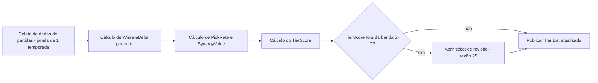
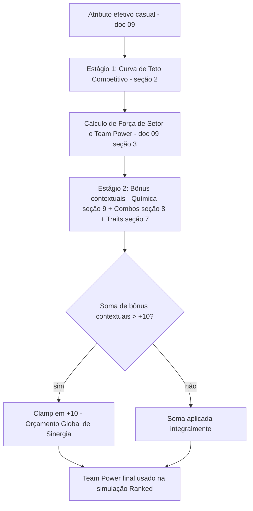
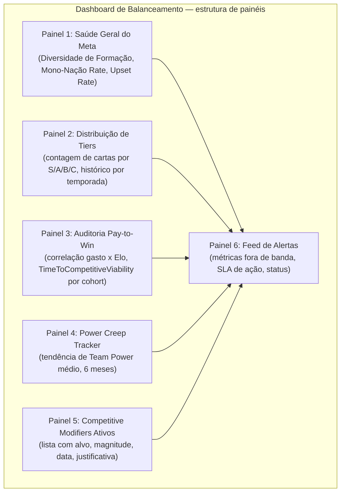
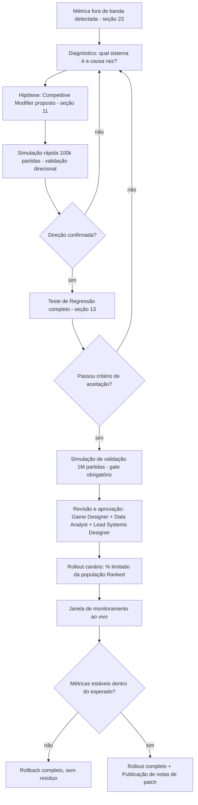

# 11 — Balance & Competitive Validation Master Document (World Legends)

> Documento de especificação pura — sem código, sem SQL, sem APIs. Define as regras, métricas, fórmulas e processos que garantem que World Legends permaneça competitivo, saudável e nunca pay-to-win, em qualquer fase do ciclo de vida do jogo. Referencia diretamente `09-match-engine-master.md` (mecânicas) e `10-card-system-master.md` (raridades, traits, combos, química, economia).

## 1. Filosofia de Balanceamento

World Legends opera sob cinco princípios inegociáveis de balanceamento:

**Habilidade acima de poder de coleção, sempre no contexto competitivo.** Qualquer mecanismo que permita que dinheiro ou tempo de grind substituam decisão tática é tratado como defeito crítico, não como "monetização agressiva".

**Diversão não é sinônimo de invencibilidade.** Uma carta ou combo "divertido de usar" não pode, ao mesmo tempo, ser estatisticamente correto em 100% dos contextos — isso mata a diversidade de decks/elencos, o problema clássico de "meta solucionado" visto em TCGs mal balanceados.

**Autenticidade histórica dentro de faixas, nunca fora delas.** Os dados reais de carreira de um jogador alimentam o atributo-base (doc 08, seção 2), mas a faixa de overall de cada raridade (doc 04, doc 10 seção 4) é um contrato de design fixo — nenhuma carta nova pode "estourar" o teto estabelecido para sua raridade só porque o jogador real foi excepcional. A exclusividade narrativa (World Cup Hero, GOAT) já existe para isso; ela não precisa também quebrar a escala numérica.

**Decisão orientada a dado, não a intuição.** Toda mudança de balanceamento percorre o pipeline de validação descrito na seção 25 antes de chegar ao jogador — opinião de designer é hipótese, não decisão.

**Duas economias de poder, claramente separadas.** "Poder de Coleção" (o que você tem) e "Poder Competitivo" (o que conta no Ranked) são eixos diferentes, com regras de conversão entre eles explicitadas na seção 10. Essa separação é o alicerce de todas as 25 seções seguintes.

---

## 2. Definição do Teto Competitivo

**Filosofia.** Um teto rígido (hard clamp) tradicional resolve pay-to-win mas cria um problema novo: todas as cartas de ponta (overall 90 e overall 99) passam a ser estatisticamente idênticas no Ranked, esvaziando o valor competitivo de evoluir a coleção. World Legends usa uma **curva de retorno decrescente** em vez de um corte abrupto.

**Fórmula — Curva de Teto Competitivo (Soft Cap):**

Para um atributo efetivo `a` (calculado normalmente em modo casual, conforme doc 09):

> Se `a ≤ 85`: valor competitivo = `a` (sem alteração)
> Se `a > 85`: valor competitivo = `85 + (a − 85) × 0.25`, com teto absoluto em `90`

| Atributo casual (`a`) | Valor competitivo equivalente |
|---|---|
| 80 | 80,0 |
| 85 | 85,0 |
| 88 | 85,75 |
| 90 | 86,25 |
| 93 | 87,0 |
| 96 | 87,75 |
| 99 | 88,5 (arredondado a 90 se a soma de bônus contextuais ultrapassar o teto absoluto) |

Isso preserva uma vantagem real, mas pequena e decrescente, para coleções mais avançadas — sem nunca permitir que ela domine a decisão de uma partida.

**Riscos e exploits.** (a) Se o teto for fixado alto demais, colecionadores de cartas Ultra/World Cup Hero ainda dominam o Ranked — vira pay-to-win disfarçado. (b) Se for fixado baixo demais, jogadores sentem que "a coleção não importa", prejudicando a motivação de progressão (risco de retenção, não de justiça).

**Prevenção.** O valor `85` (início da curva) e `90` (teto absoluto) não são constantes fixas para sempre — são parâmetros monitorados pela métrica de Auditoria Pay-to-Win (seção 20) e ajustáveis via Competitive Modifier (seção 11), nunca editando a carta original.

---

## 3. Winrates Aceitáveis por Carta

**Filosofia.** Winrate bruto de uma carta é uma métrica enganosa isolada — uma carta Ultra naturalmente tem winrate maior só porque está em times mais fortes. O que importa é o **desvio em relação ao esperado pela força do elenco**.

**Fórmula — Winrate Delta:**

> `WinrateDelta(carta) = WinrateObservado(partidas com a carta) − WinrateEsperado(dado o Team Power do elenco que a contém)`

`WinrateEsperado` é calculado via uma curva logística equivalente à usada no sistema de ELO (doc 06, seção 3.1), aplicada ao diferencial de Team Power entre os dois lados, e não ao card individual — isso isola o efeito **daquela carta especificamente**, controlando pela força geral do time.

**Tabela de bandas aceitáveis (ligada ao Tier — seção 4):**

| Tier | WinrateDelta aceitável | Interpretação |
|---|---|---|
| S | +4pp a +6pp | Melhor do que a média, dentro do esperado para o topo |
| A | +1pp a +4pp | Acima da média, saudável |
| B | −1pp a +1pp | Baseline, a maioria das cartas deve viver aqui |
| C | −4pp a −1pp | Nicho ou situacional — aceitável, não é "quebrada" |
| Fora da banda (qualquer direção) | — | Flag automático para revisão |

**Riscos e exploits.** Uma carta com WinrateDelta acima de +6pp de forma consistente (3+ ciclos de medição) é, por definição, *over-performing* relativo ao seu próprio nível de poder nominal — geralmente sinal de um trait ou combo mal calibrado, não do atributo bruto.

**Prevenção.** Toda carta fora de banda por 2 ciclos consecutivos entra automaticamente na fila de revisão de Competitive Modifier (seção 11), antes mesmo de qualquer decisão humana — o dado aciona o processo, a equipe decide a ação.

---

## 4. Sistema de Tiers (S, A, B, C)

**Filosofia.** O tier list não é uma ferramenta de marketing — é o painel de diagnóstico interno primário. Pode (e deve) ser publicado para a comunidade por transparência, mas sua função primária é guiar a equipe de balanceamento.

**Fórmula — Tier Score:**

> `TierScore = (WinrateDelta_normalizado × 0.5) + (PickRate_normalizado × 0.3) + (SynergyValue_normalizado × 0.2)`

Onde cada componente é normalizado em escala 0–10 antes da ponderação; `SynergyValue` mede quantos combos/traits relevantes a carta ativa em squads de alto bracket (seção 8).

| Tier | TierScore | Significado |
|---|---|---|
| S | ≥ 8,0 | Pico do meta atual — monitoramento prioritário |
| A | 4,0 – 7,9 | Forte e amplamente viável |
| B | 0,0 – 3,9 | Padrão, maioria do catálogo deve estar aqui |
| C | < 0,0 (até −10) | Nicho/situacional, viável só em contextos específicos |
| "Quebrada" (acima de C/S) | TierScore > 10 ou < −10 | Estado de emergência — ação corretiva obrigatória no próximo patch |

**Diagrama — fluxo de recálculo periódico do Tier List:**

**Riscos e exploits.** Recalcular o tier list com janelas de dados muito curtas gera ruído estatístico (cartas raras com poucas partidas amostradas oscilam de tier por acaso). **Prevenção:** janela mínima de uma temporada completa (doc 06) e exigência de tamanho de amostra mínimo (seção 14) antes de qualquer carta ser reclassificada.

---

## 5. Métricas de Presença no Meta

**Filosofia.** Diversidade de meta é tão importante quanto justiça matemática — um jogo "balanceado" onde 90% dos times de elite usam a mesma carta é, na prática, um jogo sem escolha real.

**Fórmula — Inclusion Rate:**

> `InclusionRate(carta, bracket) = (squads contendo a carta no bracket) / (total de squads amostrados no bracket)`

**Limites aceitáveis:**

| Métrica | Banda saudável | Ação obrigatória se ultrapassar |
|---|---|---|
| InclusionRate de uma carta única no bracket Top 5% Ranked | até 35% | Revisão de Competitive Modifier |
| InclusionRate de um trait único | até 45% | Revisão de limite de trait (seção 7) |
| InclusionRate de um combo lendário único | até 20% | Revisão de cap de combo (seção 8) |

**Riscos e exploits.** Inclusion rate alto não é automaticamente um problema se a carta for B/C tier (pode ser só popular e equilibrada) — o gatilho real de preocupação é a combinação **InclusionRate alto + WinrateDelta alto simultaneamente** (ver Protocolo de Meta Dominante, seção 18).

---

## 6. Diversidade de Formações

**Filosofia.** O Match Engine (doc 09, seção 15) já modela múltiplas formações com pesos de setor distintos — a meta de balanceamento é garantir que essa diversidade estrutural se traduza em diversidade de uso real, não apenas teórica.

**Fórmula — Índice de Diversidade de Formação (entropia de Shannon):**

> `H = − Σ pᵢ × log₂(pᵢ)`, para cada formação `i` com proporção de uso `pᵢ` no bracket analisado

Com 8 formações catalogadas (doc 09, seção 15), a entropia máxima teórica é `log₂(8) = 3,0 bits` (uso perfeitamente igualitário).

| Métrica | Valor | Interpretação |
|---|---|---|
| Entropia máxima teórica | 3,0 bits | Uso 100% igualitário entre as 8 formações |
| Meta saudável | ≥ 2,1 bits (≈ 70% do máximo) | Diversidade real, sem dominância |
| Zona de alerta | 1,5 – 2,1 bits | Começo de concentração, monitorar |
| Zona crítica | < 1,5 bits | Uma ou duas formações dominam — intervenção obrigatória |

**Prevenção.** A correção nunca é nerfar uma carta específica — é ajustar os multiplicadores de setor da formação dominante (doc 09, seção 3) via Competitive Modifier, atacando a causa estrutural.

---

## 7. Limites para Traits

**Filosofia.** Traits são a camada mais "artesanal" do sistema (curadoria manual, doc 10 seção 5) — exatamente por isso, precisam de tetos numéricos rígidos e documentados para nunca dependerem do bom senso de quem cadastra uma carta nova.

**Tabela de teto de poder por trait (bônus máximo absoluto, independente de raridade):**

| Trait | Teto de bônus mecânico |
|---|---|
| Matador | +12% na probabilidade de conversão (xG) em chances dentro da área |
| Maestro | +10% na chance de assistência em jogadas com link de química |
| Capitão (slot exclusivo, 1 por time) | +6 pontos de moral inicial, redução de 30% na queda de moral intra-partida |
| Muralha | −10% no xG do adversário nas jogadas em que participa |
| Clutch Player | +8% de desempenho efetivo após o minuto 76 |
| Big Game Player | +8% de desempenho efetivo em partidas classificadas como `alta importância` |
| Iron Man | −25% no risco-base de lesão; −20% na taxa de fadiga de calendário |
| Fast Recovery | −30% na duração de qualquer lesão sofrida |
| Super Sub | +10% de atributos efetivos nos primeiros 15 minutos após entrar |
| Dead Ball Specialist | +15% em cobranças de falta direta, escanteio e pênalti |
| Hero Moment | +0,5pp de chance adicional de evento raro de "momento heroico" sob pressão |
| Gelo nas Veias | +10% de conversão em disputas de pênalti; reduz variância negativa sob pressão |
| Leader (não exclusivo, empilhável com retorno decrescente) | ver fórmula abaixo |

**Fórmula — Empilhamento de Leader:**

> `BônusTotalLeader(n) = Σ_{i=1}^{n} base × (0,5)^(i−1)`, com teto absoluto de `2 × base`

Ou seja, o segundo Leader em campo soma metade do bônus do primeiro, o terceiro um quarto, e assim por diante — converge matematicamente para no máximo o dobro do bônus de uma única carta, nunca crescendo sem limite por mais cartas Leader que sejam escaladas.

**Riscos e exploits.** Sem o teto de empilhamento, um time poderia escalar 5+ cartas com Leader e obter um bônus de consistência/química desproporcional, tornando "spam de um trait" estrategicamente superior a qualquer outra composição. **Prevenção:** a convergência geométrica é a defesa matemática nativa — nenhuma quantidade de cartas Leader supera o teto de `2× base`.

---

## 8. Limites para Combos Lendários

**Filosofia.** Combos lendários (doc 10, seção 8) são, por design, o ponto mais "narrativamente carregado" do sistema — exatamente por isso são o ponto de maior risco de desbalanceamento se não tiverem teto explícito desde o primeiro combo cadastrado.

**Tabela de teto por tipo de combo:**

| Tipo de combo | Bônus máximo de Team Power | Regra de empilhamento |
|---|---|---|
| Dupla/Trio | +2 pontos por combo ativo | Até 2 combos pequenos simultâneos, sem sobreposição de jogadores |
| Onze Campeão Completo | +8 pontos fixos (valor único, não escalável) | Exclusivo — não coexiste com nenhum outro combo grande |

**Orçamento Global de Sinergia (Synergy Power Budget):** a soma de **todos** os bônus de química (seção 9) + combos não pode, em conjunto, ultrapassar **+10 pontos absolutos** de Team Power, independentemente de quantas fontes de bônus estejam tecnicamente ativas. Se a soma bruta calculada ultrapassar esse valor, o excedente é descartado (clamp), nunca distribuído proporcionalmente — isso evita que designers futuros precisem recalcular todos os combos existentes ao adicionar um novo.

**Riscos e exploits.** Sem o orçamento global, seria matematicamente possível combinar química histórica máxima + múltiplos combos pequenos para se aproximar (ou superar) o valor do Onze Completo sem replicar de fato um time histórico real — esvaziando o significado narrativo do combo mais raro do jogo.

---

## 9. Balanceamento de Química Histórica

**Filosofia.** Química histórica (doc 09, seção 4; doc 10, seção 7) precisa recompensar autenticidade sem forçar todo jogador competitivo a montar squads mono-nação — isso reduziria drasticamente a diversidade de formações (seção 6) e a profundidade estratégica do "dream team" híbrido, que é parte do apelo do jogo.

**Teto reafirmado:** bônus de química limitado a `−3` (química muito baixa) até `+4` (química máxima) de Team Power — valor fixo, não escalável por raridade nem por trait.

**Métrica de monitoramento — Percentual Mono-Nação:**

> `MonoNaçãoRate(bracket) = (squads com 9+ titulares da mesma nação) / (total de squads no bracket)`

| Banda | Interpretação | Ação |
|---|---|---|
| até 40% | Saudável — química é relevante mas não obrigatória | Nenhuma |
| 40% – 60% | Zona de alerta | Monitorar próximo ciclo |
| acima de 60% | Química está "forçando" homogeneidade | Reduzir teto de bônus de química via Competitive Modifier, nunca aumentar o custo de squads mistos |

**Riscos e exploits.** Se o bônus de química for aumentado sem essa métrica de controle, o jogo converge para "só vale a pena jogar com uma seleção inteira" — o oposto da proposta de "dream team histórico" descrita na filosofia do produto original.

---

## 10. Normalização Competitiva do Ranked

**Filosofia.** Esta é a seção que amarra as seções 2, 7, 8 e 9 em um único pipeline determinístico — a Normalização Competitiva não é um único cálculo, é uma sequência de estágios, cada um com seu próprio teto.

**Diagrama — Pipeline de Poder Competitivo:**

**Por que dois estágios e não um clamp único no final?** Porque um clamp único no resultado final permitiria que qualquer combinação de fontes de bônus "competisse" para preencher o mesmo teto, mascarando qual sistema está realmente desbalanceado. Separar em estágios com teto próprio por camada (atributo bruto vs. bônus contextual) preserva a capacidade de diagnóstico — quando um problema aparece, sabe-se exatamente em qual estágio investigar.

---

## 11. Competitive Modifiers (sem alterar a carta histórica)

**Filosofia.** O princípio mais protegido de todo o documento: **a carta histórica impressa nunca é editada para fins de balanceamento.** Overall, raridade e atributo-base de uma carta são registro permanente e narrativo (doc 10, seção 1) — alterá-los para nerfar/buffar quebraria a confiança do colecionador ("minha carta diminuiu de poder à toa").

**Estrutura de um Competitive Modifier (especificação conceitual, não técnica):**

| Campo | Descrição |
|---|---|
| Alvo | Carta específica, trait específico, ou combo específico |
| Magnitude | Percentual ou valor absoluto de ajuste |
| Escopo de modo | Aplica-se apenas a Ranked, ou também a ligas competitivas privadas configuradas como "modo estrito" |
| Janela de vigência | Data de início e fim (ou "indeterminado até revisão") |
| Justificativa pública | Texto curto, sempre publicado nas notas de patch (seção 25) |
| Reversibilidade | Todo modifier é, por design, revogável sem deixar resíduo — removê-lo retorna exatamente ao estado original |

**Riscos e exploits.** Se os modifiers não forem versionados e datados, fica impossível auditar "por que essa carta tinha esse comportamento na temporada passada" — uma falha de transparência tanto interna (debug) quanto externa (confiança do jogador). **Prevenção:** todo modifier é registrado com histórico completo, nunca sobrescrito silenciosamente.

---

## 12. Sistema de Buffs e Nerfs Sazonais

**Filosofia.** Mudanças de balanceamento seguem o ritmo das temporadas (doc 06, ciclos de ~6 semanas) — não há "hotfix de balanceamento" fora desse ritmo, exceto em caso de Estado de Emergência (carta "Quebrada", seção 4).

**Tabela de magnitude máxima por patch:**

| Tipo de ação | Magnitude máxima por patch | Cooldown mínimo antes de novo ajuste no mesmo alvo |
|---|---|---|
| Nerf | −8% do valor relevante (atributo competitivo, bônus de trait/combo) | 1 temporada completa de observação |
| Buff | +8% do valor relevante | 1 temporada completa de observação |
| Estado de Emergência (TierScore fora de ±10) | até −20% (exceção documentada) | Reavaliação obrigatória na temporada seguinte |

**Riscos e exploits.** Ajustes grandes demais em um único patch ("over-correction") tendem a empurrar a carta do extremo S para o extremo C, criando uma nova reclamação no sentido oposto — o clássico ciclo de "nerf de pêndulo" visto em TCGs mal geridos. **Prevenção:** o teto de 8% por patch força correções graduais e mensuráveis, e o cooldown de 1 temporada impede ajustes reativos em cascata antes que o efeito do ajuste anterior seja sequer observável nos dados.

---

## 13. Testes de Regressão

**Filosofia.** Toda mudança de balanceamento deve provar que **só** mudou o que pretendia mudar — efeitos colaterais não-intencionais são o maior risco de qualquer patch em um sistema com tantas camadas interdependentes (seção 10).

**Processo:**

1. Rodar o conjunto de simulações de referência (seeds fixos, doc 09 seção 21) na versão **pré-patch**, capturando todas as métricas-mestre (seção 23).
2. Aplicar o Competitive Modifier candidato.
3. Rodar o mesmo conjunto de seeds na versão **pós-patch**.
4. Comparar métrica a métrica.

**Critério de aceitação:**

| Métrica | Tolerância de desvio não-intencional |
|---|---|
| Métricas diretamente visadas pelo patch | Mudança esperada, validada manualmente contra a hipótese |
| Todas as demais métricas globais (distribuição de gols, winrate médio geral, entropia de formação) | Desvio máximo de ±2% em relação ao baseline pré-patch |

Qualquer desvio acima de 2% em uma métrica não-visada **rejeita o patch automaticamente**, mesmo que o efeito pretendido tenha funcionado corretamente — a causa-raiz precisa ser entendida antes de seguir.

---

## 14. Simulações em Massa (100 mil, 1 milhão e 10 milhões de partidas)

**Filosofia.** Cada ordem de magnitude de simulação serve a um propósito distinto no ciclo de desenvolvimento — usar a escala errada para a pergunta errada é desperdício de tempo de compute ou, peor, uma decisão tomada com ruído estatístico insuficiente.

**Fórmula — Erro padrão de uma proporção (winrate):**

> `EP = √( p × (1 − p) / n )`

Para `p ≈ 0,5` (winrate próximo de 50%), o intervalo de confiança de 95% é aproximadamente `± 1,96 × EP`.

| Escala | EP aproximado (p≈0,5) | IC 95% aproximado | Uso |
|---|---|---|---|
| 100 mil partidas | ≈ 0,16% | ≈ ±0,31pp | Iteração rápida — validar direção de uma hipótese de patch antes de qualquer revisão formal |
| 1 milhão de partidas | ≈ 0,05% | ≈ ±0,10pp | Gate de validação pré-lançamento de qualquer patch — obrigatório antes de produção |
| 10 milhões de partidas | ≈ 0,016% | ≈ ±0,03pp | Auditoria trimestral profunda — única escala capaz de detectar viés sutil em eventos raros (World Cup Hero, GOAT, combos de baixa frequência, distribuição do pity system) |

**Observação crítica sobre cartas raras:** para cartas com InclusionRate muito baixa (ex: World Cup Hero, presente em <1% dos squads), o `n` efetivo de partidas *com aquela carta* é muito menor que o `n` total — a escala de 10 milhões existe principalmente para garantir amostra suficiente nesses casos extremos, não para as cartas comuns, que já são bem medidas em 100 mil.

---

## 15. Testes de Monte Carlo

**Filosofia.** Simulação em massa (seção 14) valida contra **dados reais observados** — mas só captura o que os jogadores já descobriram. Monte Carlo existe para encontrar problemas **antes** que qualquer jogador os encontre, varrendo o espaço de possibilidades de forma sintética.

**Metodologia:**

1. Gerar squads sintéticos sorteando composições segundo a distribuição realista de probabilidade de obtenção (probabilidades de pack/pity, doc 10 seções 14–15), não distribuição uniforme — isso garante que o teste reflita o que jogadores reais provavelmente terão.
2. Sortear aleatoriamente formação, estratégia tática (seção 9 do doc 09), clima e perfil de árbitro para cada partida simulada.
3. Rodar um volume grande de partidas (tipicamente na escala de 1 milhão, seção 14) e procurar, por varredura estatística, qualquer subespaço de combinação (ex: "Formação X + Trait Y + Estratégia Ultra-ofensiva") cujo winrate agregado destoe significativamente do esperado.

**Diferença chave em relação à seção 14:** dados de produção (seção 14) dizem "o que está acontecendo"; Monte Carlo sintético diz "o que **poderia** acontecer" — é a ferramenta proativa de QA de balanceamento, equivalente ao processo usado por estúdios AAA de live service antes de qualquer lançamento de conteúdo competitivo.

---

## 16. Distribuição Estatística Esperada de Gols

**Filosofia.** A simulação deve convergir naturalmente para uma distribuição de gols estatisticamente compatível com o futebol real de Copas do Mundo — essa distribuição nunca é "hardcoded" no engine; ela é uma propriedade emergente validada pelas simulações em massa.

**Metas de calibração (referência histórica real de competições de Copa do Mundo):**

| Métrica | Valor-alvo |
|---|---|
| Média de gols por partida | 2,6 – 2,8 |
| Distribuição de gols totais | Aproximadamente Binomial Negativa (levemente superdispersa em relação a uma Poisson pura, como observado em dados reais de futebol) |
| Placar mais comum | 1–0 |

**Tabela de referência de placares mais frequentes (ordem de grandeza aproximada, calibração-alvo):**

| Placar | Frequência aproximada esperada |
|---|---|
| 1–0 | ~14% |
| 1–1 | ~12% |
| 2–1 | ~11% |
| 0–0 | ~8% |
| 2–0 | ~9% |
| 2–2 | ~5% |
| 3–1 | ~5% |
| Demais placares | restante distribuído na cauda |

**Processo de calibração:** os parâmetros do modelo de xG (doc 09, seção 17) — não a distribuição em si — são os únicos pontos de ajuste. Se a simulação em massa (seção 14) produzir uma média de gols fora da faixa 2,6–2,8, o ajuste correto é recalibrar `xg_base` ou os fatores de defesa, nunca forçar a distribuição artificialmente no pós-processamento.

---

## 17. Controle de Variância

**Filosofia.** Variância é o ingrediente que transforma simulação em drama — zero variância significa que o time mais forte vence sempre, o que mata o apelo emocional do "Brasfoot" (zebra, virada, gol nos acréscimos). Variância excessiva, por outro lado, transforma o jogo em loteria e destrói a integridade competitiva.

**Métrica — Taxa de Zebra (Upset Rate):**

> `UpsetRate = P(vitória do time com Team Power inferior em 15+ pontos)`

| Banda | Interpretação |
|---|---|
| < 8% | Variância baixa demais — jogo previsível, falta de "magia" |
| 12% – 22% | Banda saudável-alvo, calibrada para refletir zebras reais de Copas do Mundo históricas |
| > 28% | Variância alta demais — habilidade/elenco deixam de importar |

**Alavancas de ajuste disponíveis (sem código, apenas identificação dos parâmetros do Match Engine que afetam variância):**

| Alavanca | Efeito direcional sobre variância |
|---|---|
| `EVENT_CHANCE_PER_MINUTE` (doc 09, seção 16) | Maior valor → mais eventos → tende a reduzir variância de resultado (mais amostras dentro da mesma partida) |
| Inclinação da curva de xG (seção 17 do doc 09) | Curva mais "plana" entre times fortes/fracos → aumenta variância |
| Multiplicador de redução de variância da química (doc 09, seção 4) | Maior → reduz variância para times de alta química, criando uma vantagem adicional de consistência |

**Riscos e exploits.** Calibrar variância apenas observando médias agregadas escontextualizadas pode mascarar problemas localizados (ex: variância saudável em geral, mas anormalmente alta especificamente em partidas com clima de chuva). **Prevenção:** Upset Rate deve ser monitorado também segmentado por clima, formação e diferença de Team Power, não apenas como média global.

---

## 18. Anti-Meta Dominante

**Filosofia.** Combina as métricas das seções 5 e 6 em um protocolo de ação formal — presença alta isolada não é problema; presença alta **combinada** com desempenho acima do esperado é.

**Fórmula — Critério de Arquétipo Dominante:**

> Um arquétipo (definido como combinação de formação + estratégia + 3 cartas mais incluídas) é classificado como **Dominante** se: `Presença(bracket Top 5%) > 25%` **E** `WinrateDelta(arquétipo) > +5pp`, simultaneamente, por 2 ciclos de medição consecutivos.

**Tabela de escalonamento de severidade:**

| Severidade | Critério | SLA de ação |
|---|---|---|
| Observação | Atende 1 dos 2 critérios | Monitorar próximo ciclo |
| Dominante | Atende ambos critérios, 1 ciclo | Abrir investigação formal |
| Dominante confirmado | Atende ambos critérios, 2+ ciclos | Competitive Modifier obrigatório em até 14 dias |

**Riscos e exploits.** Reagir a um único ciclo de dados (uma temporada) é vulnerável a ruído de meta ainda "imaturo" logo após o lançamento de conteúdo novo. **Prevenção:** a exigência de 2 ciclos consecutivos antes de qualquer ação corretiva formal absorve a oscilação natural pós-lançamento.

---

## 19. Anti-Power Creep

**Filosofia.** Power creep é a forma mais sutil de quebra de balanceamento de longo prazo — cada lançamento individual pode parecer razoável, e ainda assim a soma de pequenos excessos ao longo de anos torna cartas antigas obsoletas, contradizendo o pilar de "ciclo de vida eterno" (doc 10, seção 1).

**Fórmula — Índice de Power Creep:**

> `PowerCreepIndex = inclinação da reta de tendência de Team Power médio do bracket Top 5% Ranked, em janela móvel de 6 meses`

| Valor da inclinação | Interpretação |
|---|---|
| ≈ 0 (dentro do ruído estatístico) | Saudável — meta evolui por habilidade/estratégia, não por poder bruto crescente |
| Positiva e sustentada por 2+ janelas | Power creep confirmado — congelamento obrigatório de novos lançamentos de raridade Legendary+ até correção |

**Regra de design preventiva (a mais importante desta seção):** nenhuma carta nova pode ser projetada fora da faixa de overall já fixada para sua raridade (doc 04, doc 10 seção 4). A tentação natural de "a nova carta de lançamento precisa impressionar" é resolvida por **narrativa e exclusividade** (contexto histórico, trait único, arte), nunca por estatística superior à faixa estabelecida.

---

## 20. Anti-Pay-to-Win

**Filosofia.** Esta seção formaliza, com métrica auditável, a promessa central do produto (doc 01, doc 10): gastar dinheiro real nunca deve comprar vitória competitiva.

**Fórmula — Correlação Pay-to-Win:**

> `r = correlação de Pearson entre (gasto real acumulado por conta, em janela de 90 dias) e (Elo/Rating Ranked da conta)`

| Contexto | Valor-alvo de `r` | Ação se ultrapassado |
|---|---|---|
| Modo Ranked | ≈ 0 (estatisticamente não-significativo, `r < 0,15` mesmo com significância) | Auditoria de emergência do pipeline de Normalização Competitiva (seção 10) |
| Modo Casual / Ligas privadas | Correlação positiva é esperada e aceitável (poder de coleção vale ali por design) | Nenhuma — é o comportamento pretendido |

**Riscos e exploits.** Um ponto cego comum em outros jogos: o pay-to-win pode não estar no poder da carta, mas na **velocidade de acesso a traits/combos meta-relevantes** mesmo sob normalização (ex: se craft/pity systems forem desenhados de forma que dinheiro real acelere desproporcionalmente o acesso a combos lendários *específicos* que ativam bônus de química, mesmo com atributo normalizado). **Prevenção:** a Auditoria Pay-to-Win mede não só Elo vs. gasto, mas também `Tempo até primeira ativação de combo lendário` vs. gasto, como métrica secundária de vigilância.

---

## 21. Balanceamento entre F2P e Premium

**Filosofia.** A Normalização Competitiva (seção 10) já neutraliza a vantagem bruta de poder — o desafio real de balanceamento F2P/Premium é de **percepção e tempo**, não de matemática pura: um F2P não pode sentir que está "anos" atrás de um jogador pagante.

**KPI — Tempo até Viabilidade Competitiva:**

> `TimeToCompetitiveViability` = número médio de dias de jogo regular até uma conta F2P possuir cobertura suficiente de raridades/traits para competir estruturalmente no Ranked (não significa "ter todas as cartas" — significa "ter opções suficientes dentro da Normalização Competitiva").

| Meta | Valor-alvo |
|---|---|
| TimeToCompetitiveViability (jogo regular, sem gasto) | ≤ 90 dias |
| Gap de conclusão de coleção F2P vs. Premium (modo casual, métrica de percepção/retenção) | Monitorado, sem teto rígido — gasto premium acelera amplitude de coleção e cosméticos, nunca exclusividade competitiva |

**Riscos e exploits.** Mesmo sem vantagem matemática no Ranked, um gap de coleção percebido como "enorme" prejudica a retenção F2P (sensação de "nunca vou alcançar"), mesmo que a vantagem competitiva real seja zero. **Prevenção:** o craft (doc 10, seção 17) é o equalizador de percepção — fragmentos de duplicatas garantem progresso determinístico independente de sorte ou gasto, dando ao F2P uma rota visível e previsível de avanço.

---

## 22. Stress Tests de Longo Prazo

**Filosofia.** Regressão (seção 13) valida um patch isolado; stress test de longo prazo valida o **efeito cumulativo de muitos patches em sequência**, simulando anos de operação em compute acelerado antes que isso aconteça de fato em produção.

**Metodologia — "Fast-Forward de Temporadas":**

1. Construir um cronograma sintético de conteúdo futuro planejado (lançamentos de cartas, eventos sazonais, patches de balanceamento previstos no roadmap).
2. Aplicar esse cronograma sequencialmente sobre o motor de simulação em massa (seção 14), simulando o equivalente a 10 temporadas (~14 meses de jogo real) em um único ciclo de compute.
3. Medir a trajetória das métricas-mestre (Power Creep Index, Diversidade de Formação, Mono-Nação Rate) ao longo dessas 10 temporadas simuladas.

**Critério de aceitação:** nenhuma métrica-mestre pode apresentar tendência monotônica de degradação ao longo das 10 temporadas simuladas sem que isso já esteja identificado e endereçado no roadmap de balanceamento real (seção 26).

**Cadência:** executado trimestralmente, sempre antes de qualquer revisão maior de roadmap de conteúdo.

---

## 23. Métricas Monitoradas pela Equipe

**Filosofia.** Consolidação de todas as métricas definidas neste documento em uma única referência operacional — a tabela-mestre que a equipe de live operations consulta diariamente/semanalmente.

| Métrica | Seção de origem | Frequência de medição | Responsável | Limiar de alerta |
|---|---|---|---|---|
| WinrateDelta por carta | 3 | Semanal | Data Analyst | Fora da banda do Tier por 2 ciclos |
| TierScore | 4 | Por temporada | Game Designer (Balance) | Fora de −10/+10 |
| InclusionRate (carta/trait/combo) | 5 | Semanal | Data Analyst | Acima dos tetos da seção 5 |
| Índice de Diversidade de Formação | 6 | Por temporada | Lead Systems Designer | < 1,5 bits |
| Mono-Nação Rate | 9 | Por temporada | Game Designer (Balance) | > 60% |
| Power Creep Index | 19 | Mensal (janela móvel 6 meses) | Lead Systems Designer | Tendência positiva sustentada |
| Correlação Pay-to-Win | 20 | Mensal | Economy Designer | `r > 0,15` no Ranked |
| TimeToCompetitiveViability | 21 | Por cohort de jogadores novos | Economy Designer | > 90 dias |
| Upset Rate | 17 | Semanal | Data Analyst | Fora de 12–22% |
| Distribuição de gols (média/forma) | 16 | Por patch (via regressão) | Lead Systems Designer | Fora de 2,6–2,8 gols/partida |

---

## 24. Dashboard de KPIs

**Filosofia.** O dashboard interno é o ponto único de verdade operacional — nenhuma decisão de balanceamento deveria depender de consulta manual a múltiplas planilhas isoladas.

**Diagrama — Estrutura de painéis do dashboard:**

---

## 25. Processo de Balance Patch

**Filosofia.** Nenhuma mudança de balanceamento chega à produção sem percorrer integralmente este pipeline — não há atalho, mesmo para correções aparentemente óbvias, porque "óbvio" já causou regressões inesperadas em outros sistemas interligados (seção 13).

**Diagrama — Pipeline completo de Balance Patch:**

**Papéis e responsabilidades no gate de aprovação (etapa I):**

| Papel | Responsabilidade no gate |
|---|---|
| Game Designer (Balance) | Valida que a mudança resolve o problema de design original |
| Data Analyst | Valida que os números das simulações sustentam estatisticamente a decisão |
| Lead Systems Designer | Aprovação final, garante coerência com a filosofia geral (seção 1) |

---

## 26. Roadmap de Balanceamento Pós-Lançamento

**Filosofia.** Balanceamento não é um projeto com fim — é uma disciplina operacional contínua, com fases de maturidade distintas.

| Fase | Janela | Foco |
|---|---|---|
| Calibração de lançamento | Dia 0 até semana 4 | **Nenhuma mudança de balanceamento é publicada** — período dedicado exclusivamente a coletar dados limpos de um meta ainda não influenciado por patches |
| Temporada 1 | Semanas 5–10 | Primeiro patch reativo, baseado inteiramente em dados reais (não em hipóteses pré-lançamento) |
| Cadência sazonal contínua | Temporada 2 em diante | Ciclo regular: seção 23 (monitoramento) → seção 25 (patch quando necessário) → seção 12 (limites de magnitude) |
| Revisão sistêmica de Ano 1 | Após 12 meses / ~8 temporadas | Reavaliação completa dos tetos fixos do documento (faixas de raridade do doc 04/10, teto competitivo da seção 2, orçamento de sinergia da seção 8) usando o histórico completo de auditorias de 10 milhões de partidas (seção 14) |
| Auditoria de longo prazo | Anual, a partir do Ano 2 | Stress tests de longo prazo (seção 22) cobrindo o histórico real acumulado, não mais apenas cronogramas sintéticos — validação de que o pipeline de Normalização Competitiva continua suficiente para o volume e a diversidade de conteúdo já lançado |
| Mecanismo de última instância | Sob demanda, qualquer fase | **Reset Competitivo:** se a auditoria de longo prazo revelar que a Normalização Competitiva (seção 10) precisa de revisão estrutural (não apenas paramétrica), o jogo pode anunciar uma mudança de versão maior do pipeline — sempre comunicada com antecedência, nunca retroativa às temporadas já encerradas |

---

Este documento, junto com `09-match-engine-master.md` e `10-card-system-master.md`, forma o tripé de design que sustenta a integridade competitiva de World Legends antes de qualquer linha de implementação. Próximo passo natural: escrever o **Plano de Testes Unitários e de Simulação** que traduz cada fórmula e cada limiar aqui definido em casos de teste concretos para `packages/engine` — ou prefere primeiro um documento de **Telemetria e Instrumentação** definindo exatamente quais eventos o client/servidor precisam emitir para alimentar as métricas da seção 23?
