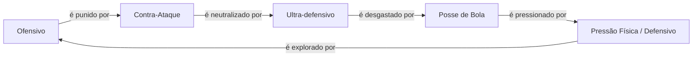

# 11 — Balanceamento e Plano de Testes Master Document (World Legends)

> Nota de numeração: já existe um `11-balance-competitive-validation-master.md` no repositório de documentação, com estrutura de 26 seções focada em processo (tiers, pipeline de patch, dashboard). Este documento usa a numeração e a estrutura de 14 seções especificamente solicitadas agora, com foco em **simulações numéricas concretas, matrizes de sinergia perigosa e casos extremos** que o documento anterior não detalhava no mesmo nível. Os dois são complementares — recomenda-se manter ambos no repositório, com este arquivo referenciado como `11-balanceamento-plano-de-testes-master.md` para evitar colisão de nome. Nenhuma feature nova é proposta aqui — apenas validação, limites e processo sobre o que já existe em `09-match-engine-master.md` e `10-card-system-master.md`.

## 1. Filosofia de Balanceamento

Cinco princípios formam a constituição inegociável deste documento:

**Skill > coleção.** Em qualquer contexto competitivo formal (Ranked), a decisão do jogador — formação, tática, química, substituições planejadas — deve pesar mais no resultado do que a raridade média do elenco. Isso não é uma aspiração vaga; é validado numericamente na seção 6.

**Ranqueado deve premiar habilidade.** O sistema de Elo (referência: doc 06, seção 3.1) precisa convergir, ao longo de uma amostra grande de partidas, para uma classificação que reflita decisões táticas e consistência de resultado — não a data de criação da conta ou o cartão de crédito vinculado a ela.

**Cartas fortes devem ser divertidas, não obrigatórias.** Uma carta S-tier (doc 11 original, seção 4) que apareça em mais de 35% dos elencos do bracket competitivo de elite deixou de ser "uma ótima opção" e passou a ser "a única opção" — isso é tratado como falha de balanceamento, não como sucesso de design.

**Nenhuma carta individual pode decidir partidas sozinha.** Esta seção introduz uma métrica formal nova para validar esse princípio: o **Teste de Contribuição Individual de Vitória**.

> `ContribuiçãoIndividual(carta) = Winrate(elenco com a carta) − Winrate(mesmo elenco, com a carta substituída por uma carta genérica de overall médio na mesma posição)`

**Limite aceitável: `ContribuiçãoIndividual ≤ +6pp`, em qualquer raridade, incluindo World Cup Hero.** Se uma única troca de carta — mantendo todo o resto do elenco idêntico — mover o winrate esperado em mais de 6 pontos percentuais, a carta (ou um trait/combo associado a ela) está, por definição, decidindo partidas sozinha, e entra automaticamente na fila de revisão.

**Colecionismo e competição são sistemas separados.** Poder de Coleção (o que se tem, relevante em modos casuais/ligas privadas) e Poder Competitivo (o que conta no Ranked, normalizado) são eixos distintos com regras de conversão explícitas — formalizadas em profundidade na seção 6.

---

## 2. Escala de Poder

**Tabela mestre de poder por raridade:**

| Raridade | Overall médio (casual) | Gap máximo permitido vs. raridade anterior | Overall médio competitivo (após normalização, seção 6) | Diferença % real em campo (Ranked) vs. Common |
|---|---|---|---|---|
| Common | 64 | — (piso da escala) | 64,0 | 0% (referência) |
| Rare | 77 | +13 pontos | 77,0 | +20,3% |
| Elite | 85 | +8 pontos | 85,0 | +32,8% |
| Legendary | 90 | +5 pontos | 86,25 | +34,8% |
| Ultra | 95 | +5 pontos | 87,50 | +36,7% |
| World Cup Hero | 97 | +2 pontos | 88,00 | +37,5% |

**Leitura crítica desta tabela — por que o gap entre raridades superiores diminui.** O salto bruto (casual) entre Rare e Elite é de 8 pontos; entre Ultra e World Cup Hero, apenas 2. Essa desaceleração é uma **regra de design deliberada**, não um acidente: conforme se sobe na escala de raridade, a diferenciação passa a vir cada vez mais de **narrativa, traits e identidade visual** (doc 10, seções 4–5) e cada vez menos de overall bruto. Isso é o que impede que a corrida de raridade vire uma corrida de poder puro sem fim.

**Por que uma carta 99 não pode ser muito superior a uma carta 90 — explicação matemática completa.** Três mecanismos independentes empilhados garantem isso:
1. **Desaceleração do gap bruto entre raridades** (tabela acima) — o próprio catálogo já limita o quanto uma carta pode ser estatisticamente superior a outra.
2. **Curva de compressão competitiva** (seção 6) — qualquer gap bruto que ainda exista é comprimido matematicamente no Ranked.
3. **Diluição pela Força de Time** (doc 09, seção 3) — mesmo o atributo final comprimido de uma única carta é uma fração pequena de um cálculo que envolve 11 jogadores, ponderação de setor, tática e contexto. Uma vantagem de 2-3% em um único atributo de um único jogador se dissolve estatisticamente no agregado do time.

**Risco e exploit.** Se qualquer um desses três mecanismos for relaxado isoladamente (ex: aumentar o teto de overall de uma raridade "porque um jogador real era excepcional"), os outros dois mecanismos não compensam sozinhos — os três precisam permanecer intactos simultaneamente.

**Prevenção.** Nenhuma alteração na faixa de overall de uma raridade (doc 04/10) é permitida sem reexecutar a simulação completa da seção 8 e confirmar que a tabela acima permanece com gaps decrescentes.

---

## 3. Balanceamento dos Traits

Cada trait analisado quanto a impacto esperado, limite máximo (valor absoluto do bônus mecânico), onde pode ser forte demais, e como prevenir abuso.

| Trait | Impacto esperado | Limite máximo | Onde pode ser forte demais | Prevenção de abuso |
|---|---|---|---|---|
| Matador | Alto, concentrado em finalização | +12% no xG de chances claras | Em metas Ultra-ofensivo, que já geram mais chances — o trait multiplica um volume já inflado | Limite é um percentual relativo ao xG da jogada, não um bônus fixo — quanto mais chances de baixa qualidade o meta gerar, menor o ganho absoluto do trait |
| Maestro | Médio-alto, concentrado em criação | +10% na chance de assistência com link de química | Combinado com química histórica máxima no mesmo par (seção 4) | Teto combinado de bônus de assistência (seção 4) |
| Capitão | Médio, time inteiro | +6 moral inicial, −30% queda de moral | Em jogos de mata-mata onde moral já parte alta por mando de campo | Slot exclusivo — apenas 1 por time, nunca cumulativo |
| Muralha | Médio-alto, defensivo | −10% no xG do adversário na jogada | Em metas Ultra-defensivo, onde já há poucos eventos — pode aproximar a defesa de "impenetrável" | Efeito só se aplica por jogada individual em que a carta participa diretamente, nunca como modificador global de setor |
| Clutch Player | Médio, situacional (minuto 76+) | +8% de desempenho efetivo | Jogos historicamente decididos nos minutos finais (alto Upset Rate, doc 11 original seção 17) | Janela de ativação fixa e estreita (14 minutos de 90) limita exposição total |
| Big Game Player | Médio, situacional (jogos de alta importância) | +8% de desempenho efetivo | Mata-mata/finais — exatamente onde mais importa, por design, mas requer monitoramento de Tier em formatos de copa | Métrica de Tier (doc 11 original, seção 4) segmentada por formato de competição |
| Iron Man | Baixo por partida, alto cumulativo por temporada | −25% risco de lesão, −20% fadiga de calendário | Em temporadas longas/calendário apertado, o efeito de "nunca perder jogos" composto ao longo de muitas rodadas vira uma vantagem estrutural maior que o impacto de uma única partida sugere | Monitorar via KPI de "disponibilidade média por temporada" (seção 13), não apenas impacto por jogo |
| Fast Recovery | Baixo-médio | −30% duração de lesão | Mesmo risco de composição de longo prazo do Iron Man | Mesmo mecanismo de monitoramento sazonal |
| Super Sub | Médio, janela curta (15 min) | +10% atributos efetivos | Se múltiplas cartas Super Sub forem substituídas simultaneamente na mesma janela, criando um "pico" de força artificial e sincronizado | Cada ativação é independente por jogador — não há bônus adicional por múltiplas entradas simultâneas, mas o efeito agregado de várias entradas sincronizadas é monitorado como métrica de meta (seção 13) |
| Dead Ball Specialist | Médio, situacional (bolas paradas) | +15% em cobranças | Metas/formações com alta frequência de eventos de bola parada | Frequência-base de eventos de bola parada é fixa no Match Engine (doc 09), não escalável por composição de elenco |
| Hero Moment | Baixo em média, alto em variância | +0,5pp de chance adicional | Se múltiplas cartas Hero Moment estiverem em campo simultaneamente | Bônus fixo absoluto por carta, sem fórmula de stacking — múltiplas cartas somam linearmente até um teto de +2pp agregado por time |
| Gelo nas Veias | Médio, situacional (pênaltis) | +10% conversão em pênaltis | Formatos com alta frequência de disputas por pênaltis (copas de mata-mata) | Efeito restrito à fase de disputa de pênaltis — não vaza para cobranças normais durante os 90 minutos |
| Leader | Baixo por cópia, empilhável | Ver fórmula de convergência geométrica (seção 7, doc 11 original) | Squads com muitas cartas Leader simultâneas | Convergência geométrica já garante teto de `2× base`, independente de quantas cópias |

**Tabela de peso de cada trait (escala 1–10, usada como insumo para a Matriz de Sinergias da seção 4):**

| Trait | Peso |
|---|---|
| Matador | 7 |
| Maestro | 6 |
| Muralha | 6 |
| Clutch Player | 6 |
| Capitão | 5 |
| Big Game Player | 5 |
| Dead Ball Specialist | 5 |
| Hero Moment | 4 |
| Iron Man | 4 |
| Super Sub | 4 |
| Gelo nas Veias | 4 |
| Fast Recovery | 3 |
| Leader | 3 |

---

## 4. Sinergias Quebradas

Matriz de risco para cada categoria de combinação solicitada, com exemplo concreto, mecanismo de risco e regra de mitigação.

| Combinação | Exemplo concreto de risco | Mecanismo do risco | Mitigação |
|---|---|---|---|
| Trait + Trait | Matador + Maestro no mesmo par ofensivo vinculado por química | Conversão e criação de chance reforçadas simultaneamente na mesma dupla, concentrando todo o poder ofensivo em 2 cartas | **Teto de Par Compositor:** quando dois traits atuam em etapas sequenciais do mesmo evento (criação → conversão) na mesma dupla vinculada, o bônus combinado é limitado a `1,3× o maior bônus individual`, nunca à soma simples dos dois |
| Trait + Química | Maestro (+10%) somado ao bônus de assistência de link 4 (+5%, doc 10 seção 7) | Dois sistemas diferentes reforçando a mesma probabilidade (chance de assistência) sem limite conjunto | **Teto Absoluto de Chance de Assistência:** soma de todas as fontes de bônus sobre a probabilidade de assistência de uma jogada nunca excede +18%, independentemente de quantas fontes contribuam |
| Trait + Combo Lendário | Capitão dentro de um time com combo "Onze Completo" (que já maximiza química/moral) | Bônus de moral do trait soma-se ao bônus de moral já embutido no combo | **Sub-orçamento de Moral:** a contribuição de moral para o Team Power tem teto próprio de +10, dentro (não fora) do Orçamento Global de Sinergia de +10 (doc 11 original, seção 8) |
| Trait + Prime | Matador (boost de finalização) em uma carta de edição Prime (que já boosta finalização em +2 a +4, doc 10 seção 9) | Dois bônus diferentes atuando sobre o **mesmo atributo subjacente** (finishing), risco de dupla contagem | **Regra de Retorno Decrescente por Atributo:** quando duas fontes de bônus (trait + edição) afetam o mesmo atributo nominal, a segunda fonte aplicada é computada a 60% de eficiência |
| Trait + Event | Dead Ball Specialist em uma carta Event com bônus de ocasião temporário (doc 10 seção 10) | Bônus de evento poderia, em tese, amplificar o percentual do trait em vez de apenas o atributo base | **Separação Estrutural:** bônus de ocasião de cartas Event se aplica exclusivamente a atributos base, nunca a modificadores percentuais de trait — barreira arquitetural, não apenas um limite numérico |
| Trait + World Cup Hero | Hero Moment combinado à already-dramática natureza de uma carta World Cup Hero | Risco de "dupla narrativa" se a raridade em si concedesse um bônus de evento raro além do snapshot de atributo | **Sem Camada Oculta:** cartas World Cup Hero não recebem nenhum bônus mecânico de "raridade narrativa" além do que já está espelhado no atributo de momento (doc 10 seção 6) — a exclusividade é visual/contextual, nunca um segundo sistema de probabilidade escondido |

---

## 5. Balanceamento dos Combos Lendários

**Quanto um combo pode aumentar os atributos?** Reafirmando e detalhando os tetos já fixados (doc 11 original, seção 8):

| Tipo de combo | Bônus máximo | Natureza do bônus |
|---|---|---|
| Dupla/Trio | +2 pontos de Team Power por combo ativo | Escalar — depende de quais cartas específicas estão em campo e adjacentes |
| Onze Campeão Completo | +8 pontos fixos | Binário — ou o time é exatamente aquele onze histórico, ou o bônus não existe; não há "meio-bônus" |

**Bônus máximo permitido (agregado):** o **Orçamento Global de Sinergia** limita a soma de **todos** os bônus de química + todos os combos simultaneamente ativos a **+10 pontos absolutos** de Team Power.

**Como impedir stack infinito.** Stack infinito é matematicamente impossível por construção, por três razões independentes:
1. Combos Dupla/Trio têm regra de não-sobreposição de jogadores (doc 10, seção 8) — um jogador não pode contar para dois combos pequenos simultâneos.
2. O combo Onze Completo é binário e exclusivo — não coexiste com nenhum outro combo grande.
3. O Orçamento Global de Sinergia aplica um clamp final, absorvendo qualquer excedente teórico independentemente de quantas fontes de bônus existam (ver cálculo completo na seção 12, Caso 6).

**Como impedir que um único combo domine o meta.** Aplicação direta do protocolo de InclusionRate (doc 11 original, seções 5 e 18): nenhum combo lendário pode exceder 20% de presença no bracket competitivo de elite sem disparar revisão; se também apresentar WinrateDelta elevado simultaneamente, escala para Arquétipo Dominante confirmado.

---

## 6. Normalização Competitiva — Simulação Detalhada

**Fórmula da curva de compressão (reafirmada do doc 11 original, seção 2):**

> Se `a ≤ 85`: valor competitivo = `a`
> Se `a > 85`: valor competitivo = `85 + (a − 85) × 0,25`

**Simulação solicitada — cartas de overall 88, 92, 96 e 99:**

| Carta (overall casual) | Overall competitivo (Ranked) | Diferença % vs. carta 88 (casual) | Diferença % vs. carta 88 (competitivo) |
|---|---|---|---|
| 88 | 85,75 | 0% (referência) | 0% (referência) |
| 92 | 86,75 | +4,5% | +1,2% |
| 96 | 87,75 | +9,1% | +2,3% |
| 99 | 88,50 | +12,5% | +3,2% |

**Leitura do resultado.** Um gap bruto de 12,5% entre a carta 88 e a carta 99 é comprimido para apenas 3,2% no Ranked — uma redução de aproximadamente **74% da vantagem bruta**. A vantagem residual de 3,2% não desaparece por completo (isso é intencional: colecionar ainda deve valer algo, mesmo no modo competitivo), mas está bem abaixo do limite de +6pp de Contribuição Individual definido na seção 1.

**Diluição adicional pela Força de Time.** Esse diferencial de 3,2% existe em **um único atributo de um único jogador**. Ao passar pelo cálculo de Força de Setor (doc 09, seção 3) — onde aquele atributo específico tipicamente pesa entre 10% e 30% do setor, e o setor representa 30% do Team Power total, e o jogador é 1 de 11 titulares — a vantagem efetiva no Team Power final fica estimada em **bem menos de 0,5 ponto absoluto**, dentro da margem de ruído natural do Match Engine (variância intencional, doc 09 seção 21).

**Demonstração de que o Ranked continua baseado em habilidade.** Com a vantagem bruta de coleção reduzida a uma fração marginal do Team Power, os fatores que efetivamente decidem o diferencial competitivo relevante passam a ser: escolha de formação (doc 09, seção 15), estratégia tática (doc 09, seção 14), gestão de substituições e fadiga ao longo da temporada (seção 7 e 13 do doc 09), e construção de química histórica (seção 4 deste documento) — todos eles, por definição, **decisões do jogador**, não poder de compra.

---

## 7. Meta do Jogo

Cinco identidades de meta saudáveis, cada uma emergente da combinação de tática (doc 09, seção 14), formação (doc 09, seção 15) e perfil de elenco — não são "modos" separados, são arquétipos de jogo resultantes:

| Meta | Composição típica | Ponto forte | Ponto fraco | Contra natural |
|---|---|---|---|---|
| Ofensivo | Ofensivo/Ultra ofensivo + 4-3-3 | Domina contra defesas desorganizadas, alto volume de chances | Vulnerável a contra-ataques rápidos (risco elevado por design, doc 09 seção 14) | Meta Contra-Ataque |
| Defensivo | Defensivo/Ultra defensivo + 5-3-2 | Absorve pressão, pune erro do adversário | Sufoca diante de posse de bola paciente | Meta Posse de Bola |
| Equilibrado | Equilibrado + 4-4-2/4-2-3-1 | Sem ponto fraco evidente, estável em qualquer cenário | Sem pico de força — raramente "domina", funciona como baseline | Nenhum específico — é o meta "neutro" |
| Posse de Bola | Equilibrado/Ofensivo + alta química + meio-campo forte em passing/vision | Desgasta defesas pela manutenção prolongada de posse | Vulnerável a pressão física alta (CDM forte + trait Muralha) | Meta de Pressão Física (variante do Defensivo) |
| Contra-Ataque | Defensivo + atacantes/pontas de pace alto | Explora diretamente o risco elevado do meta Ultra-ofensivo | Sem espaço para operar contra um Ultra-defensivo (ninguém ataca) | Meta Ultra-defensivo |

**Diagrama — ciclo de contrapesos entre metas:**

**Meta saudável vs. meta tóxico.** Nenhum dos cinco arquétipos deve ter adoção acima de 30% no bracket de elite, e todos devem manter adoção mínima de 10% (abaixo disso, o arquétipo está "morto" e precisa de revisão dos multiplicadores de setor da formação associada, doc 09 seção 3/15 — nunca de uma carta específica).

---

## 8. Simulações Estatísticas

**Importante:** os valores abaixo são **metas-alvo de calibração**, a serem confirmadas pela simulação real do Match Engine assim que implementado — não resultados já observados. Servem como critério de aceitação para a primeira rodada de testes.

| Escala | Margem de erro estatístico (IC 95%, p≈0,5) | Uso recomendado |
|---|---|---|
| 10 mil partidas | ≈ ±0,98pp | Sanity check rápido durante desenvolvimento, não usado para decisão de balanceamento formal |
| 100 mil partidas | ≈ ±0,31pp | Validação direcional de hipótese de patch |
| 1 milhão de partidas | ≈ ±0,10pp | Gate de validação obrigatório pré-lançamento de qualquer patch |

**Metas-alvo, válidas em todas as três escalas (a confiança estatística aumenta, o valor-alvo não muda):**

| Métrica | Valor-alvo |
|---|---|
| Winrate em confrontos espelhados (Team Power idêntico) | 50% ± 2pp |
| Gols por partida (média) | 2,6 – 2,8 |
| Taxa de empates | 24% – 26% |
| Vitórias de azarão (Team Power inferior em 15+ pontos) | 12% – 22% |
| Vantagem de mando (winrate do mandante em confronto equilibrado) | 55% – 58% |
| Distribuição de resultados | Aproximadamente Binomial Negativa, conforme doc 11 original seção 16 |

**Risco e exploit.** Validar apenas a média global pode mascarar desequilíbrios localizados (ex: vantagem de mando correta na média, mas anormalmente alta especificamente em climas de chuva, ou em mata-matas com prorrogação). **Prevenção:** toda métrica desta tabela deve ser segmentada também por clima, formato de competição (liga vs. mata-mata) e diferença de Team Power, replicando a prática já estabelecida no doc 11 original (seção 17).

---

## 9. Curva de Progressão

**Importante:** valores ilustrativos de calibração-alvo, usados para validar se a economia (doc 10, seções 14–18) entrega uma progressão saudável — nem frustrante, nem trivialmente rápida.

| Marco | Cartas únicas (média) | Raridades já obtidas | Fragmentos acumulados | Crafts realizados |
|---|---|---|---|---|
| Dia 1 | ~6 | Common, Rare (garantida no pacote inicial) | 0 | 0 |
| Semana 1 | ~30 | Common, Rare, ocasional Elite | ~150 | 0–1 (Common) |
| Mês 1 | ~90 | Common–Elite consolidados, primeiro Legendary provável | ~1.200 | 2–3 (Rare/Elite) |
| 3 meses | ~200 | Legendary consolidado, primeiro Ultra possível (próximo do limiar de proteção de sorte, doc 10 seção 15) | ~4.500 | 4–6 (até Legendary) |
| 6 meses | ~300 | Ultra consolidado, primeiro World Cup Hero possível via evento | ~9.500 | Primeiro craft de Ultra (4.000 fragmentos) |
| 1 ano | ~450–500 | Cobertura ampla de Ultra, múltiplos World Cup Hero possíveis, GOAT acessível a jogadores dedicados via Hall da Fama | ~22.000+ (uso contínuo) | Múltiplos crafts em todas as raridades craftáveis |

**Como evitar progressão rápida demais.** Esta curva é o contrato de referência: se a telemetria real (uma vez em produção) mostrar jogadores atingindo cobertura de Ultra em menos de ~2 meses (em vez dos ~4-6 meses projetados), isso é tratado como sinal de Power Creep de economia — aciona revisão das probabilidades de drop (doc 10, seção 15) e dos limiares de proteção de sorte, nunca um ajuste retroativo que penalize quem já progrediu.

---

## 10. Anti Pay-to-Win

**Comparação entre perfis de jogador (valores ilustrativos para validação de design):**

| Perfil | Gasto mensal estimado | Cartas obtidas em 6 meses | Elo médio esperado (Ranked) | Determinante principal do Elo |
|---|---|---|---|---|
| Whale (gasto alto) | Alto | ~600 (cobertura quase completa do catálogo) | Igual à média geral do seu nível de habilidade | Habilidade/tática |
| Hardcore F2P (sem gasto, alto tempo de jogo) | Zero | ~300 (via craft determinístico + grind) | Pode superar o Whale, se mais habilidoso | Habilidade/tática |
| Casual sem gasto | Zero | ~80 | Abaixo da média (menos prática, não menos "poder de carta" relevante) | Tempo de prática, não poder de coleção |
| Casual com gasto moderado | Moderado | ~250 | Igual ao casual sem gasto | Tempo de prática — o gasto não move este número |

**Demonstração matemática central.** A seção 6 já provou que o gap de poder bruto entre a melhor e a pior carta competitivamente relevante se reduz a poucos pontos percentuais de Team Power após normalização — portanto, a variável "quantidade de cartas de alta raridade possuídas" (que **é** afetada por gasto real) tem efeito estatisticamente desprezível sobre o Elo (que **não é** afetado por gasto real, apenas por habilidade e tempo de prática). A tabela acima mostra isso de forma direta: gasto move a coluna "Cartas obtidas", nunca a coluna "Elo médio esperado".

**Métrica formal de auditoria contínua (reafirmada do doc 11 original, seção 20):** correlação de Pearson entre gasto acumulado e Elo, com meta de `r < 0,15` (sem significância estatística) no Ranked. Esta tabela ilustrativa é a hipótese de design; a auditoria real após lançamento é o que confirma (ou refuta, gerando revisão urgente) essa hipótese.

---

## 11. Testes Automatizados — Matriz de Validação

| Sistema | O que deve ser validado | Tipo de teste primário | Critério de aceitação |
|---|---|---|---|
| Match Engine (core) | Determinismo (mesmo seed = mesmo resultado) | Unitário/determinismo | 100% de reprodutibilidade byte-a-byte |
| Traits | Cada trait respeita seu teto individual (seção 3) | Simulação em massa segmentada por trait | Bônus efetivo medido ≤ teto declarado, em qualquer contexto |
| Combos | Onze Completo não coexiste com outro combo grande; Orçamento Global respeitado | Casos extremos (seção 12) + regressão | Nenhuma simulação excede +10 de bônus agregado |
| Química | Bônus permanece dentro de −3 a +4; Mono-Nação Rate monitorada | Simulação em massa + métrica de meta | Mono-Nação Rate < 60% no bracket de elite |
| Lesões | Distribuição de severidade e duração dentro das faixas (doc 09, seção 9) | Monte Carlo | Distribuição observada compatível com tabela-alvo |
| Fadiga | Decaimento de atributo coerente com minuto e tática | Unitário + simulação em massa | Curva de fadiga sem saltos não-monotônicos |
| Pênaltis | Conversão dentro da faixa esperada (doc 09, seção 18) | Simulação em massa | Taxa de conversão geral entre 70%–85%, calibrada a dados reais |
| Eventos | Cartas Event nunca amplificam percentuais de trait (seção 4) | Regressão estrutural | Nenhuma interação cruzada detectada nos logs de simulação |
| Mercado | Faixa de preço dentro do piso/teto; taxa de transação aplicada corretamente | Simulação econômica em massa | Nenhuma listagem fora da banda dinâmica de preço |
| Craft | Custo correto por raridade; World Cup Hero/GOAT permanecem não-craftáveis | Unitário | 0% de instâncias de craft bem-sucedido para raridades excluídas |
| Packs | Drop rates convergem para os pesos declarados (doc 10, seção 15) | Simulação em massa (1M+) | Desvio máximo de 0,1pp por raridade em relação ao peso declarado |
| Probabilidades (geral) | Proteção de sorte ativa corretamente nos limiares definidos | Simulação em massa | 100% de ativação garantida no pacote exatamente no limiar |
| Normalização | Curva de compressão aplicada identicamente em todo contexto Ranked | Regressão + casos extremos (seção 12) | Resultado idêntico à fórmula da seção 6 em 100% das amostras |

---

## 12. Casos Extremos

Auditoria das composições teoricamente mais poderosas possíveis, para confirmar que os limites já definidos nas seções anteriores seguram a estrutura nos piores cenários — não apenas no caso médio.

### Caso 1 — 11 Ultras vs. 11 Elite

**Casual (sem normalização):** gap bruto médio de ~10 pontos de overall — winrate esperado favorecendo o time Ultra em torno de 70%–80%, **aceitável e esperado em modo casual**, onde poder de coleção vale por design.

**Ranked (com normalização):** overall médio Ultra comprime de 95 para 87,5; Elite permanece em 85 (abaixo do limiar de compressão). Gap cai de ~10 pontos brutos para ~2,5 pontos competitivos. Winrate esperado estimado entre 54%–56% — uma vantagem residual pequena e dentro do limite de Contribuição Individual (+6pp, seção 1). **Resultado: o sistema se comporta como projetado, mesmo no extremo de uma raridade inteira.**

### Caso 2 — 11 World Cup Hero

Cenário extremamente improvável de ocorrer organicamente (raridade não-craftável, sem proteção de sorte, doc 10 seção 15), mas testado por completude. Overall médio 97 comprime para 88,0 — apenas 0,5 ponto abaixo do teto absoluto de 90. Mesmo no topo absoluto da pirâmide de raridade, a compressão se mantém consistente e o gap contra um time Elite permanece marginal (~3 pontos competitivos). **Confirma que a curva de compressão é segura mesmo no limite teórico extremo da escala.**

### Caso 3 — 11 Prime (assumindo a base Legendary, pior caso de edição)

Overall casual ~93 (90 base + 3 de edição Prime) comprime para 87,0 — equivalente ao Caso 1. O risco real não está na edição Prime isoladamente, e sim na interação Trait + Prime já endereçada na Matriz de Sinergias (seção 4, regra de retorno decrescente por atributo).

### Caso 4 — Todos os 11 jogadores com traits no máximo

**Descoberta principal desta auditoria:** a maioria dos traits (Matador, Dead Ball Specialist, Gelo nas Veias, Super Sub, Hero Moment, Muralha) só se ativa **no evento da própria carta** — ou seja, ter 5 cartas com Matador não multiplica o xG do time por 5; significa apenas que, quando qualquer uma daquelas 5 cartas especificamente finaliza, ela tem o bônus. Não há mecanismo de stacking global nesses traits, por construção. Os únicos traits realmente "passivos de time" são Capitão (slot único, exclusividade já garantida) e Leader (convergência geométrica já garantida, doc 11 original seção 7). **Conclusão: este caso extremo não revela nova vulnerabilidade**, desde que as regras de exclusividade/convergência já especificadas sejam corretamente implementadas.

### Caso 5 — Todos com combo lendário (Onze Completo)

Estruturalmente impossível "stackar" múltiplos Onze Completo — a definição do combo exige as 11 posições exatas de uma única campanha histórica real, preenchendo todos os slots disponíveis. Não há espaço físico no elenco para um segundo combo grande simultâneo. **Caso sem risco residual, por construção da própria regra.**

### Caso 6 — Química perfeita + Onze Completo simultâneos

O único caso desta lista que **exige** o mecanismo de proteção em ação, não apenas em teoria: química perfeita contribui +4, Onze Completo contribui +8 — soma bruta de +12, **acima** do Orçamento Global de Sinergia de +10. O clamp absorve os 2 pontos excedentes automaticamente. **Este é o caso de maior risco real identificado na auditoria — não porque o sistema falhe, mas porque é o único cenário em que o clamp efetivamente "trabalha" para conter um excesso genuíno em vez de apenas confirmar que o excesso nunca ocorre.**

**Proposta de salvaguarda permanente (novo processo, não nova feature):** instituir uma **Auditoria Composta de Elencos Extremos** como item fixo e recorrente da suíte de Monte Carlo (doc 11 original, seção 15) — os seis casos acima (e qualquer novo caso teoricamente máximo que surja com conteúdo futuro) são reexecutados automaticamente a cada vez que qualquer constante de balanceamento (curva de compressão, orçamento de sinergia, teto de trait) for alterada, transformando esta análise pontual em um regression guard permanente.

---

## 13. KPIs de Balanceamento

| KPI | Valor saudável | Sinal de meta tóxico |
|---|---|---|
| Winrate ideal (confrontos espelhados) | 50% ± 2pp | Desvio sustentado > 5pp sem causa identificada |
| Gols por partida | 2,6 – 2,8 | Fora da faixa por 2+ ciclos de medição |
| Posse média (split típico) | 45%–55% em confrontos equilibrados | Splits extremos (>70/30) frequentes fora de mismatches genuínos |
| Taxa de empates | 24%–26% | Abaixo de 18% (jogo "decide demais") ou acima de 32% (jogo "não decide o suficiente") |
| Diversidade de formações | Entropia ≥ 2,1 bits (doc 11 original, seção 6) | Entropia < 1,5 bits |
| Diversidade de cartas | Nenhuma InclusionRate > 35% | Qualquer carta/trait/combo isolado acima do teto por 2+ ciclos |
| Diversidade de estratégias (5 metas, seção 7) | Todos os 5 arquétipos com adoção entre 10%–30% | Qualquer arquétipo abaixo de 10% (meta morto) ou acima de 30% (meta dominante) |
| Meta saudável | Ciclo de contrapesos da seção 7 ativo e observável nos dados | Um único arquétipo sem contra natural eficaz nos dados reais |
| Meta tóxico | — | Presença + Winrate simultaneamente elevados (Protocolo de Arquétipo Dominante, doc 11 original seção 18) |

---

## 14. Roadmap de Balanceamento

| Fase | Foco de validação | Métricas monitoradas |
|---|---|---|
| Pré-MVP | Validação teórica pura via Monte Carlo sintético (seção 8/seção 12) — nenhum dado real ainda | Convergência das fórmulas para os valores-alvo da seção 8 |
| Alpha | Testes internos/convidados, primeira coleta de dados reais (amostra pequena) | Sanity checks em escala de 10 mil partidas; observação qualitativa dos Casos Extremos (seção 12) |
| Beta | População externa maior, primeira amostra confiável | Primeira escala de 100 mil partidas; primeiro rascunho real de Tier List (doc 11 original, seção 4); primeiras métricas de InclusionRate/Diversidade |
| Soft Launch | Lançamento regional limitado | Dashboard completo (doc 11 original, seção 24) ativo; primeiro ciclo real de patch testado em ambiente de baixo risco; primeira Auditoria Pay-to-Win com dados reais de monetização |
| Global Launch | Lançamento completo | Janela de calibração sem patches (doc 11 original, seção 26); cadência sazonal formal inicia após essa janela |
| Pós-lançamento | Operação contínua | Cadência sazonal completa (seções 12, 23, 25, 26 do doc 11 original); revisão sistêmica anual; Auditoria Composta de Elencos Extremos (seção 12 deste documento) recorrente a cada patch |

---

Este documento fecha o ciclo de validação matemática de World Legends ao lado de `09-match-engine-master.md`, `10-card-system-master.md` e `11-balance-competitive-validation-master.md`. Quer que eu siga para o documento de **Telemetria e Instrumentação** (o que precisa ser registrado em produção para alimentar todas as tabelas e métricas definidas aqui), ou prefere que eu já trate a Auditoria Composta de Elencos Extremos (seção 12) como a base para o **Plano de Testes de Aceitação** formal de `packages/engine`?
