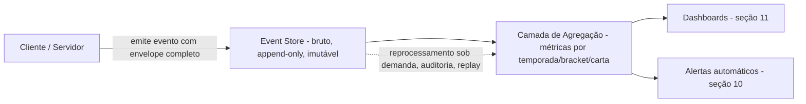

# 12 — Telemetria e Instrumentação Master Document (World Legends)

> Especificação pura — sem código, sem SQL. Define o que precisa ser observável em produção para que `09-match-engine-master.md`, `10-card-system-master.md`, `11-balance-competitive-validation-master.md` e `11-balanceamento-plano-de-testes-master.md` deixem de ser teoria e se tornem processo operacional real, auditável por anos.

## 1. Filosofia de Telemetria

**Toda decisão de balanceamento deve ser baseada em dados.** Nenhuma fórmula, teto ou limiar definido nos documentos anteriores tem valor prático se não existir um evento correspondente registrado em produção capaz de validá-lo ou refutá-lo.

**Nenhum sistema importante deve ser uma caixa-preta.** Traits, combos, química e normalização competitiva são sistemas com efeitos compostos e interdependentes (doc 11, seção 4) — se a ativação de cada um não for individualmente registrável, é impossível distinguir qual peça causou um desvio de meta.

**O jogo precisa ser observável, não apenas jogável.** Observabilidade significa que qualquer pergunta razoável sobre o estado do jogo ("essa carta está quebrada?", "esse evento sazonal inflacionou a economia?") deve ter resposta nos dados já coletados, sem precisar instrumentar algo novo depois do fato.

**Telemetria não deve depender de logs manuais.** Todo evento relevante é emitido automaticamente pelo sistema que o gera (Match Engine, economia, mercado) no momento em que ocorre — never via planilha, relato de suporte ou amostragem manual como fonte primária de verdade.

**Métricas devem ser reproduzíveis.** Como o Match Engine é determinístico por seed (doc 09, seção 21), todo evento de partida registra `seed` e `engine_version` — qualquer métrica derivada pode, em princípio, ser auditada e recalculada a partir do evento bruto, não apenas confiada como um número já agregado.

---

## 2. Eventos Registrados

### 2.1 Sessão

| Evento | Disparado quando | Payload conceitual | Alimenta |
|---|---|---|---|
| `session_login` | Usuário autentica com sucesso | timestamp, dispositivo, build, região | DAU/MAU (seção 14) |
| `session_logout` | Sessão é encerrada (ativa ou por timeout) | duração da sessão | Tempo médio de sessão (seção 8) |
| `session_heartbeat` | Periódico durante sessão ativa | tempo online acumulado | Tempo online, detecção de bots (seção 10) |
| `session_daily_streak` | Calculado ao login | dias consecutivos | Retenção (seção 8), funil (seção 9) |
| `session_count_daily` | Agregado diário por usuário | sessões no dia | Engajamento (seção 14) |

### 2.2 Partidas

| Evento | Disparado quando | Payload conceitual | Alimenta |
|---|---|---|---|
| `match_started` | Início da simulação | seed, engine_version, modo, formato, squads envolvidos | Reprodutibilidade (seção 1) |
| `match_ended` | Simulação concluída | placar final, duração efetiva, status (normal/prorrogação/pênaltis) | Métricas do Match Engine (seção 4) |
| `match_lineup_submitted` | Escalação confirmada pelo usuário | formação, titulares, banco, capitão | Meta Analytics (seção 6) |
| `match_substitution` | Substituição ocorre (planejada ou forçada) | minuto, jogador saiu/entrou, gatilho | Telemetria do Match Engine (seção 4) |
| `match_foul` | Falta ocorre | minuto, autor, perfil de árbitro | Estatísticas de partida |
| `match_card` | Cartão aplicado | tipo (amarelo/vermelho), motivo (direto/2º amarelo) | Cartões (seção 4) |
| `match_penalty` | Pênalti marcado/cobrado | cobrador, goleiro, resultado | Chance de pênalti (doc 09, seção 18) |
| `match_injury` | Lesão ocorre | jogador, severidade, dias estimados | Lesões (seção 4) |
| `match_extra_time_triggered` | Prorrogação iniciada | motivo (mata-mata empatado) | Prorrogação (doc 09, seção 19) |
| `match_penalty_shootout` | Disputa de pênaltis ocorre | sequência completa, resultado, `rodadas_totais`, `desempate_por_seed` [DD-02] | Disputa de pênaltis (doc 09, seção 20/20.1) |
| `match_walkover` [DD-01] | Equipe cai abaixo de 7 jogadores em campo (doc 09, seção 12.1) | `lado_afetado`, `minuto_da_interrupcao`, `jogadores_restantes`, `motivo: "insuficiência de elenco"` | Taxa de W.O. (seção 4), Alertas (seção 10) |
| `match_xg_snapshot` | A cada chance resolvida | valor de xG calculado, lado, jogador | xG agregado (seção 4) |
| `match_possession_tick` | Por minuto simulado | lado favorecido no minuto | Posse média (seção 4) |
| `match_mvp_assigned` | Pós-jogo | jogador eleito MVP, critério | Telemetria de cartas fortes (seção 5) |

### 2.3 Match Engine (granularidade de jogada)

| Evento | Disparado quando | Payload conceitual | Alimenta |
|---|---|---|---|
| `engine_play_resolved` | Cada jogada simulada (chance, falta, escanteio, disputa) | tipo, lado, jogadores envolvidos, resultado | Telemetria geral do engine |
| `engine_shot_resolved` | Finalização ocorre | xG, resultado (gol/defesa/fora) | Eficiência ofensiva (seção 4) |
| `engine_assist_resolved` | Assistência ocorre | jogador, link de química envolvido (se houver) | Maestro/química (seção 5) |
| `engine_hero_moment_triggered` | Evento raro de "momento heroico" dispara | jogador, contexto (minuto, placar) | Hero Moment (seção 5) |
| `engine_trait_activated` | Qualquer trait dispara seu efeito mecânico | trait, jogador, magnitude aplicada | Telemetria dos traits (seção 5) |
| `engine_combo_activated` | Combo lendário reconhecido no início da partida | combo, jogadores envolvidos, bônus aplicado | Combos (seção 6) |
| `engine_chemistry_calculated` | Início da partida | quimica_score, distribuição de links | Química histórica (seção 5) |
| `engine_clutch_event` | Evento ocorre em janela "clutch" (76'+, decisivo) | tipo de evento, jogador | Clutch Player (seção 5) |

### 2.4 Cartas

| Evento | Disparado quando | Payload conceitual | Alimenta |
|---|---|---|---|
| `card_obtained` | Nova carta entra na coleção do usuário | origem (pack/craft/recompensa/troca), card_id | Funil (seção 9), economia |
| `card_crafted` | Craft concluído com sucesso | card_id alvo, custo em fragmentos | Tempo até craft (seção 7) |
| `card_listed` / `card_sold` / `card_bought` | Eventos de mercado envolvendo a carta | preço, card_id, contraparte | Mercado (seção 6 do catálogo de eventos) |
| `card_duplicate_converted` | Duplicata convertida em fragmentos | card_id, fragmentos gerados | Fragmentos (seção 7) |
| `card_evolution_applied` | Progressão/treino de carta aplicado (se habilitado) | atributo afetado, magnitude | Telemetria de cartas |
| `card_showcased` | Usuário fixa a carta na vitrine de perfil | card_id, posição na vitrine | Hall da Fama |
| `card_traded` | Troca concluída entre usuários | card_id, ambas as contas | Trocas (seção 7/14) |

### 2.5 Packs

| Evento | Disparado quando | Payload conceitual | Alimenta |
|---|---|---|---|
| `pack_opened` | Abertura concluída | pack_id, seed, raridades sorteadas por slot | Drop rates reais (seção 7) |
| `pack_pity_triggered` | Proteção de sorte ativa o sorteio garantido | tipo de proteção (Legendary+/Ultra+), pacotes desde último hit | Validação de pity (doc 10, seção 15) |
| `pack_rare_card_interval` | Calculado a cada Legendary+/Ultra+/World Cup Hero obtido | pacotes desde a última ocorrência daquela raridade | Tempo entre lendárias/ultras/heróis (seção 7) |

### 2.6 Mercado

| Evento | Disparado quando | Payload conceitual | Alimenta |
|---|---|---|---|
| `market_listing_created` | Usuário lista uma carta | card_id, preço pedido, raridade | Preços do mercado (seção 7) |
| `market_listing_purchased` | Compra concluída | preço pago, tempo desde a listagem | Tempo até venda (seção 7) |
| `market_listing_cancelled` | Listagem cancelada pelo vendedor | tempo ativo antes do cancelamento | Liquidez do mercado |
| `market_price_history_point` | Snapshot periódico de preço médio por card_id | card_id, raridade, preço médio da janela | Histórico de preços |

### 2.7 Economia

| Evento | Disparado quando | Payload conceitual | Alimenta |
|---|---|---|---|
| `economy_credits_earned` / `economy_credits_spent` | Qualquer ganho/gasto de Créditos | quantidade, motivo (partida, objetivo, compra de pack) | Inflação (seção 7) |
| `economy_fragments_earned` / `economy_fragments_spent` | Qualquer ganho/gasto de Fragmentos | quantidade, motivo (duplicata, craft) | Fragmentos (seção 7) |
| `economy_premium_purchased` / `economy_premium_spent` | Transação de moeda premium | quantidade, item adquirido | Anti-pay-to-win (doc 11b, seção 10) |
| `economy_sink_applied` | Qualquer remoção líquida de moeda do sistema (taxa de mercado, custo de craft) | tipo de sink, quantidade | Velocidade da economia |
| `economy_source_applied` | Qualquer injeção líquida de moeda no sistema (recompensa de partida, objetivo) | tipo de source, quantidade | Velocidade da economia |

---

## 3. Banco de Eventos — Estrutura Conceitual

Todo evento, independentemente da categoria, compartilha um **envelope comum** — não um schema técnico, mas o conjunto mínimo de contexto que torna qualquer evento auditável isoladamente, sem depender de outros registros para ser interpretado:

| Campo do envelope | Propósito |
|---|---|
| `timestamp` | Momento exato do evento, base de toda análise temporal (retenção, funil, sazonalidade) |
| `user_id` | Identifica a conta — base de toda análise por cohort/perfil de jogador |
| `match_id` | Vincula o evento a uma partida específica, quando aplicável — permite reconstruir a timeline completa de qualquer jogo |
| `season_id` | Vincula o evento ao ciclo competitivo vigente — essencial para qualquer métrica de Ranked/Tier List (doc 11) |
| `event_type` | O nome canônico do evento (tabelas da seção 2) |
| `payload` | Os campos específicos daquele tipo de evento, conforme tabelas da seção 2 |
| `version` (`engine_version`) | Garante que métricas nunca misturem dados de versões de regras diferentes do Match Engine sem essa segmentação ser explícita |
| `build` | Versão do client/app que gerou o evento — distingue problemas de telemetria causados por bug de build vs. mudança real de comportamento |
| `região` | Suporta análise geográfica e detecção de anomalias regionais (ex: bug específico de uma loja/plataforma) |
| `modo_de_jogo` | Distingue Ranked / Casual / Liga Privada / Evento — crítico porque normalização competitiva (doc 11, seção 10) só se aplica a alguns modos |

**Propriedades de design do armazenamento de eventos (conceitual):**

- **Append-only e imutável.** Eventos nunca são editados ou sobrescritos após registrados — correções entram como novos eventos de correção, nunca como alteração retroativa, preservando a cadeia de auditoria.
- **Granularidade bruta preservada indefinidamente.** Tabelas agregadas (para dashboards, seção 11) podem expirar/comprimir, mas o evento bruto original — especialmente `match_started`/`match_ended` com seed e engine_version — é retido permanentemente, pois é a única forma de reproduzir uma partida específica anos depois (doc 09, seção 22, Replay).
- **Particionamento lógico por temporada (`season_id`).** Não é uma decisão de banco de dados (fora de escopo deste documento), é uma decisão de **modelagem conceitual**: toda pergunta de balanceamento deve poder ser respondida "dentro de uma temporada específica" sem misturar regras/metas de temporadas diferentes.

---

## 4. Métricas do Match Engine

| Métrica | Definição/fórmula | Por que monitorar | Faixa-alvo de referência |
|---|---|---|---|
| Gols por jogo | Média de `homeScore + awayScore` | Calibração geral do xG (doc 09, seção 17) | 2,6 – 2,8 (doc 11, seção 16) |
| xG agregado | Soma de todo `match_xg_snapshot` por partida/time | Validar que o placar real converge para o xG ao longo de grandes amostras | Gols reais ≈ xG agregado, dentro de ruído estatístico |
| Assistências por jogo | Contagem de `engine_assist_resolved` | Saúde do sistema de criação de chance (Maestro, química) | Proporcional à taxa histórica real de assistência por gol |
| Cartões por jogo | Contagem de `match_card` | Calibração do perfil de árbitro (doc 09, seção 10) | Compatível com médias reais de competições de Copa |
| Lesões por jogo | Contagem de `match_injury` | Calibração de risco de lesão (doc 09, seção 12) | Baixa frequência, mas não nula — deve gerar gestão de elenco real |
| Taxa de empates | % de `match_ended` com placar igual | Saúde geral de variância (doc 11, seção 17) | 24% – 26% |
| Taxa de viradas (comebacks) | % de partidas em que o time atrás no intervalo vence ou empata | Indicador de "drama" saudável vs. jogo decidido cedo demais | Monitorado, sem teto rígido — queda abrupta sinaliza variância insuficiente |
| Vantagem de mando | Winrate do mandante em confrontos de Team Power equivalente | Calibração do bônus de mando (doc 09, seção 9) | 55% – 58% |
| Distribuição de placares | Frequência relativa de cada placar específico | Validação fina da forma da distribuição (doc 11, seção 16) | Compatível com a tabela de referência do doc 11 |
| Tempo dos gols (distribuição por minuto) | Histograma de `engine_shot_resolved` convertidos em gol, por faixa de minuto | Validar o efeito de "fase do jogo" no Match Engine (doc 09, seção 16) | Leve concentração nos minutos finais (76'+), refletindo desespero ofensivo |
| Gols por posição | Distribuição de `engine_shot_resolved` convertido, por posição do finalizador | Sanity check contra as tabelas de peso de atributo por posição (doc 09, seção 1) | ST/CF e CAM concentram a maioria, com cauda razoável em CM/LM-RM |
| Eficiência ofensiva | Gols reais / xG acumulado do time atacante | Detecta times "sortudos" ou traits de conversão fora da faixa (Matador, doc 11) | Próximo de 1,0 na média da população; outliers individuais são esperados, outliers sistemáticos não |
| Eficiência defensiva | xG concedido / gols concedidos | Detecta efeito real de Muralha e qualidade de goleiro além do esperado | Próximo de 1,0 na média da população |
| Taxa de W.O. por insuficiência de elenco [DD-01] | Contagem de `match_walkover` / total de `match_ended` (incluindo W.O.), por janela | Deve ser extremamente rara por construção — frequência anômala indica problema de calibração upstream em cartão/lesão (doc 09 §10/§12), não um bug do próprio mecanismo de W.O. | Próxima de 0%; sustentada acima de 0,05% das partidas aciona alerta (seção 10) |
| Distribuição de rodadas de morte súbita em pênaltis [DD-02] | Histograma de `rodadas_totais` por disputa de pênaltis (`match_penalty_shootout`) | Teste de sanidade estatística: a esmagadora maioria das disputas deve resolver-se nas primeiras rodadas; ativação de `desempate_por_seed = true` deve ser estatisticamente próxima de zero em amostras grandes | Frequência decrescente acentuada conforme o número de rodadas aumenta; teto de 20 raramente atingido |

---

## 5. Telemetria dos Traits

| Trait | Taxa de ativação (definição) | Impacto médio (definição) | Sinal automático de "trait quebrado" |
|---|---|---|---|
| Matador | % de finalizações daquele jogador com o bônus aplicado | Gols gerados acima do esperado pelo xG bruto sem o trait | Eficiência ofensiva atribuída ao trait > +12% sustentado (teto do doc 11, seção 3) |
| Maestro | % de jogadas de criação com o bônus aplicado | Assistências geradas acima do esperado | Bônus de assistência observado > +10% isolado do trait |
| Capitão | % de partidas com a carta em campo | Delta de moral medido vs. partidas sem capitão | Delta de moral > teto declarado (+6 inicial, −30% de queda) |
| Muralha | % de jogadas defensivas com o bônus aplicado | Redução de xG do adversário acima do esperado | Redução observada > −10% isolada do trait |
| Clutch Player | % de eventos em janela 76'+ com bônus aplicado | Efeito em vitórias decididas nos minutos finais | Impacto observado > +8% sustentado |
| Big Game Player | % de partidas de alta importância com bônus aplicado | Efeito em vitórias em mata-mata/finais | Impacto observado > +8% sustentado |
| Iron Man | % de partidas elegíveis (calendário apertado) com redução de risco aplicada | Disponibilidade média por temporada vs. baseline | Disponibilidade anormalmente próxima de 100% ao longo de temporadas inteiras |
| Fast Recovery | % de lesões com duração reduzida aplicada | Dias de ausência evitados, acumulado por temporada | Redução de duração > −30% isolada do trait |
| Super Sub | % de substituições com bônus de entrada aplicado | Desempenho nos 15 minutos pós-entrada vs. baseline | Impacto observado > +10% sustentado |
| Dead Ball Specialist | % de bolas paradas com bônus aplicado | Gols/assistências de bola parada gerados | Impacto observado > +15% sustentado |
| Hero Moment | % de partidas com evento raro disparado | Frequência de "momento heroico" vs. taxa-base declarada | Frequência observada > +2pp agregado por time (teto de stacking, doc 11b seção 3) |
| Gelo nas Veias | % de disputas de pênalti com bônus aplicado | Conversão em pênaltis vs. baseline do jogador | Impacto observado > +10% sustentado |
| Leader | % de partidas com 1+ cópia em campo | Bônus de consistência medido vs. número de cópias simultâneas | Bônus medido excede a curva de convergência geométrica declarada (doc 11, seção 7) |

**Sinergias e cartas mais fortes.** Para cada trait, a telemetria também agrega: (a) quais outros traits/combos mais frequentemente coexistem com ele em squads vitoriosos (alimenta a Matriz de Sinergias Quebradas, doc 11b seção 4), e (b) quais cartas específicas portando aquele trait performam consistentemente acima da média do próprio trait — distinguindo um **trait genuinamente desbalanceado** de **uma carta individual outlier** (ex: o trait Matador estar correto na média, mas uma única carta específica estar fora de banda — nesse caso o ajuste é na carta, não no trait).

**Detecção automática.** Qualquer linha desta tabela que ultrapasse seu sinal de "quebrado" por 2 ciclos de medição consecutivos dispara automaticamente um Alerta (seção 10) e entra na fila do processo de patch (doc 11, seção 25) — sem necessidade de um analista identificar manualmente o problema primeiro.

---

## 6. Meta Analytics

| Métrica | Definição | Vincula-se a |
|---|---|---|
| Formações mais usadas | InclusionRate por formação no bracket de elite | Diversidade de Formação (doc 11, seção 6) |
| Taxa de vitória por formação | WinrateDelta por formação | Anti-meta dominante (doc 11, seção 18) |
| Times mais usados (arquétipos) | Combinação formação + estratégia + top-3 cartas mais incluídas | Protocolo de Arquétipo Dominante (doc 11, seção 18) |
| Combos mais usados | InclusionRate por combo lendário | Limites de combo (doc 11, seção 8 / doc 11b seção 5) |
| Cartas mais usadas | InclusionRate por carta individual | Diversidade de cartas (doc 11, seção 5) |
| Diversidade do meta | Entropia de Shannon sobre a distribuição de arquétipos | Meta saudável vs. tóxico (seção 7 do doc 11) |
| Meta saudável | Todos os 5 arquétipos (doc 11b, seção 7) com adoção entre 10%–30% | KPIs de balanceamento (doc 11b, seção 13) |
| Meta tóxico | Qualquer arquétipo fora dessa banda por 2+ ciclos | Alertas (seção 10) |
| Meta dominante | Presença > 25% **e** WinrateDelta > +5pp simultâneos, 2+ ciclos | Protocolo formal (doc 11, seção 18) |

---

## 7. Economia Analytics

**Inflação.** Fórmula de referência:

> `ÍndiceDeInflação = (Sources − Sinks) / TotalDeMoedaEmCirculação`, medido em janela móvel (ex: 4 semanas)

| Valor | Interpretação |
|---|---|
| ≈ 0 ou levemente negativo | Saudável — leve tendência deflacionária é preferível a inflação descontrolada |
| Positivo sustentado por 4+ semanas | Alerta de inflação (seção 10) — revisão de sinks/sources necessária |

**Demais métricas de economia:**

| Métrica | Definição | Por que monitorar |
|---|---|---|
| Créditos totais em circulação | Soma de saldo de Créditos de todas as contas ativas | Base do Índice de Inflação |
| Fragmentos totais em circulação | Soma de saldo de Fragmentos de todas as contas | Saúde do sistema de Craft (doc 10, seção 17) |
| Velocidade da economia | Volume total de transações (compras de pack + craft + mercado) / Total de moeda em circulação, por janela | Economia "travada" (velocidade baixa) sinaliza falta de propósito para a moeda acumulada; velocidade excessiva pode sinalizar farming anômalo |
| Preços do mercado (por raridade) | Preço médio/mediano de listagens concluídas, por raridade, por janela | Validação da faixa dinâmica de preço (doc 10, seção 20) |
| Tempo médio até craft | Dias desde criação da conta até primeiro `card_crafted` | Curva de progressão (doc 11b, seção 9) |
| Tempo médio até Legendary / Ultra / GOAT | Dias desde criação da conta até primeira ocorrência de cada raridade | Validação direta da Curva de Progressão (doc 11b, seção 9) — desvio sustentado da meta aciona revisão de drop rates |

---

## 8. Retenção

| Cohort | Definição | Banda-alvo ilustrativa de referência |
|---|---|---|
| D1 | % de novos usuários ativos 1 dia após instalação | 35% – 45% |
| D7 | % ativos 7 dias após instalação | 15% – 20% |
| D30 | % ativos 30 dias após instalação | 8% – 12% |
| D90 | % ativos 90 dias após instalação | 5% – 8% |
| D180 | % ativos 180 dias após instalação | 3% – 5% |
| D365 | % ativos 365 dias após instalação | 2% – 4% |

**Métricas complementares:** tempo médio de sessão, partidas por dia por usuário ativo, usuários ativos diários/mensais (detalhado na seção 14), taxa de abandono (churn) por cohort.

**Motivos prováveis de abandono — metodologia.** Não é inferido por suposição: cada conta que sai de um cohort de retenção é analisada retroativamente contra o contexto da última sessão registrada — sequência de derrotas anterior à saída, ausência de drop relevante em N pacotes consecutivos, fricção no funil (seção 9), ou simplesmente fim natural de interesse sem sinal de frustração. Essa correlação (não causal, mas direcional) é o principal insumo para priorização de melhorias de produto.

---

## 9. Funil do Jogador

| Etapa | % retém da etapa anterior (referência ilustrativa) |
|---|---|
| Instalação | 100% (base) |
| Tutorial concluído | ~80% |
| Primeira partida | ~95% de quem concluiu o tutorial |
| Primeiro pack aberto | ~90% |
| Primeira Legendary | ~55% (depende de tempo de jogo acumulado, não só sorte) |
| Primeiro craft | ~40% |
| Primeira liga (com amigos) | ~30% |
| Primeira temporada completa (Ranked) | ~25% |
| Primeiro Ultra | ~15% |
| Primeiro GOAT | ~1% (por design — conquista de altíssimo esforço, doc 10 seção 11) |

**Identificação de pontos de abandono.** A etapa com a maior queda percentual de conversão **em relação ao tempo médio que ela deveria levar** (não a queda absoluta, que é naturalmente maior em etapas tardias) é a etapa priorizada para investigação de UX/design — por exemplo, se "Primeira liga" cair muito abaixo do esperado mesmo para jogadores que já têm amigos na plataforma, o problema é de descoberta/fricção de UI, não de profundidade de conteúdo.

---

## 10. Alertas Automáticos

| Alerta | Gatilho | Severidade | Ação |
|---|---|---|---|
| Trait quebrado | Sinal da seção 5 sustentado por 2 ciclos | Alta | Abre ticket no pipeline de patch (doc 11, seção 25) |
| Combo dominante | InclusionRate > 20% **e** WinrateDelta > +5pp, 2+ ciclos | Alta | Competitive Modifier obrigatório em até 14 dias (doc 11, seção 18) |
| Formação dominante | Entropia de formação < 1,5 bits | Média | Revisão de multiplicador de setor da formação (doc 09, seção 3) |
| Economia inflacionada | Índice de Inflação positivo sustentado por 4+ semanas | Alta | Revisão de sinks/sources (seção 7) |
| Drop rates anormais | Desvio observado vs. declarado > 0,1pp em amostra de 1M+ (doc 11, seção 14) | Crítica | Suspensão preventiva do pacote suspeito, investigação imediata |
| Bug em packs | Qualquer entrega fora da especificação (slot vazio, raridade excluída de craft aparecendo fora de rota) | Crítica | Rollback imediato |
| Mercado manipulado | Padrão de transações repetidas entre as mesmas contas em ciclo curto (assinatura de wash trading) | Alta | Flag para Anti-fraude (seção 11) |
| Winrate acima de 60% | Qualquer carta/trait/combo/arquétipo projetando winrate bruto > 60% em confronto equilibrado | Alta | Entra na fila de revisão de balanceamento |
| Taxa de abandono anormal | Churn de cohort acima da banda da seção 8 por 2+ semanas | Média | Repassado à análise de funil (seção 9) |
| Exploração de exploits | Padrão estatístico atípico concentrado em um grupo pequeno e específico de contas | Crítica | Investigação manual prioritária |
| Bots | Padrões de sessão não-humanos (timing perfeito, atividade ininterrupta 24/7, latência de ação impossivelmente baixa) | Alta | Repassado a Anti-fraude |
| Fraudes | Duplicação de moeda/cartas, chargebacks anômalos, contas coordenadas para farming de trocas | Crítica | Ação imediata de conta + auditoria retroativa |
| Taxa de W.O. anormal [DD-01] | Taxa de W.O. (seção 4) > 0,05% sustentada por 2+ ciclos de medição | Média | Revisão das probabilidades de cartão (doc 09 §10) e lesão (doc 09 §12) — não uma revisão do mecanismo de W.O. em si |
| Taxa de desempate por seed em pênaltis anormal [DD-02] | Ativação de `desempate_por_seed = true` acima do esperado estatístico para 1M+ disputas simuladas (doc 11 §14) | Média | Revisão das taxas de conversão de pênalti (doc 09 §18) — uma taxa muito acima de zero sugere conversões artificialmente próximas de 50/50 |

---

## 11. Dashboards

| Dashboard | O que mostra | Público-alvo |
|---|---|---|
| Executivo | DAU/MAU, retenção, ARPDAU, saúde geral resumida em poucos números | Liderança/produto |
| Game Design | Tier list atual, diversidade de meta, telemetria de traits/combos | Game Designers |
| Balanceamento | Estrutura completa já definida em doc 11, seção 24 (Saúde do Meta, Distribuição de Tiers, Auditoria Pay-to-Win, Power Creep, Modifiers Ativos, Alertas) | Balance Team |
| Economia | Inflação, circulação de moedas, preços de mercado, tempo até craft/Ultra/GOAT | Economy Designer |
| Match Engine | Distribuição de gols, xG, cartões, lesões, eficiência ofensiva/defensiva | Lead Systems Designer |
| Coleção | Funil de obtenção de cartas, progressão de álbum, taxa de craft, Hall da Fama | Game Design / Live Ops |
| Marketplace | Volume de transações, liquidez, preços por raridade, sinais de manipulação | Economy Designer / Anti-fraude |
| LiveOps | Calendário de eventos ativos, performance de cada evento (engajamento, economia gerada) | Live Ops Team |
| Suporte | Histórico de conta por usuário, eventos recentes, status de tickets vinculados a alertas | Time de Suporte |
| Anti-fraude | Sinais de bot, padrões de mercado manipulado, contas coordenadas, exploits ativos | Segurança/Anti-fraude |

---

## 12. Regression Guards Permanentes

Formaliza a proposta da Auditoria Composta de Elencos Extremos (doc 11b, seção 12) como checklist obrigatório, reexecutado a cada patch:

| Cenário | O que valida | Critério de aceitação |
|---|---|---|
| 11 Ultras | Curva de compressão competitiva no extremo de raridade alta | WinrateDelta competitivo ≤ +6pp vs. squad de referência (doc 11, seção 1) |
| 11 World Cup Hero | Curva de compressão no extremo absoluto da escala (doc 11b, Caso 2) | Mesmo critério acima, mesmo no topo da pirâmide de raridade |
| Química máxima | Teto de +4 nunca excedido | Bônus medido = +4, nunca mais |
| Combo máximo (Onze Completo + química perfeita) | Orçamento Global de Sinergia (doc 11, seção 8) absorve o excedente | Bônus agregado medido = +10, nunca mais, mesmo com soma bruta de +12 |
| Stack de traits (Leader/Capitão em quantidade) | Convergência geométrica e exclusividade de slot | Bônus nunca excede `2× base` (Leader) nem permite 2+ Capitães simultâneos |
| Cartas Prime | Regra de retorno decrescente por atributo (doc 11b, seção 4) aplicada corretamente quando combinada a trait do mesmo atributo | Segunda fonte de bônus sobre o mesmo atributo aplicada a 60% de eficiência, nunca 100% |
| Eventos ativos | Separação estrutural entre bônus de ocasião e modificadores percentuais de trait (doc 11b, seção 4) | Nenhuma interação cruzada detectada nos logs de simulação |

**Regra de processo:** nenhum patch é aprovado no gate da seção 25 do doc 11 sem que todos os sete cenários acima sejam reexecutados e aprovados — independentemente de o patch parecer, a princípio, não relacionado a nenhum deles.

---

## 13. A/B Testing

**Princípio central, não-negociável:** A/B testing nunca pode comprometer a justiça competitiva — o que exige separar dois tipos fundamentalmente diferentes de experimento.

| Tipo | O que pode ser testado | Metodologia |
|---|---|---|
| **A/B Comportamental** (sem risco de integridade competitiva) | Fluxo de tutorial, apresentação de eventos, mensagens de matchmaking, onboarding, framing de recompensas | Split test tradicional por cohort de usuários, medindo impacto em funil/retenção — risco zero de integridade, pois não altera probabilidade real de jogo |
| **A/B Paramétrico de economia/probabilidade** (drop rates, limiares de pity, preços) | **Nunca testado como split ao vivo entre contas pagantes/competidoras** | Validado exclusivamente via Monte Carlo offline (doc 11, seção 15) antes de qualquer rollout; lançado via canário de rollout único (doc 11, seção 25), não como dois grupos permanentemente diferentes — todo jogador eventualmente recebe a mesma regra final |

**Justificativa da restrição.** Testar duas taxas de drop diferentes simultaneamente entre dois grupos de jogadores reais — mesmo que estatisticamente "só para aprender" — significa, na prática, que dois jogadores abrindo pacotes idênticos têm probabilidades estruturalmente diferentes sem consentimento ou aviso. Isso violaria diretamente o princípio de justiça do doc 10/11, mesmo sendo tecnicamente "apenas um teste". A separação entre os dois tipos de A/B existe exatamente para nunca permitir essa ambiguidade.

**Matchmaking e tutorial** entram na categoria comportamental (não afetam resultado de partida, apenas pareamento e onboarding) e podem ser testados livremente com a metodologia tradicional.

---

## 14. KPIs Oficiais do World Legends

| KPI | Definição | Meta de referência |
|---|---|---|
| DAU | Usuários ativos diários | Definido por fase de lançamento (seção 15) |
| MAU | Usuários ativos mensais | Definido por fase de lançamento |
| DAU/MAU (stickiness) | Proporção entre os dois acima | 20% – 30%, saudável para um jogo competitivo de sessão diária |
| Retenção (D1/D7/D30/D90/D180/D365) | Ver seção 8 | Ver bandas da seção 8 |
| ARPDAU | Receita média por usuário ativo diário | Definido pela equipe de monetização, monitorado em conjunto com a Auditoria Pay-to-Win (doc 11b, seção 10) — nunca otimizado isoladamente da correlação gasto×Elo |
| Partidas por dia (usuário ativo) | Média de `match_ended` por DAU | 2 – 5 |
| Gols por jogo | Ver seção 4 | 2,6 – 2,8 |
| Tempo de sessão | Duração média de `session_login` → `session_logout` | 10 – 20 minutos por sessão, múltiplas sessões/dia |
| Diversidade de cartas | InclusionRate máxima individual | < 35% (doc 11, seção 5) |
| Diversidade do meta | Entropia de arquétipos | ≥ 2,1 bits (doc 11, seção 6) |
| Crafts por jogador ativo (mensal) | Volume de `card_crafted` | Crescente nos primeiros meses, estabilizando conforme cobertura de coleção aumenta (ver doc 11b, seção 9) |
| Trocas por jogador ativo (mensal) | Volume de `card_traded` | Indicador de engajamento social — sem teto, monitorado por tendência |
| Liquidez de mercado | Tempo médio até venda de uma listagem | Quanto menor, mais saudável — sem inflação de preço associada |
| Satisfação dos jogadores | NPS ou CSAT periódico (pesquisa, fora do escopo de telemetria automática) | NPS > 30 como referência de saúde para um jogo competitivo F2P |

---

## 15. Roadmap Analytics

| Fase | Métricas que se tornam relevantes |
|---|---|
| Alpha | Validação do pipeline de eventos em si (eventos chegam? envelope completo? seed reproduzível?) — nenhuma métrica agregada ainda é confiável com tão poucos usuários |
| Beta | Primeiras curvas de retenção (D1/D7), primeiras métricas de diversidade de meta com amostra mínima viável, primeiro rascunho de Tier List real |
| Soft Launch | Economia Analytics completa ativa (inflação, mercado, tempo até craft/Ultra), primeira rodada de A/B Comportamental, linha de base de Anti-fraude estabelecida |
| Global Launch | Suite completa de KPIs (seção 14) ativa, Regression Guards (seção 12) obrigatórios em todo patch, todos os 10 dashboards (seção 11) operacionais |
| Pós-lançamento | Cohorts de longo prazo (D180/D365) tornam-se estatisticamente significativos, revisões sistêmicas anuais (doc 11, seção 26), programa de A/B Comportamental maduro e contínuo |

---

Com este documento, a tríade `09` (mecânica) + `10` (cartas/economia) + `11`/`11b` (balanceamento) + `12` (telemetria) cobre o ciclo completo de design-para-produção de World Legends sem que nenhuma linha de código tenha sido escrita. Próximo passo natural: o **Plano de Testes de Aceitação** de `packages/engine` (traduzindo cada fórmula e cada evento aqui especificado em casos de teste concretos), ou prefere primeiro um documento de **Especificação de API e Contrato de Dados** definindo formalmente os endpoints/Server Actions que emitem esses eventos (ainda sem implementação, apenas contrato)?

---

**Changelog de sincronização:** Seções 2.2, 4 e 10 atualizadas para incorporar `DD-01` e `DD-02`, aprovadas em `14-design-decisions-open-issues-master.md` e especificadas em `15-decision-propagation-master.md`. Nenhuma métrica, alerta ou dashboard não-relacionado foi alterado. Ver `15.1-sync-report-dd01-dd02.md` para o relatório completo desta sincronização.
