# 17 — Domain Model Master Document (World Legends)

> Especificação pura de modelagem de domínio — sem código, sem schema de banco de dados, sem endpoints. Este documento sintetiza `01` a `16` em um modelo formal de Domain-Driven Design (Bounded Contexts, Aggregate Roots, Entidades, Value Objects e Invariantes), servindo de base para a futura revisão de `02-modelagem-banco-dados.md` (escrito antes desta modelagem formal, e que deverá ser reconciliado com este documento quando a fase de schema for retomada) e para a arquitetura de pacotes do monorepo (doc 01, §5).

## 1. Filosofia DDD do Projeto

World Legends modela seu domínio com quatro compromissos:

**Agregados são fronteiras de consistência, não tabelas.** Um Aggregate Root é o único ponto de entrada para qualquer mutação dentro de seu limite — nenhuma regra de negócio é satisfeita por uma escrita parcial em uma entidade interna sem passar pela raiz. Isso é independente de como esses dados serão eventualmente persistidos (doc 02 será revisitado à luz deste modelo, não o contrário).

**Reference data curada é modelada como Value Object, não como agregado complexo.** Raridade, Traits e suas magnitudes de balanceamento são dados de referência com ciclo de vida administrativo, não transacional — modelá-los como agregados ricos criaria fronteiras de consistência onde não existe necessidade real de invariante transacional. Esta escolha é deliberada e está detalhada nas Seções 3, 5 e 19.

**A separação entre "o que uma carta é" (Catálogo) e "o quão forte ela está agora" (Balanceamento) é uma fronteira de contexto, não um detalhe de implementação.** Esta é a tradução em DDD do princípio já fixado em `11-balance-competitive-validation-master.md`, §11: a carta histórica nunca é editada para fins de balanceamento. Em termos de domínio, isso significa que `Card` (Catálogo) e `CompetitiveModifier` (Balanceamento) são agregados de contextos diferentes, nunca o mesmo agregado com dois conjuntos de campos.

**Serviços de domínio são funções puras sobre agregados, nunca agregados eles mesmos.** O Match Engine é o exemplo mais importante (Seção 13) — ele não tem identidade nem ciclo de vida próprio; recebe Value Objects derivados de agregados (`TeamSnapshot`) e produz um novo agregado (`Match`).

---

## 2. Bounded Contexts

| Bounded Context | Classificação DDD | Responsabilidade central | Documentos de origem |
|---|---|---|---|
| **Catálogo** | Supporting Domain | Dados curados e historicamente verificáveis: jogadores, cartas, raridades, traits, combos | `04`, `08`, `10` |
| **Coleção** | **Core Domain** | O que cada usuário possui e como organiza seu elenco | `02`, `10` |
| **Aquisição** (Packs & Craft) | **Core Domain** | Como novas cartas entram na posse de um usuário | `10`, `07` |
| **Economia** | **Core Domain** | Saldo e fluxo de Créditos, Fragmentos e moeda premium | `10`, `11b` |
| **Partidas & Match Engine** | **Core Domain** | Simulação determinística e seu resultado persistido | `09`, `15`, `15.1` |
| **Multiplayer (Ligas)** | **Core Domain** | Competição estruturada entre amigos, incluindo draft | `06` |
| **Ranking & Temporadas** | **Core Domain** | Competição global, Elo e normalização competitiva | `06`, `11` |
| **Mercado** | Supporting Domain | Compra/venda e troca de cartas entre usuários | `10` |
| **Hall da Fama** | Supporting Domain | Conquistas, prestígio e a carta GOAT | `10` |
| **Telemetria** | Generic Subdomain | Observabilidade — resolvível com padrões genéricos de event store | `12` |
| **Balanceamento** | Supporting Domain (interno, não voltado ao jogador) | Governança de Competitive Modifiers, tiers, regression guards | `11`, `11b`, `12` |

A classificação Core/Supporting/Generic determina onde o esforço de modelagem rico (este documento) é mais necessário: os seis contextos Core recebem tratamento de agregado completo nas seções seguintes; Catálogo, Mercado e Hall da Fama recebem tratamento sólido mas mais simples; Telemetria é tratado como infraestrutura de observação, não como domínio de negócio com invariantes próprias.

**Mapa de Contexto (relações entre Bounded Contexts):**

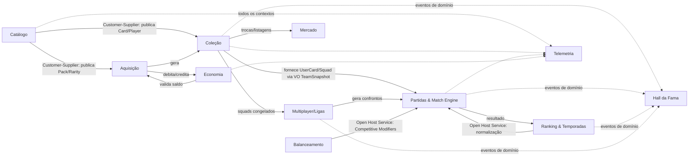

Setas sólidas indicam dependência direta de contrato (Customer-Supplier/Open Host Service); setas pontilhadas indicam integração por **Eventos de Domínio** (Seção 20) — Hall da Fama e Telemetria nunca chamam outro contexto diretamente, apenas reagem a eventos publicados.

---

## 3. Catálogo

**Classificação:** Supporting Domain — dados curados, mudam por curadoria administrativa, não por ação do jogador.

### Aggregate Root: `Player`

| Camada | Itens |
|---|---|
| Entidades internas | Nenhuma — `Player` é um agregado simples, sem partes internas com identidade própria |
| Value Objects | `Nationality` (código ISO), `EraRange` (`era_start`, `era_end`), `PositionSet` (posição primária + secundárias), `BaseAttributeSet` (doc 09 §1) |
| Invariantes | `era_start ≤ era_end`; `primary_position` pertence ao enum de posições válidas (doc 09 §1); `BaseAttributeSet` tem todos os atributos no intervalo `[1, 99]` |
| Regras que nunca podem ser quebradas | Um `Player` nunca é removido do catálogo (apenas marcado inativo) — cartas históricas (`Card`, Seção 5) dependem de sua existência permanente para integridade de coleções já distribuídas |

### Agregados de referência menores (Value Objects com identidade estável, não agregados ricos)

| Item | Por que não é um Aggregate Root completo |
|---|---|
| `Rarity` (Comum/Rara/Elite/Lendária/Ultra/World Cup Hero) | Dado de referência fixo (doc 10 §4) — sem invariante transacional própria, apenas consultado |
| `Trait` (os 13 traits, doc 09 §11) | Dado de referência descritivo — sua **magnitude/teto numérico** vive deliberadamente no contexto de Balanceamento (Seção 19), não aqui, preservando o princípio de "carta nunca editada para balancear" |
| `LegendaryComboDefinition` | **Aggregate Root pequeno** — tem identidade e ciclo de vida próprio (combos podem ser adicionados ao longo do tempo), referencia uma lista fixa de `card_id`s exigidos e um bônus (doc 10 §8). Invariante: a lista de cartas exigidas nunca é alterada após publicação — uma mudança cria uma nova definição, nunca edita a existente (preserva combos já conquistados por jogadores) |

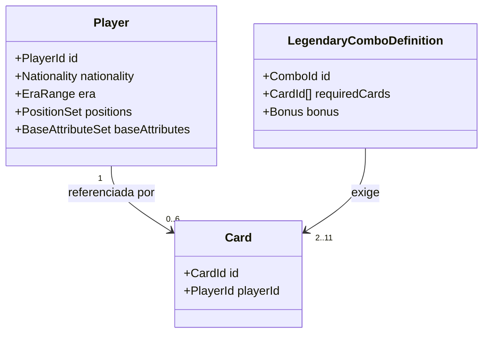

---

## 4. Coleção do Usuário

**Classificação:** Core Domain.

Este contexto abriga dois agregados centrais: `UserCard` (tratado em profundidade na Seção 6) e **`Squad`**, o agregado que organiza UserCards em um elenco jogável.

### Aggregate Root: `Squad`

| Camada | Itens |
|---|---|
| Entidades internas | `SquadSlot` (uma por posição da formação; tem identidade própria dentro do agregado, mas não existe fora dele) |
| Value Objects | `Formation` (enum, doc 09 §15), `TacticMentality` (doc 09 §14), `ChemistryScore` (0–100, calculado, doc 09 §4) |
| Invariantes | Um `SquadSlot` referencia um `UserCard` **por ID**, nunca o incorpora — `Squad` não possui o `UserCard`, apenas o referencia (fronteira de agregado, doc 02 §4); no máximo 11 `SquadSlot`s marcados `is_starter = true`; nenhum slot pode referenciar um `UserCard` simultaneamente lesionado (`is_injured = true`) ou suspenso (`suspended_matches > 0`) como titular (doc 09 §12.1, doc 13 TC-WO) |
| Regras que nunca podem ser quebradas | Um `UserCard` pode estar referenciado em múltiplos `Squad`s diferentes simultaneamente (ex: elenco de Ranked + elenco "congelado" de uma liga, doc 03 §3.3) — a posse da carta é o agregado `UserCard`, não o `Squad`; `Squad` nunca clona ou bifurca a carta |

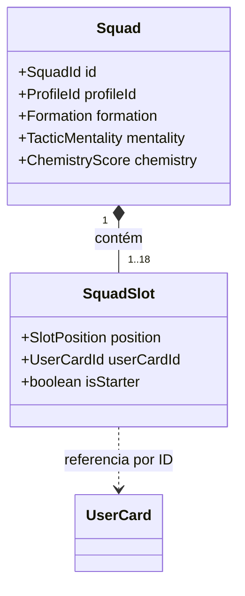

---

## 5. Cartas

**Classificação:** Catálogo (Supporting Domain) — detalhamento do agregado mais complexo deste contexto.

### Aggregate Root: `Card`

| Camada | Itens |
|---|---|
| Entidades internas | Nenhuma |
| Value Objects | `RarityRef` (referência à Seção 3), `EditionCode` (`base`/`prime`/`wc_special_<ano>`/`icon`), `TournamentContext` (opcional — preenchido para cartas ancoradas a um momento específico, doc 10 §2), `FinalAttributeSet` (calculado, doc 09 §2/§6), `TraitAssignment[]` (lista de `Trait` refs, 1 a 3 por carta), `Overall` (derivado, nunca definido manualmente) |
| Invariantes | `(player_id, rarity_id)` é único — no máximo 1 carta por par jogador+raridade (doc 10 §3); `Overall` está dentro da faixa floor/ceiling da `Rarity` referenciada (doc 04/10 §4); `FinalAttributeSet` é sempre derivado pela fórmula do doc 09 §2/§6 a partir de `Player.baseAttributes`, nunca um valor arbitrário; uma carta `World Cup Hero` exige `TournamentContext` não-nulo |
| Regras que nunca podem ser quebradas | `Overall`, `FinalAttributeSet` e `RarityRef` de uma `Card` já publicada **nunca são editados** para fins de balanceamento (doc 11 §11) — qualquer ajuste competitivo vive exclusivamente no agregado `CompetitiveModifier` do contexto de Balanceamento, referenciando esta `Card` por ID, nunca mutando-a |

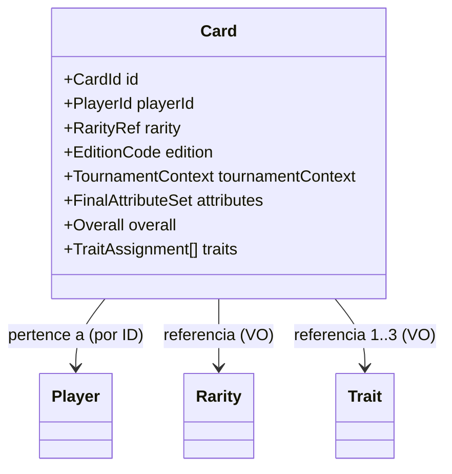

---

## 6. UserCard

**Classificação:** Coleção (Core Domain).

### Aggregate Root: `UserCard`

| Camada | Itens |
|---|---|
| Entidades internas | Nenhuma — agregado intencionalmente flat |
| Value Objects | `Form` (-2..+2, doc 09 §6), `InjuryStatus` (`is_injured`, `injury_returns_at_round`), `SuspensionStatus` (`suspended_matches`, `yellow_cards_accum`), `AcquisitionSource` (`pack`/`draft`/`reward`/`trade`/`craft`/`achievement`) |
| Invariantes | Exatamente **um** `UserCard` por par `(profile_id, card_id)` — uma segunda ocorrência da mesma `Card` nunca cria uma nova instância; é convertida em `FragmentBalance` (Seção 9) no momento da tentativa de criação (doc 10 §16, doc 13 TC-PACK-10/11); `Form` permanece em `[-2, +2]`; `suspended_matches ≥ 0` |
| Regras que nunca podem ser quebradas | Um `UserCard` cuja `Card` referenciada é de raridade `World Cup Hero` ou de uma `LegendaryComboDefinition` do tipo "GOAT" (Seção 17) só pode ter `AcquisitionSource = achievement` — **nunca** `pack`, `craft` ou `trade` (doc 10 §11, doc 13 TC-HOF-03) |

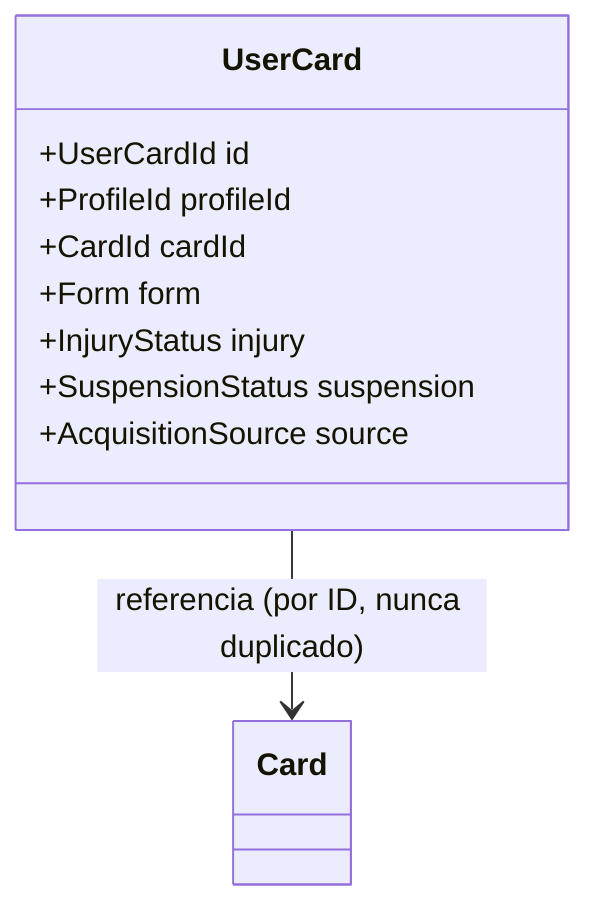

---

## 7. Álbum

**Classificação:** dois agregados, um por contexto — `CollectionSetDefinition` (Catálogo) e `CollectionProgress` (Coleção).

### Aggregate Root: `CollectionSetDefinition` (Catálogo)

| Camada | Itens |
|---|---|
| Value Objects | `RequiredCardList` (lista fixa de `card_id`s, doc 10 §13), `RewardSpec` (pacote e/ou moeda) |
| Invariantes | `RequiredCardList` nunca muda após publicação (mesma lógica de `LegendaryComboDefinition`, Seção 3) |

### Aggregate Root: `CollectionProgress` (Coleção)

| Camada | Itens |
|---|---|
| Value Objects | `CompletionStatus` (percentual, ou `completed_at` quando 100%) |
| Invariantes | `CollectionProgress` nunca marca conclusão sem que o usuário possua (via `UserCard`, Seção 6) **todas** as cartas de `RequiredCardList` no momento da verificação |
| Regras que nunca podem ser quebradas | A recompensa de uma `CollectionSetDefinition` é entregue **exatamente uma vez** por usuário — `CollectionProgress.completed_at` é o guard de idempotência (doc 13 TC-HOF-01) |

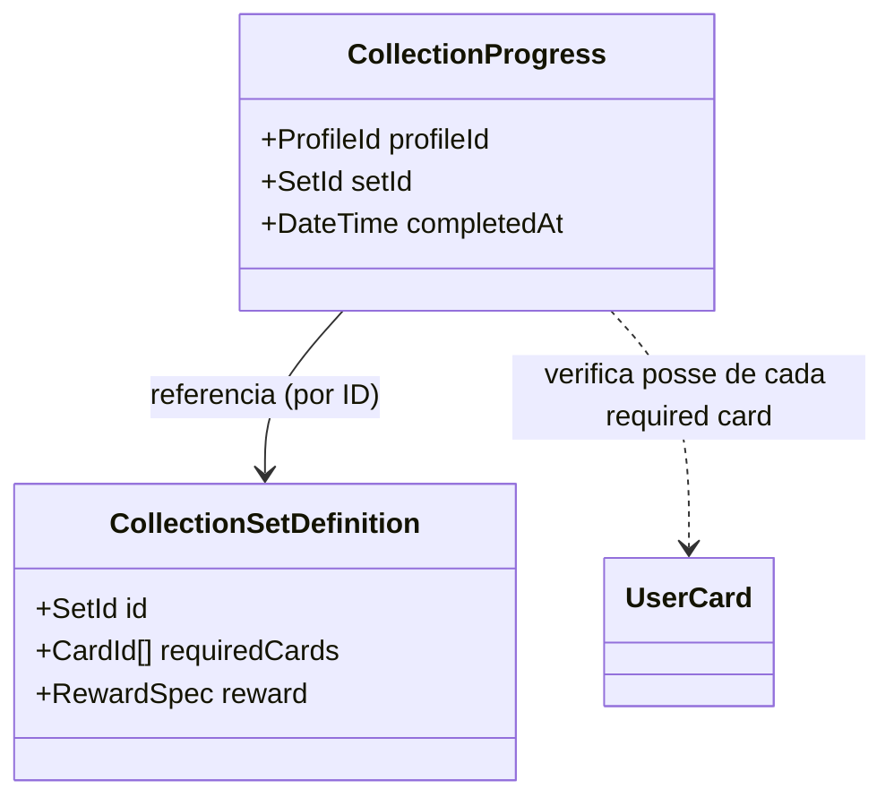

---

## 8. Packs

**Classificação:** Aquisição (Core Domain).

### Aggregate Root: `Pack` (definição, dado de catálogo de comércio)

| Value Objects | `DropTable` (pesos por raridade/edição, doc 10 §15), `PriceSpec`, `AvailabilityWindow` |
|---|---|
| Invariantes | `DropTable` nunca inclui `World Cup Hero` em um slot "garantido" fora de um `Pack` do tipo evento explicitamente desenhado para isso (doc 10 §14) |

### Aggregate Root: `PackOpening` (transacional)

| Camada | Itens |
|---|---|
| Entidades internas | `PackOpeningCard` (um por carta revelada — entidade interna, não existe fora da abertura que a gerou) |
| Value Objects | `Seed`, `RevealResult[]` |
| Invariantes | Número de `PackOpeningCard` igual a `Pack.cardsPerPack`; toda garantia declarada em `Pack.DropTable` (ex: "mínimo 1 Legendary+") é satisfeita antes de a abertura ser considerada válida (doc 13 TC-PACK-01 a 05) |

### Aggregate Root: `PityCounter` (per `profile_id` × tipo de proteção)

| Value Objects | `PacksSinceLastHit` (inteiro) |
|---|---|
| Invariantes | Zera exatamente quando a raridade-alvo daquele contador é obtida; nunca aplica-se a `World Cup Hero` (doc 10 §15, doc 13 TC-PACK-09) |
| Regras que nunca podem ser quebradas | Ao atingir o limiar (40 para Legendary+, 120 para Ultra+), a **próxima** abertura é forçada a conter a raridade-alvo — esta é uma garantia, não uma probabilidade aumentada |

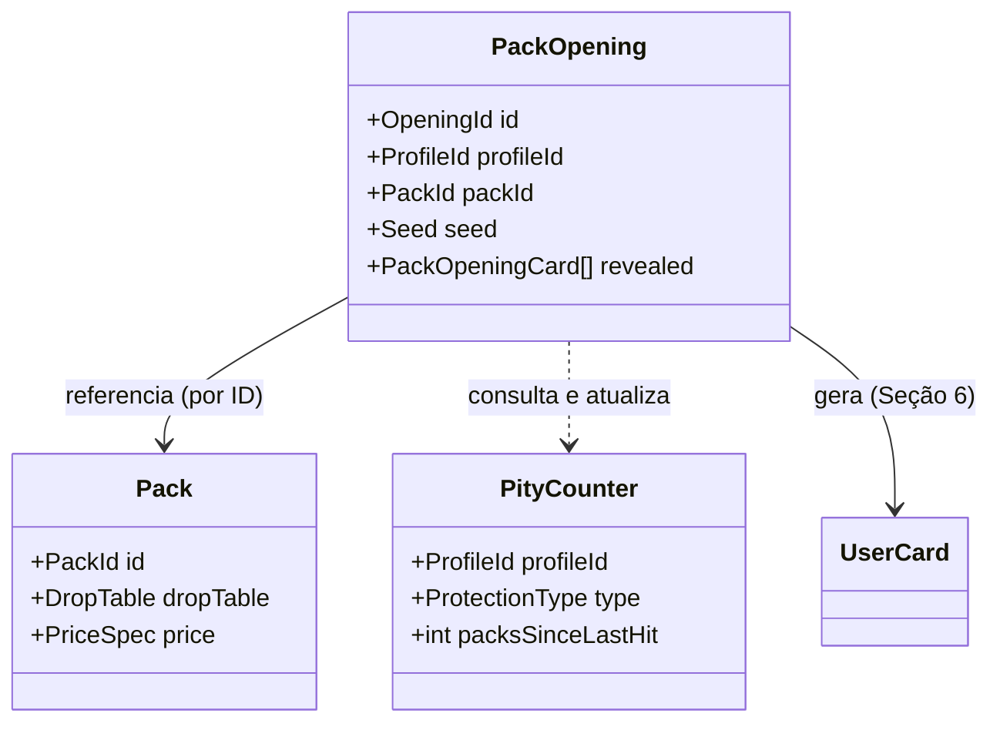

---

## 9. Fragmentos

**Classificação:** Economia (Core Domain).

### Aggregate Root: `FragmentBalance` (per `profile_id`)

| Value Objects | `FragmentAmount` (inteiro não-negativo) |
|---|---|
| Invariantes | `FragmentAmount ≥ 0` em qualquer momento — nenhuma operação pode levá-lo abaixo de zero (doc 13 TC-CRAFT-09) |
| Regras que nunca podem ser quebradas | Fragmentos **nunca** se convertem em moeda premium nem em Créditos por nenhuma rota — o único destino de débito é `CraftRequest` (Seção 10); a única fonte de crédito é conversão de duplicata via `PackOpening`/`Craft` (doc 13 TC-ECO-04) |

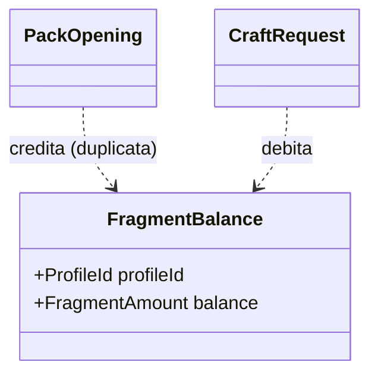

---

## 10. Craft

**Classificação:** Aquisição (Core Domain).

### Aggregate Root: `CraftRequest`

| Value Objects | `TargetCardId`, `Cost` (em fragmentos, escalado pela raridade do alvo, doc 10 §17), `IdempotencyKey` |
|---|---|
| Invariantes | `TargetCardId` nunca referencia uma `Card` de raridade `World Cup Hero` ou marcada como parte de uma `LegendaryComboDefinition` do tipo GOAT (doc 13 TC-CRAFT-06/07); o usuário não pode já possuir um `UserCard` para o `TargetCardId` (doc 13 TC-CRAFT-10); débito de `FragmentBalance` e criação de `UserCard` são atômicos — ambos ocorrem ou nenhum ocorre |
| Regras que nunca podem ser quebradas | Reenvio da mesma `IdempotencyKey` nunca executa um segundo débito (doc 13 TC-SEC-01) |

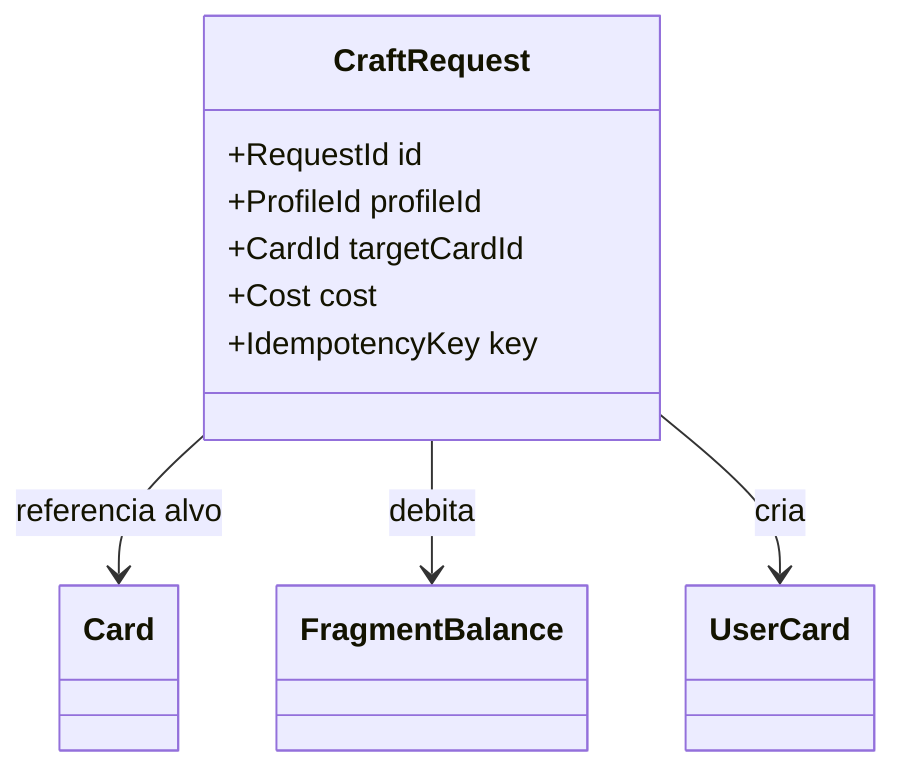

---

## 11. Economia

**Classificação:** Core Domain — agregados de saldo restantes (Fragmentos já tratado na Seção 9).

### Aggregate Root: `CreditBalance` (per `profile_id`)

| Invariantes | `≥ 0` sempre; fonte primária = recompensa de partida/objetivo; destino primário = compra de `Pack`, listagem/compra no `Mercado` |
|---|---|

### Aggregate Root: `PremiumBalance` (per `profile_id`)

| Invariantes | `≥ 0` sempre |
|---|---|
| Regras que nunca podem ser quebradas | `PremiumBalance` **nunca** é debitado em troca direta de uma `Card`/`UserCard` específica — apenas em troca de `Pack`s ou itens cosméticos elegíveis (doc 10 §18, doc 13 TC-ECO-05). Esta é a regra de domínio que torna o princípio "gastar dinheiro acelera coleção, mas não compra ranking" (doc 11b §10) estruturalmente impossível de violar, não apenas politicamente indesejável |

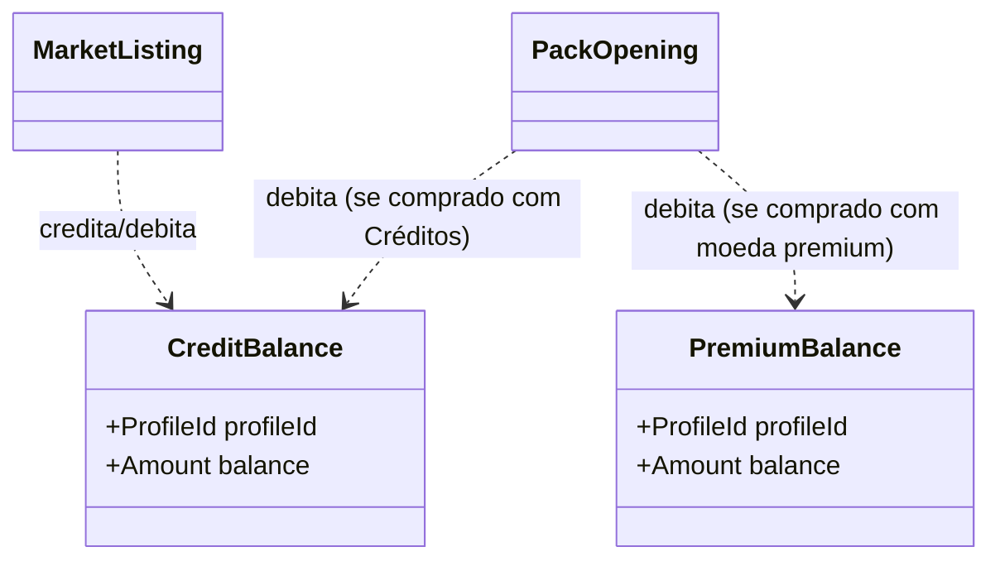

---

## 12. Partidas

**Classificação:** Core Domain.

### Aggregate Root: `Match`

| Camada | Itens |
|---|---|
| Entidades internas | `MatchEvent` (lista ordenada, append-only uma vez que a simulação é concluída — doc 09 §22) |
| Value Objects | `Seed`, `EngineVersion`, `MatchStats` (doc 09 §24), `PenaltyShootoutResult` (`homeScore`, `awayScore`, `rodadasTotais`, `desempatePorSeed` — doc 15.1), `WalkoverInfo` (`ladoAfetado`, `minutoDaInterrupcao`, `jogadoresRestantes` — doc 15.1) |
| Invariantes | `home_squad_id`/`away_squad_id` referenciam `Squad` **por ID**, nunca incorporados (fronteira de contexto, Seção 4); uma vez `status = simulated` ou `status = walkover`, a lista de `MatchEvent` é imutável; `WalkoverInfo` e `PenaltyShootoutResult` nunca coexistem no mesmo `Match` (doc 09 §12.1 — precedência de W.O. sobre prorrogação/pênaltis) |
| Regras que nunca podem ser quebradas | `Seed` + `EngineVersion` são obrigatórios em todo `Match` com `status ≠ scheduled` — sem eles, o agregado não pode transicionar para `simulated`, pois a reprodutibilidade (doc 09 §21) deixaria de ser garantida |

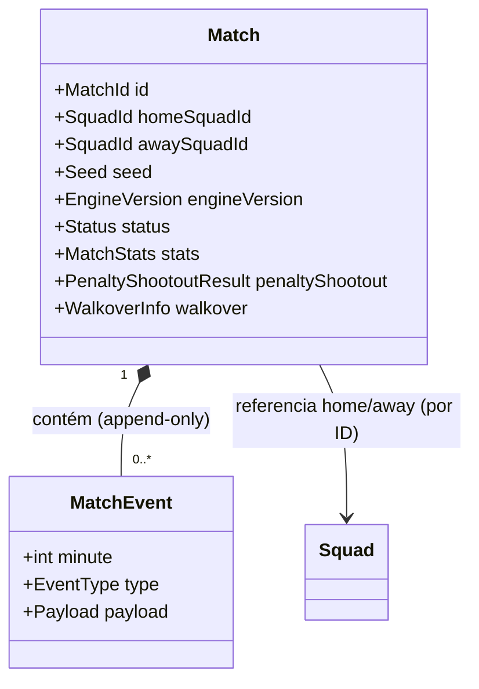

---

## 13. Match Engine

**Classificação:** não é um Bounded Context com agregados próprios — é o **Serviço de Domínio** central do contexto de Partidas (detalhado na Seção 19).

O Match Engine (`simulateMatch`, doc 09 §25) é deliberadamente **stateless e sem identidade**: não é instanciado, não é persistido, não tem ciclo de vida. Ele consome Value Objects efêmeros — `TeamSnapshot` e `PlayerRuntime` (doc 09 §2.2) — derivados, no momento da chamada, dos agregados `Squad` e `UserCard` (Seções 4 e 6), e produz como saída um novo agregado `Match` (Seção 12).

| Conceito | Natureza DDD |
|---|---|
| `TeamSnapshot` | Value Object efêmero — nunca persistido isoladamente, existe apenas durante a execução do serviço |
| `PlayerRuntime` | Value Object efêmero — atributos já com modificadores de química/moral/forma/fadiga/clima aplicados (doc 09 §1.3) |
| `simulateMatch` | Serviço de domínio puro — `(TeamSnapshot, TeamSnapshot, Seed) → Match` |

Esta separação é o que permite ao Match Engine, no futuro, rodar em qualquer runtime (doc 01 §3) sem nunca acoplar-se a como `Squad`/`UserCard` são persistidos.

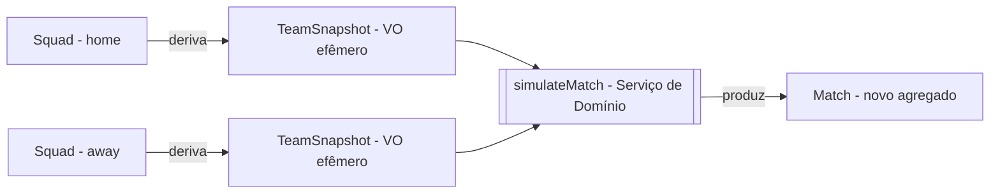

---

## 14. Ranking

**Classificação:** Core Domain.

### Aggregate Root: `Season`

| Value Objects | `SeasonWindow` (`starts_at`, `ends_at`), `Status` (`upcoming`/`active`/`closed`) |
|---|---|
| Invariantes | Apenas uma `Season` pode estar `active` por vez |

### Aggregate Root: `PlayerRanking` (per `profile_id` × `season_id`)

| Value Objects | `EloRating`, `Division` |
|---|---|
| Invariantes | `EloRating` só é atualizado pela fórmula do doc 11 §3.1, nunca diretamente; atualização só ocorre para `Match`es originados em contexto `public_ranked` (doc 06 §3.1) — `Match`es de liga privada nunca tocam este agregado |
| Regras que nunca podem ser quebradas | Todo `Match` que atualiza `PlayerRanking` deve ter sido simulado sob a Normalização Competitiva (doc 11 §10) — o serviço de domínio de Ranking nunca aceita um `Match` simulado com poder bruto não-normalizado como insumo válido de Elo |

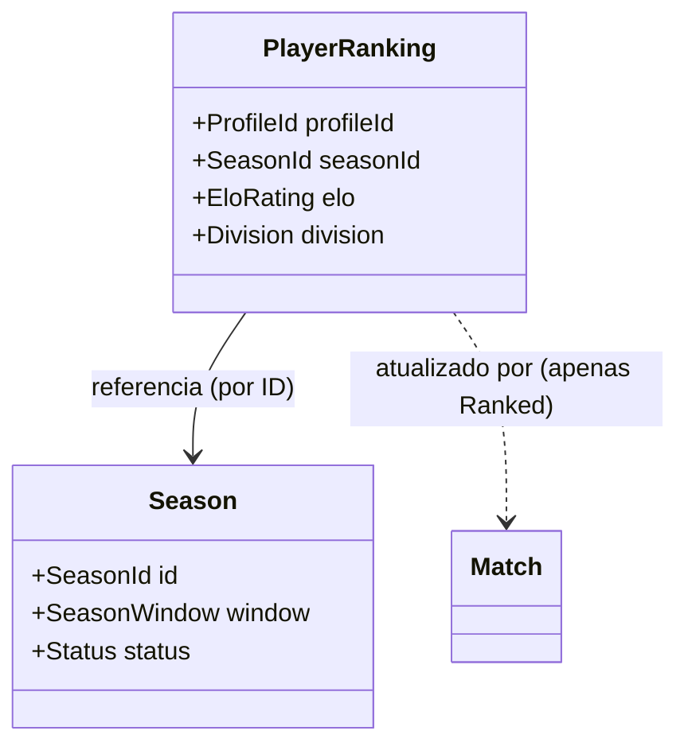

---

## 15. Multiplayer

**Classificação:** Core Domain.

### Aggregate Root: `League`

| Camada | Itens |
|---|---|
| Entidades internas | `LeagueMember`, `LeagueRound` (ambas vivem e morrem com a `League`) |
| Value Objects | `InviteCode`, `Format` (`round_robin`/`knockout`/`groups_knockout`) |
| Invariantes | Número de `LeagueMember` nunca excede `max_members`; `LeagueMember.squad_id` referencia um `Squad` **congelado** (cópia lógica, não o `Squad` ativo do usuário em Ranked — doc 03 §3.3) |

### Aggregate Root: `DraftSession` (transitório)

| Value Objects | `PickOrder`, `Pool` (cartas disponíveis), `PickLog` |
|---|---|
| Invariantes | Cada `card_id` no `Pool` só pode ser escolhido uma vez; ao concluir, produz exatamente um `Squad` por `LeagueMember`, então o agregado `DraftSession` é encerrado — não é reaberto |
| Regras que nunca podem ser quebradas | A ordem de picks (`PickOrder`) é determinística e auditável — reconexão de um membro nunca altera o estado já avançado do draft (doc 03 §3.3) |

```mermaid
classDiagram
    class League {
        +LeagueId id
        +Format format
        +InviteCode code
    }
    class LeagueMember {
        +ProfileId profileId
        +SquadId squadId
    }
    class LeagueRound {
        +int roundNumber
        +Status status
    }
    class DraftSession {
        +LeagueId leagueId
        +Pool pool
        +PickLog log
    }
    League "1" *-- "2..*" LeagueMember
    League "1" *-- "1..*" LeagueRound
    DraftSession --> League : referencia (por ID)
    DraftSession -->|produz| Squad
```

---

## 16. Mercado

**Classificação:** Supporting Domain.

### Aggregate Root: `MarketListing`

| Value Objects | `Price` (validado contra faixa dinâmica, doc 13 TC-MKT-03/04), `Status` (`active`/`sold`/`cancelled`) |
|---|---|
| Invariantes | `Price` dentro da banda dinâmica vigente para a `Rarity` da `Card` listada; apenas o proprietário do `UserCard` pode criar ou cancelar a listagem |
| Regras que nunca podem ser quebradas | `MarketListing` nunca é criada para um `UserCard` cuja `Card` é `não-tradeable` (GOAT — Seção 17; Event ativo — Seção 8) |

### Aggregate Root: `TradeOffer`

| Value Objects | `OfferedCardId`, `RequestedCardId`, `Status` (`pending`/`accepted`/`declined`) |
|---|---|
| Invariantes | Transferência de ambos os `UserCard`s é atômica — nunca ocorre transferência unilateral; sujeita às mesmas restrições de não-tradeable da `MarketListing` |

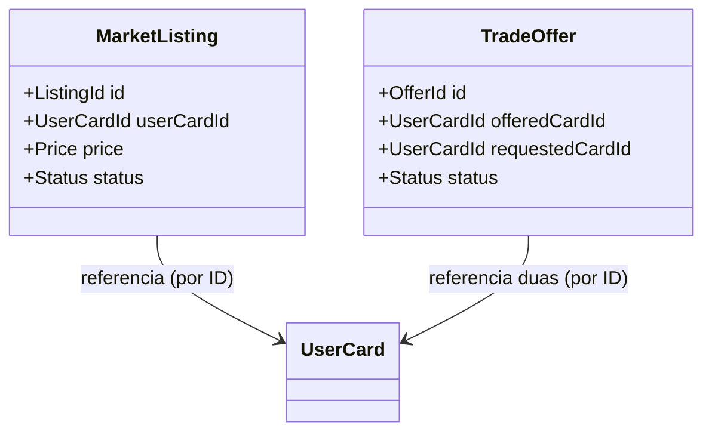

---

## 17. Hall da Fama

**Classificação:** Supporting Domain.

### Aggregate Root: `AchievementDefinition` (Catálogo)

| Value Objects | `Criteria`, `RewardSpec` |
|---|---|

### Aggregate Root: `AchievementProgress` (per `profile_id`)

| Value Objects | `ProgressValue`, `UnlockedAt` |
|---|---|
| Invariantes | `UnlockedAt` é preenchido **exatamente uma vez** — reentrega de recompensa nunca ocorre (doc 13 TC-HOF-01) |
| Regras que nunca podem ser quebradas | Quando `AchievementDefinition.RewardSpec` inclui uma carta `GOAT`, o `UserCard` resultante só pode ser criado com `AcquisitionSource = achievement` (Seção 6) — este é o único ponto de todo o domínio autorizado a fazer isso |

### Value Object: `Showcase` (parte do agregado `Profile`, contexto de Identidade — fora do escopo central deste documento, mencionado por completude)

| Invariante | No máximo 5 `UserCardId` referenciados simultaneamente (doc 13 TC-HOF-06) |
|---|---|

```mermaid
classDiagram
    class AchievementDefinition {
        +AchievementId id
        +Criteria criteria
        +RewardSpec reward
    }
    class AchievementProgress {
        +ProfileId profileId
        +AchievementId achievementId
        +DateTime unlockedAt
    }
    AchievementProgress --> AchievementDefinition : referencia (por ID)
    AchievementProgress -->|único caminho para| UserCard : cria UserCard GOAT
```

---

## 18. Telemetria

**Classificação:** Generic Subdomain — resolvível com padrões de event store genéricos; não modelado como agregado de negócio rico.

### Value Object: `TelemetryEnvelope`

| Campos | `timestamp`, `user_id`, `match_id`, `season_id`, `event_type`, `payload`, `version`, `build`, `região`, `modo_de_jogo` (doc 12 §3) |
|---|---|
| Invariante | Imutável — nunca editado após emissão; correções entram como novos eventos, nunca como alteração retroativa |

Telemetria não tem Aggregate Root no sentido transacional: não há uma operação de negócio cuja consistência dependa de um "agregado de telemetria" — o Event Store é uma projeção de leitura de **Eventos de Domínio** (Seção 20) publicados pelos demais contextos. Tratar Telemetria como Generic Subdomain (em vez de Core) é uma escolha deliberada: nenhuma vantagem competitiva de produto vem de uma modelagem rica aqui, apenas de captura completa e consistente.

---

## 19. Serviços de Domínio

Funções puras, sem identidade nem estado próprio, que operam sobre Value Objects derivados de agregados:

| Serviço | Contexto | Input | Output | Referência |
|---|---|---|---|---|
| `OverallCalculator` | Catálogo | `BaseAttributeSet`, `Position` | `Overall` | Doc 09 §2 |
| `ChemistryCalculator` | Coleção | `Squad` (slots + cartas referenciadas) | `ChemistryScore` | Doc 09 §4 |
| `TeamPowerCalculator` | Partidas | `TeamSnapshot`, contexto (clima/mando/moral) | `TeamPower` | Doc 09 §3 |
| `MatchEngine` (`simulateMatch`) | Partidas | `TeamSnapshot` × 2, `Seed` | `Match` (novo agregado) | Doc 09 §25; Seção 13 |
| `CompetitiveNormalizationService` | Ranking | Atributo bruto | Atributo competitivo (curva de compressão + orçamento de sinergia) | Doc 11 §2/§10 |
| `PackDropService` | Aquisição | `Pack.DropTable`, `Seed`, `PityCounter` | `RevealResult[]` | Doc 10 §15; Seção 8 |
| `CraftCostCalculator` | Aquisição | `Rarity` do alvo | `Cost` em fragmentos | Doc 10 §17 |
| `EloUpdateService` | Ranking | `PlayerRanking` × 2, resultado do `Match` | Novos `EloRating`s | Doc 06 §3.1 |
| `TierScoreCalculator` | Balanceamento | Métricas agregadas (doc 11 §3) | `TierScore` | Doc 11 §4 |
| `PenaltyTiebreakResolver` | Partidas | `Seed` (stream `penalty_tiebreak`) | Lado vencedor | Doc 09 §20.1; doc 15.1 |

Nenhum destes serviços persiste estado entre chamadas — toda entrada relevante é passada explicitamente, nunca lida de um "estado global" do serviço.

---

## 20. Eventos de Domínio

Eventos de Domínio (DDD) são distintos, mas sobrepostos, dos Eventos de Telemetria (doc 12 §2): um Evento de Domínio é o que um agregado publica ao mudar de estado relevante para **outros agregados/contextos reagirem** (integração via Seção 2); um Evento de Telemetria é a projeção desse mesmo fato para fins de observação (doc 12). Frequentemente o mesmo fato gera ambos.

| Evento de Domínio | Agregado de origem | Quem reage | Evento de Telemetria correspondente (doc 12) |
|---|---|---|---|
| `CardObtainedEvent` | `PackOpening` / `CraftRequest` | `CollectionProgress` (Seção 7), `AchievementProgress` (Seção 17) | `card_obtained` |
| `MatchSimulatedEvent` | `Match` | `PlayerRanking` (Seção 14), `AchievementProgress` | `match_ended` |
| `MatchEndedByWalkoverEvent` [DD-01] | `Match` | `AchievementProgress` (negativamente — não conta como "vitória de mérito" em conquistas de desempenho) | `match_walkover` |
| `PenaltyTiebreakResolvedEvent` [DD-02] | `Match` | Nenhum reator direto além de Telemetria | (payload de `match_penalty_shootout`) |
| `CraftCompletedEvent` | `CraftRequest` | `CollectionProgress`, `AchievementProgress` | `card_crafted` |
| `TradeCompletedEvent` | `TradeOffer` | `AchievementProgress` (conquistas sociais) | `card_traded` |
| `AchievementUnlockedEvent` | `AchievementProgress` | Eventualmente cria `UserCard` GOAT (Seção 17) | (categoria Hall da Fama, doc 12) |
| `SeasonClosedEvent` | `Season` | `PlayerRanking` (promoção/rebaixamento, doc 06 §3.2) | — |
| `CompetitiveModifierAppliedEvent` | `CompetitiveModifier` (Balanceamento) | `CompetitiveNormalizationService` passa a considerar o novo modifier | (doc 12 §10, alertas) |

---

Este documento encerra formalmente a fase de arquitetura de domínio de World Legends. `02-modelagem-banco-dados.md` precisará ser revisitado à luz dos agregados aqui identificados que não tinham tabela própria explícita (`PityCounter`, `FragmentBalance`/`CreditBalance`/`PremiumBalance` como agregados distintos em vez de colunas em `profiles`, `DraftSession`, `AchievementProgress`) — mas essa reconciliação é, deliberadamente, trabalho futuro, não deste documento. Quer que eu inicie essa reconciliação de schema agora, ou prefere primeiro fechar a estrutura de pastas e os primeiros arquivos reais de `packages/engine` e `packages/db`?
