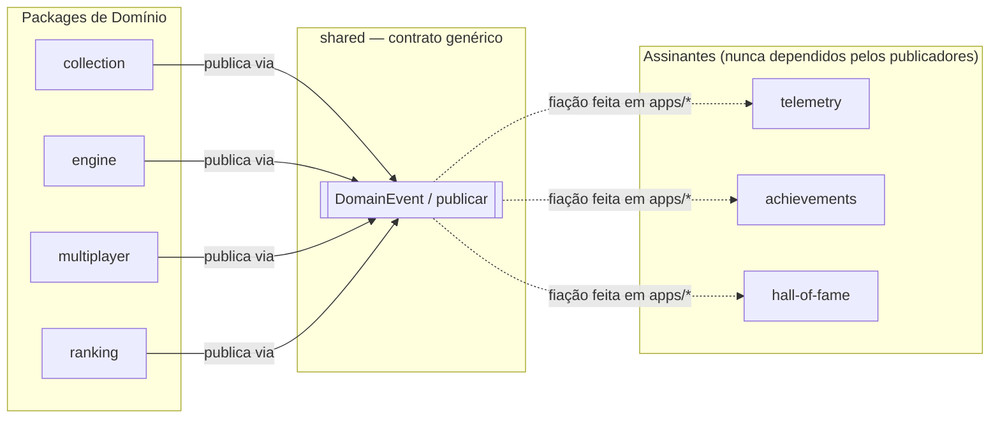
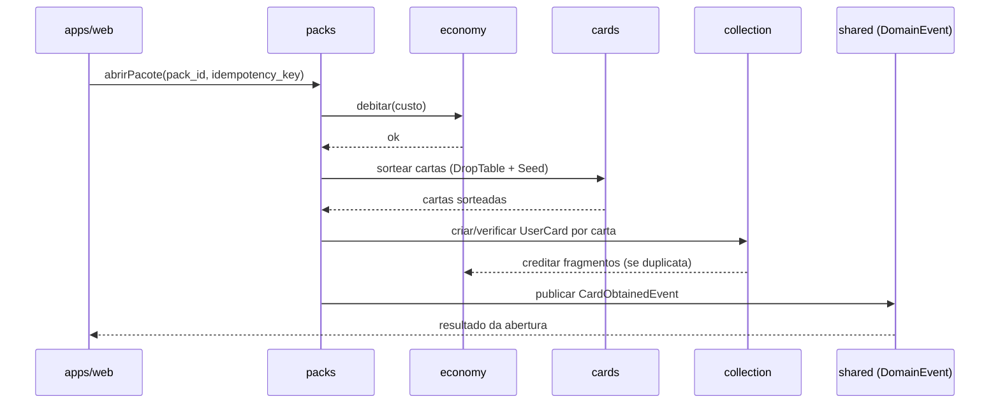
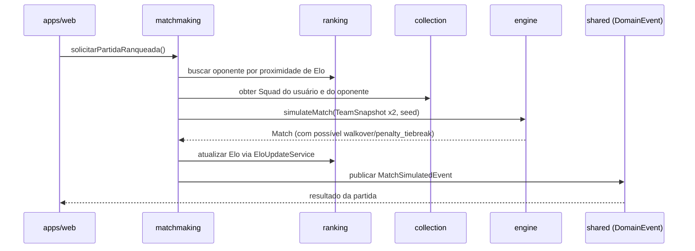
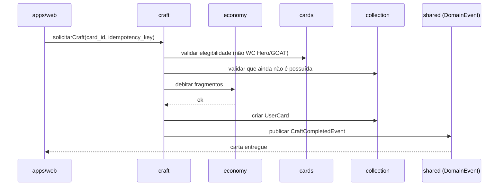
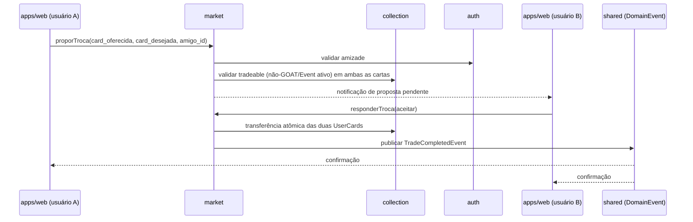
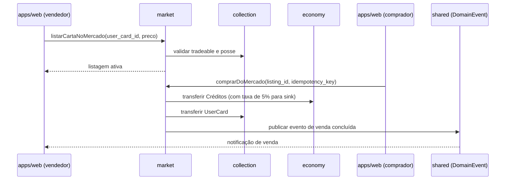

# 18 — Monorepo Architecture Master Document (World Legends)

> Especificação pura de arquitetura — sem código, sem SQL, sem endpoints, sem implementação. Traduz `01` a `17` (especialmente o Domain Model de `17`) em uma estrutura real de packages, suas responsabilidades e suas regras de dependência, preparando a transição segura e incremental para implementação.

## 1. Objetivos da Arquitetura

Seis princípios guiam toda decisão estrutural deste documento:

**Testabilidade.** Todo package de domínio deve ser testável em memória, sem banco de dados real e sem rede — uma consequência direta de `packages/engine` já ser desenhado como função pura (doc 09 §0) e que esta arquitetura estende a **todos** os packages de domínio, não só ao engine.

**Determinismo.** Qualquer operação que envolva aleatoriedade (simulação, abertura de pacote, sorteio de clima/árbitro) é seedada e reproduzível (doc 09 §21) — a arquitetura de packages nunca introduz uma fonte de aleatoriedade não-seedada em nenhuma camada.

**Isolamento de domínio.** Cada package de domínio (Seções 5–13) conhece apenas o vocabulário do seu próprio Bounded Context (doc 17 §2) — nunca importa um conceito de persistência, de transporte HTTP, ou de outro domínio fora do que a Matriz de Dependências (Seção 3) autoriza explicitamente.

**Reprodutibilidade por seed.** Toda função que consome um `Seed` o faz como parâmetro explícito, nunca implícito — qualquer package pode ser testado com um seed fixo e produzir exatamente o mesmo resultado, em qualquer ambiente, para sempre.

**Baixo acoplamento.** Medido concretamente pela Matriz de Dependências (Seção 3): nenhum package de domínio depende de Telemetria, Achievements ou Hall of Fame; a comunicação nessa direção ocorre exclusivamente por Eventos de Domínio (doc 17 §20), nunca por import direto.

**Facilidade para adicionar competições futuras (Libertadores, Champions).** Esta arquitetura trata "Copa do Mundo" como **conteúdo de Catálogo**, não como estrutura de package. Adicionar a Libertadores no futuro significa: novos registros em `cards` (jogadores/cartas daquela competição), um novo `CollectionSetDefinition` em `collection` (doc 17 §7), e possivelmente novos `Pack`s temáticos em `events`/`packs` — **nenhum package novo, nenhuma mudança em `engine`, `ranking` ou `multiplayer`**, que já são agnósticos de tema por construção (`Format` em `League` já é genérico, doc 17 §15). Esta é a prova de que o isolamento de domínio funciona: a extensão de conteúdo nunca exige extensão de arquitetura.

---

## 2. Organização do Monorepo

```
world-legends/
├── apps/
│   ├── web/        # Next.js 15, PWA — app principal voltado ao jogador
│   ├── mobile/      # wrapper nativo (futuro) sobre os mesmos packages de domínio
│   └── admin/       # ferramenta interna — Balanceamento, Catálogo, LiveOps
│
├── packages/
│   ├── engine/         # Match Engine determinístico (doc 09; doc 17 §13)
│   ├── cards/          # Catálogo: Player, Card, Rarity, Trait, Edition (doc 17 §3/§5)
│   ├── collection/      # Coleção: UserCard, Squad, Álbum, Showcase (doc 17 §4/§6/§7)
│   ├── economy/         # Créditos, Premium, Fragmentos — saldos e sinks/sources (doc 17 §9/§11)
│   ├── craft/           # CraftRequest (doc 17 §10)
│   ├── packs/           # Pack, PackOpening, PityCounter (doc 17 §8)
│   ├── matchmaking/      # Orquestração de partida ranqueada (busca de oponente, doc 06 §3.3)
│   ├── ranking/          # Season, PlayerRanking, Elo, divisões (doc 17 §14)
│   ├── multiplayer/      # League, LeagueMember, LeagueRound, DraftSession (doc 17 §15)
│   ├── market/           # MarketListing, TradeOffer (doc 17 §16)
│   ├── hall-of-fame/     # AchievementDefinition (consumida), GOAT, prestígio, vitrine (doc 17 §17)
│   ├── achievements/     # AchievementProgress — motor de progresso e desbloqueio (doc 17 §17)
│   ├── events/           # LiveOps: eventos sazonais, missões, pacotes/recompensas de evento (doc 10 §10/§23)
│   ├── telemetry/        # Captura de evento, métricas, dashboards, regression guards (doc 12)
│   ├── auth/             # Identidade, sessão, perfil, amizades (doc 02 §2)
│   ├── shared/           # Value Objects reutilizáveis: Result, Money, Seed... (Seção 15)
│   ├── db/               # Camada de persistência — adapters (Seção 17)
│   ├── types/             # DTOs e enums compartilhados, sem lógica (Seção 16)
│   └── config/            # presets de eslint/tsconfig/tailwind compartilhados
│
└── docs/                  # toda a documentação 00–18 já existente
```

> **Nota de nomenclatura:** o package `events/` (LiveOps — eventos sazonais, missões) e os "Eventos de Domínio" do doc 17 §20 (`CardObtainedEvent`, `MatchSimulatedEvent`...) são conceitos homônimos, mas distintos. Para evitar ambiguidade na implementação futura, o mecanismo de Eventos de Domínio não vive no package `events/` — vive em `shared/` (Seção 15), como um contrato genérico de publicação/assinatura usado por **todos** os packages, enquanto `events/` é especificamente o domínio de negócio de calendário de LiveOps.

---

## 3. Dependências Permitidas

A matriz abaixo é a tradução literal do Mapa de Contexto do doc 17, §2: toda seta sólida daquele diagrama torna-se uma dependência direta de package permitida aqui; toda seta pontilhada (Hall of Fame, Achievements, Telemetria) torna-se, deliberadamente, **ausência** de dependência direta — a integração ocorre via Eventos de Domínio.

| Package | Pode depender de |
|---|---|
| `shared` | (nenhum — base da pirâmide) |
| `types` | `shared` |
| `config` | (nenhum) |
| `engine` | `shared`, `types` |
| `auth` | `shared`, `types` |
| `cards` | `shared`, `types` |
| `collection` | `cards`, `shared`, `types` |
| `economy` | `shared`, `types` |
| `packs` | `cards`, `collection`, `economy`, `shared`, `types` |
| `craft` | `cards`, `collection`, `economy`, `shared`, `types` |
| `ranking` | `shared`, `types` |
| `matchmaking` | `engine`, `ranking`, `collection`, `cards`, `shared`, `types` |
| `multiplayer` | `collection`, `cards`, `engine`, `shared`, `types` |
| `market` | `collection`, `economy`, `shared`, `types` |
| `events` | `cards`, `packs`, `economy`, `shared`, `types` |
| `hall-of-fame` | `shared`, `types` (+ Eventos de Domínio) |
| `achievements` | `shared`, `types` (+ Eventos de Domínio) |
| `telemetry` | `shared`, `types` (+ Eventos de Domínio) |
| `db` | `types`, `shared` |
| `apps/*` | qualquer package — é a única camada de composição |

**Regra inegociável:** nenhum package de domínio (`engine` a `events`) depende de `telemetry`, `achievements` ou `hall-of-fame`. Nenhum package de domínio depende de `db`. Ambas as ausências são resolvidas pelo mesmo padrão arquitetural, detalhado a seguir.

### 3.1 Como Telemetria observa tudo sem que nada dependa dela

Resolução do paradoxo aparente ("telemetria precisa saber de tudo, mas nada pode depender dela"): todo package de domínio publica Eventos de Domínio (doc 17 §20) através de um contrato genérico definido em `shared` (uma função `publicar(evento)` e um tipo `DomainEvent`, sem lógica de negócio nenhuma ali). `telemetry`, `achievements` e `hall-of-fame` são **assinantes** desse mesmo contrato genérico — eles dependem de `shared`, nunca dos packages que publicam. A ligação entre "quem publica" e "quem assina" é fiação (`wiring`), feita exclusivamente em `apps/*` (Seção 4), nunca dentro de um package de domínio.



### 3.2 Como packages de domínio persistem sem depender de `db`

Padrão **Ports & Adapters (Arquitetura Hexagonal)**: cada package de domínio que precisa persistir estado define sua própria **porta** (uma interface de repositório, expressa em termos do próprio domínio — ex: "algo capaz de salvar um `UserCard`"). O package `db` fornece o **adapter** que implementa essa porta usando Supabase (quando essa fase chegar). A composição entre porta e adapter acontece exclusivamente em `apps/*`. Isso é o que permite testar `collection`, `packs`, `craft` etc. inteiramente em memória, com um adapter falso, sem nenhuma infraestrutura real — exatamente o objetivo de testabilidade da Seção 1.

---

## 4. Apps

| App | Responsabilidade | Composição |
|---|---|---|
| `web` | App principal voltado ao jogador (Next.js 15, PWA, doc 01 §5) — toda tela descrita em `03-fluxos-telas.md` | Importa os packages de domínio relevantes a cada tela + `db` (adapters reais) + `auth`; é a camada de composição primária do produto |
| `mobile` | Wrapper nativo futuro (ex: via Capacitor, doc 01 roadmap MVP5) — reaproveita 100% dos packages de domínio e da lógica de `web`; nunca duplica regra de negócio | Mesma composição de `web`, com camada de UI/empacotamento nativo adicional |
| `admin` | Ferramenta interna de Balanceamento, Catálogo e LiveOps — único lugar onde os Contratos Internos do doc 16 §14 (`aplicarCompetitiveModifier`, `executarSimulacaoEmMassa`, `executarRegressionGuards`, `publicarBalancePatch`, `gerenciarCatalogoDeCartas`) são expostos | Importa `engine`, `cards`, `telemetry`, `db` (com papel de serviço) — nunca exposto à sessão de jogador comum |

---

## 5. Package `engine`

Submódulos, cada um mapeado a uma seção específica de `09-match-engine-master.md`:

| Submódulo | Responsabilidade | Referência |
|---|---|---|
| `overall` | Cálculo de Overall a partir de atributos-base e posição | Doc 09 §2 |
| `chemistry` | Cálculo de links e química de time | Doc 09 §4 |
| `traits` | Aplicação dos modificadores de cada trait sobre eventos resolvidos | Doc 09 §11; doc 11 §3/§7 |
| `rng` | Geração e derivação de streams de seed independentes | Doc 09 §21 |
| `events` | Geração e resolução de eventos minuto a minuto (chance, falta, escanteio, disputa) | Doc 09 §16–18 |
| `fatigue` | Cálculo de fadiga intra-partida e de calendário | Doc 09 §7 |
| `injuries` | Sorteio de lesão, severidade, risco de recaída, regra de W.O. por insuficiência de elenco [DD-01] | Doc 09 §12/§12.1 |
| `match` | Orquestração do loop principal — `simulateMatch` | Doc 09 §25 |
| `penalties` | Disputa de pênaltis, teto de 20 rodadas, desempate determinístico via seed [DD-02] | Doc 09 §20/§20.1 |
| `replay` | Reconstrução de timeline a partir de eventos persistidos; re-simulação verdadeira para auditoria | Doc 09 §22 |

Nenhum desses submódulos importa `db`, `types` de outro domínio além de `shared`/`types`, ou qualquer package fora desta lista — `engine` é o package mais isolado de toda a arquitetura, por design (doc 09 §0, doc 17 §13).

---

## 6. Package `cards`

Modelagem conceitual (sem schema): `Player`, `Card`, `Trait`, `Rarity`, `Edition`, `LegendaryComboDefinition` (doc 17 §3/§5). `UserCard` **não** vive aqui — vive em `collection` (Seção 7), pois representa posse, não catálogo.

**Invariantes que este package precisa garantir internamente, independente de qualquer banco de dados:**
- No máximo uma `Card` por par `(player_id, rarity_id)`.
- `Overall` de uma `Card` está sempre dentro da faixa floor/ceiling de sua `Rarity`.
- Atributos finais de uma `Card` são sempre derivados via `engine.overall`/fórmula do doc 09 §6 — `cards` nunca aceita um atributo final atribuído arbitrariamente em sua função de criação.
- A lista de cartas exigidas por uma `LegendaryComboDefinition` é imutável após criação.

---

## 7. Package `collection`

Cobre `UserCard`, `Squad`/`SquadSlot`, Álbum (`CollectionSetDefinition` consumida de `cards`, `CollectionProgress` própria), Galeria de Lendas, e `Showcase` (doc 17 §4/§6/§7).

| Responsabilidade | Descrição |
|---|---|
| Álbuns | Verificação de progresso de `CollectionProgress` contra `RequiredCardList` |
| Galeria de Lendas | Subconjunto de Álbum filtrando apenas Ultra/World Cup Hero já possuídas |
| Showcase | Garantia do limite de 5 cartas fixadas (doc 13 TC-HOF-06) |
| Progressão | Cálculo de química de `Squad` (delega a `engine.chemistry`), validação de escalação (lesão/suspensão bloqueando titularidade) |

**Invariante crítica:** exatamente um `UserCard` por par `(profile_id, card_id)` — a lógica de conversão de duplicata em fragmento (delegando débito/crédito a `economy`) vive na fronteira deste package, nunca em `packs`/`craft` isoladamente (evita duplicação de regra em dois lugares).

---

## 8. Package `packs`

Cobre `Pack` (definição), `PackOpening` (transacional), `PityCounter` (doc 17 §8).

| Responsabilidade | Descrição |
|---|---|
| Pacotes | Definição de `DropTable`, garantias de slot, preço |
| Pity | Contadores por `(profile_id, tipo de proteção)`, nunca aplicável a World Cup Hero |
| Drop tables | Sorteio ponderado seedado, delegando geração de cartas a `cards` |
| Fragmentos | Delegação a `economy` no momento de conversão de duplicata — `packs` nunca manipula saldo diretamente, apenas solicita a operação |

---

## 9. Package `economy`

Cobre `CreditBalance`, `PremiumBalance`, `FragmentBalance` (doc 17 §9/§11) — três agregados de saldo, cada um com sua própria regra de movimento.

| Responsabilidade | Descrição |
|---|---|
| Créditos | Sources (partida, objetivo), sinks (compra de pack, taxa de mercado) |
| Premium | Apenas compra de pacotes/cosméticos — nunca débito direto por uma `Card` específica (doc 13 TC-ECO-05) |
| Fragmentos | Apenas crédito por duplicata, apenas débito por `craft` (doc 13 TC-ECO-04) |
| Sources e sinks | Todo movimento é registrado como um evento de ledger imutável — saldo é sempre a soma de movimentos, nunca um campo editável diretamente |

---

## 10. Package `multiplayer`

Cobre `League`, `LeagueMember`, `LeagueRound`, `DraftSession` (doc 17 §15).

| Responsabilidade | Descrição |
|---|---|
| Liga privada | Criação, formato (`round_robin`/`knockout`/`groups_knockout`), código de convite |
| Amigos | **Não vive aqui** — vive em `auth` (relação social é de identidade, não de competição); `multiplayer` apenas consulta a lista de amigos via `auth` quando necessário |
| Convites | Geração e validação de `InviteCode` |
| Temporadas | `multiplayer` não possui `Season` — referencia o agregado `Season` de `ranking` apenas para ligas do tipo `public_ranked`; ligas privadas operam fora de qualquer `Season` |

---

## 11. Package `ranking`

Cobre `Season`, `PlayerRanking`, Elo, divisões (doc 17 §14).

| Responsabilidade | Descrição |
|---|---|
| Elo | `EloUpdateService` (doc 06 §3.1) — atualização apenas a partir de resultados de partidas `public_ranked` |
| Divisões | Classificação dentro de cada `Season` |
| Temporadas | Ciclo `upcoming`/`active`/`closed`, apenas uma `Season` ativa por vez |
| Reset | Fechamento de temporada: cálculo de promoção/rebaixamento, distribuição de recompensa, criação da próxima `Season` com regressão à média (doc 06 §3.2) — nunca reset total |

---

## 12. Package `market`

Cobre `MarketListing`, `TradeOffer` (doc 17 §16).

| Responsabilidade | Descrição |
|---|---|
| Listagens | Validação de faixa dinâmica de preço, status (`active`/`sold`/`cancelled`) |
| Trades | Propostas diretas entre amigos, transferência atômica |
| Taxas | Cálculo e aplicação do sink de 5% (doc 10 §20) — delegado a `economy` para o movimento real de saldo |
| Anti-abuso | Limites diários de listagem/troca, verificação de elegibilidade de tradeable (GOAT/Event ativo bloqueados) — a decisão "é tradeable?" é consultada em `collection`/`cards`, nunca duplicada aqui |

---

## 13. Package `hall-of-fame`

Cobre GOAT, prestígio, vitrine pública (doc 17 §17) — consome `AchievementDefinition`/`AchievementProgress` de `achievements` via Evento de Domínio, nunca por import direto.

| Responsabilidade | Descrição |
|---|---|
| GOAT | Validação de que a única origem possível de um `UserCard` GOAT é `AcquisitionSource = achievement` — `hall-of-fame` é o reator que, ao receber `AchievementUnlockedEvent`, solicita a criação dessa carta especial via `collection` |
| Conquistas | **Apenas a definição/catálogo de conquistas** (`achievements`, package separado, é quem rastreia o progresso) |
| Prestígio | Rankings de prestígio (sem efeito competitivo, doc 10 §21) — puramente leitura agregada a partir de Eventos de Domínio recebidos ao longo do tempo |

---

## 14. Package `telemetry`

| Responsabilidade | Descrição |
|---|---|
| Captura de eventos | Recebe Eventos de Domínio via assinatura (Seção 3.1) e os converte para o envelope de Telemetria (doc 12 §3) |
| Dashboards | Agregação para os 10 dashboards do doc 12 §11 |
| Regression guards | Execução dos cenários obrigatórios do doc 12 §12/doc 13 §18, disparada por `admin` (Seção 4), nunca pelo runtime de jogo |

**Explícito, conforme exigido:** nenhum package de domínio (`engine` a `events`) importa `telemetry`. A relação é estritamente unidirecional e baseada em evento, nunca em chamada direta.

---

## 15. Package `shared`

Value Objects reutilizáveis, sem nenhuma regra de negócio específica de domínio:

| Value Object | Propósito |
|---|---|
| `Result` | Encapsula sucesso/falha sem lançar exceções, usado por toda função de domínio que pode falhar de forma esperada |
| `Money` | Quantia + moeda (Créditos/Premium/Fragmentos), usado por `economy`, `packs`, `craft`, `market` |
| `Percentage` | Valor 0–100 com validação embutida, usado por química, normalização, taxas |
| `Seed` | Wrapper sobre o valor de seed + derivação de streams (doc 09 §21) |
| `DateRange` | Usado por `EraRange` (doc 17 §3), janelas de evento (`events`), janelas de temporada (`ranking`) |
| `DomainEvent` / contrato de publicação | O mecanismo descrito na Seção 3.1 — tipo genérico + assinatura de função, sem lógica de roteamento embutida |

---

## 16. Package `types`

DTOs, enums e tipos compartilhados — **sem lógica**, por definição. Exemplos de forma (não de implementação): `CardDTO`, `UserCardDTO`, `MatchDTO`, `MatchEventDTO`, `SquadDTO`, enums de `Position`, `RarityCode`, `EditionCode`, `EventType` (com a nota de desambiguação da Seção 2 entre LiveOps e Eventos de Domínio). Este package é o único que `db` pode depender, junto de `shared` — é a "linguagem comum" entre persistência e domínio sem acoplar um ao outro.

---

## 17. Package `db`

**Responsabilidade futura, explicitamente não detalhada aqui (sem schema ainda, doc 17 já sinalizou a necessidade de reconciliação).** Por ora, este documento apenas fixa seu papel arquitetural: implementar os **adapters** (Seção 3.2) que tornam os DTOs de `types` persistíveis, usando qualquer tecnologia de armazenamento (Supabase, conforme doc 01 §4, é a escolha já registrada, mas a definição de schema fica para um documento futuro dedicado).

---

## 18. Fluxos Principais

### 18.1 Abrir Pacote



### 18.2 Partida Ranqueada



### 18.3 Craft



### 18.4 Troca entre Amigos



### 18.5 Mercado



---

## 19. Estratégia de Testes

Mapeamento da pirâmide de testes (doc 13 §2) sobre a estrutura de packages desta arquitetura:

| Nível | Onde se concentra | Característica |
|---|---|---|
| Unitários | `engine` (cada submódulo da Seção 5 isoladamente), `cards`, `collection`, `economy` | Sem rede, sem banco, sem outros packages além de `shared`/`types` |
| Integração | `packs`↔`collection`↔`economy`, `craft`↔`collection`↔`economy`, `market`↔`collection`↔`economy` | Usa adapters falsos de `db` (Seção 3.2), nunca infraestrutura real |
| Regression Suite | `engine` (cenários do doc 12 §12/doc 13 §18) | Executada a cada patch, com seeds fixos |
| Monte Carlo | `engine` em conjunto com `cards`/`collection` (squads sintéticos, doc 11 §15) | Varre o espaço de composições possíveis, não apenas dados observados |
| Acceptance Tests | Nível de `apps/web` (fluxos completos da Seção 18) | Confirma que a composição de packages entrega a regra de negócio ponta a ponta |

A camada `db` recebe um tipo de teste próprio, não coberto pela pirâmide clássica: **testes de contrato** — confirmam que o adapter real satisfaz exatamente a porta que o package de domínio espera, executados apenas quando a infraestrutura real (Supabase) estiver disponível, nunca como parte da suíte rápida de CI dos packages de domínio.

---

## 20. Roadmap de Implementação

| Fase | Packages | Critério de saída |
|---|---|---|
| Fase 1 | `shared`, `types`, `engine` | `simulateMatch` testável em memória com seeds fixos, sem nenhum outro package |
| Fase 2 | `cards`, `collection`, `packs` | Loop "abrir pacote → coleção → elenco" funcional em memória, com adapters falsos de `db` |
| Fase 3 | `economy`, `ranking`, `multiplayer` | Partida ranqueada e liga privada completas em memória, incluindo Elo e draft |
| Fase 4 | `market`, `hall-of-fame`, `events` | Economia social (trocas, mercado) e prestígio funcionais, ainda sem persistência real |
| Fase 5 | `telemetry` | Pipeline de Eventos de Domínio conectado a captura de telemetria — primeira vez que o padrão da Seção 3.1 é exercitado de ponta a ponta |
| Fase 6 | `apps/*` + `db` (adapters reais) | Primeira composição real: `web` ligando todos os packages anteriores a Supabase — fim da fase puramente in-memory |

Cada fase produz algo testável e demonstrável **antes** de a próxima começar — nenhuma fase depende de infraestrutura real até a Fase 6, o que significa que a maior parte da lógica de negócio de World Legends pode ser validada exaustivamente (incluindo todos os Casos Extremos do doc 13 §17) sem nunca ter tocado em um banco de dados real.

---

Com este documento, a documentação de arquitetura (`01` a `18`) está completa: domínio, balanceamento, telemetria, QA, decisões de design, contratos de API e agora a estrutura real de packages. O próximo passo natural — e o primeiro que vai, de fato, escrever algo no disco além de markdown — é inicializar o monorepo (Turborepo + pnpm workspaces) com os três packages da Fase 1 vazios, prontos para receber o primeiro código real de `engine`. Quer seguir por aí?
