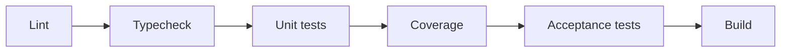

# 19 — Implementation Strategy Master Document (World Legends)

> Especificação pura de processo de construção — sem código, sem SQL, sem endpoints, sem implementação. Este é o manual que transforma `01` a `18` em uma sequência executável de trabalho real, sem que nenhuma decisão de arquitetura ou domínio precise ser reaberta no meio do caminho.

## 1. Filosofia de Implementação

**Small commits.** Cada commit corresponde a exatamente uma tarefa da lista da Seção 18 — nunca mais, nunca uma mistura de duas tarefas não relacionadas para "economizar tempo de revisão".

**Vertical slices.** Prefere-se entregar uma fatia fina e completa (um formula com testes verdes, doc 09, ponta a ponta) a um esqueleto largo e vazio cobrindo muitos arquivos sem nenhum comportamento testado — é por isso que `packages/engine` é construído submódulo por submódulo (Seção 10), nunca todos os arquivos vazios de uma vez.

**Test first.** Todo código novo nasce de um teste que falha primeiro (Seção 12), idealmente um caso já catalogado em `13-acceptance-tests-qa-master.md` ou um exemplo numérico já calculado em `09`/`10`/`11`/`11b` — a implementação nunca "descobre" o comportamento esperado, ela confirma um comportamento já especificado.

**Determinismo.** Toda função que depende de aleatoriedade recebe `Seed` como parâmetro explícito (doc 09 §21) — nunca uma fonte de aleatoriedade implícita ou ambiente.

**Seed reproduzível.** Qualquer bug relatado durante a implementação precisa do `seed` e da versão exata do código para ser investigado — esta é a mesma regra de `13-acceptance-tests-qa-master.md` §1, agora aplicada também ao processo de desenvolvimento, não só ao produto final.

**Nada depende do banco.** Consequência direta do padrão Ports & Adapters (doc 18 §3.2) — nenhuma fase de implementação anterior à Fase 6 (Seção 2) toca infraestrutura real.

**Tudo funciona em memória primeiro.** A prova de que um package está pronto nunca é "funcionou no Supabase" — é "funcionou com um adapter falso, em memória, em milissegundos, repetidamente".

---

## 2. Ordem de Construção

| Fase | Conteúdo |
|---|---|
| Fase 1 | `packages/shared` |
| Fase 2 | `packages/types` |
| Fase 3 | `packages/engine` |
| Fase 4 | `packages/cards` |
| Fase 5 | `packages/collection` |
| Fase 6 | `packages/packs` |
| Fase 7 | `packages/economy` |
| Fase 8 | `packages/ranking` |
| Fase 9 | `packages/multiplayer` |
| Fase 10 | `market`, `hall-of-fame`, `events`, `telemetry`, `apps` |

**Por que esta ordem existe — quatro razões, não uma:**

**Dependência.** `shared` e `types` não dependem de nada (doc 18 §3) e tudo depende deles — começar por eles é a única ordem que não exige retrabalho posterior.

**Risco.** `engine` é, de longe, o módulo de maior complexidade combinatória de todo o sistema (25 seções no doc 09). Construí-lo terceiro — imediatamente após suas únicas duas dependências existirem — significa atacar o maior risco do projeto enquanto a base de código ainda é pequena e fácil de raciocinar sobre, em vez de descobrir um problema fundamental de modelagem depois de dez outros packages já terem sido construídos sobre uma suposição errada.

**Aparente inversão Packs→Economy, explicada.** Note que `packs` (Fase 6) vem **antes** de `economy` (Fase 7), mesmo a Matriz de Dependências do doc 18 §3 listando `packs → economy`. Isso não é uma contradição: a Fase 6 constrói apenas a parte de `packs` que **não** precisa de moeda real — sorteio de cartas via `DropTable`, `PityCounter`, geração de `PackOpening` — tudo isso é testável e validável por Monte Carlo (Seção 14) sem nenhum conceito de saldo. A operação completa `abrirPacote` (que debita custo) só fica funcionalmente completa quando `economy` chega na Fase 7 — exatamente o tipo de corte vertical fino que a Seção 1 pede.

**Valor demonstrável.** Cada fase produz algo que pode ser mostrado funcionando, não apenas "compilando" — a Seção 19 lista exatamente o que cada marco prova.

---

## 3. Definition of Done

Nenhum package é considerado pronto sem satisfazer **todos** os critérios abaixo simultaneamente:

| Critério | Definição objetiva | Como verificar |
|---|---|---|
| Testes verdes | 100% dos testes do nível de pirâmide aplicável a este package (doc 18 §19) passam | Pipeline de CI (Seção 8) |
| Documentação | README do package referencia explicitamente qual(is) seção(ões) de `01`–`18` ele implementa | Revisão manual no PR |
| Zero TODO | Nenhum comentário de placeholder ou função incompleta chega a `develop` | Verificação automatizada no CI |
| Sem dependência circular | O grafo de imports do package respeita exatamente a Matriz de Dependências (doc 18 §3) | Verificação automatizada no CI |
| Cobertura mínima | `engine` e `shared`: 95%+; demais packages de domínio: 85%+; cobertura medida por branch, não apenas por linha — todo `if` de invariante precisa de um teste para cada ramo | Relatório de cobertura no CI |

---

## 4. Estratégia de Commits

- Um commit = uma tarefa da Seção 18, identificada pelo ID da tarefa na mensagem de commit.
- Nenhum commit mistura uma feature nova com um refactor de código já existente — se um refactor for necessário para viabilizar uma feature, ele é um commit separado, **anterior** ao commit da feature.
- Nenhum "refactor gigante": uma mudança estrutural que afete mais de um package por vez é dividida em uma sequência de commits pequenos, cada um deixando a suíte de testes verde — nunca um commit intermediário quebrado "que será corrigido no próximo".
- Mensagens de commit descrevem o comportamento entregue, não a implementação ("Adiciona validação do teto de raridade no Overall", não "Edita função calcularOverall").

---

## 5. Estratégia de Branches

| Branch | Papel |
|---|---|
| `main` | Sempre estável e implantável; só recebe merge de `release/*` |
| `develop` | Branch de integração; toda `feature/*` concluída é mesclada aqui primeiro |
| `feature/*` | Uma por tarefa da Seção 18 (ex: `feature/T012-mulberry32-rng`); nasce de `develop`, morre ao ser mesclada |
| `hotfix/*` | Nasce de `main`, para correção urgente em produção; equivale, em termos de processo, a um Competitive Modifier de emergência (doc 11 §25) |
| `release/*` | Branch de estabilização antes de promover `develop` a `main`; só recebe correções, nunca features novas |

Regra de merge: `feature/*` → `develop` exige CI verde (Seção 8) + Definition of Done (Seção 3) satisfeita no PR. `release/*` → `main` exige, adicionalmente, a Regression Suite completa (Seção 13) verde.

---

## 6. Convenções

| Categoria | Convenção |
|---|---|
| Nomes de package | kebab-case, já fixados em `18-monorepo-architecture-master.md` §2 (ex: `hall-of-fame`) — nunca renomeado ad-hoc durante implementação |
| Pastas internas de um package | `src/`, `tests/`, `README.md` — estrutura idêntica em todo package, sem exceção |
| Arquivos | Um conceito de domínio por arquivo (ex: o submódulo `overall` do `engine` não compartilha arquivo com `chemistry`); nome do arquivo em kebab-case espelhando o conceito | 
| Testes | Arquivo de teste ao lado do arquivo testado, nome espelhado (o teste de `overall` chama-se `overall`, sufixo de teste padronizado pela ferramenta de teste escolhida na Fase 1) |
| Enums | Nomes e valores **idênticos** aos já fixados nos documentos anteriores — nunca um sinônimo novo no momento da implementação (ex: `RarityCode` usa exatamente `common`/`rare`/`elite`/`legendary`/`ultra`/`world_cup_hero`, doc 04 §1/doc 10 §4) |
| Value Objects | Nomeados pelo conceito de domínio (`Seed`, `Money`, `ChemistryLink`), nunca pela estrutura técnica subjacente |

---

## 7. Estratégia de Testes

Aplicação prática, durante a implementação, da pirâmide já definida em `13-acceptance-tests-qa-master.md` §2 e mapeada por package em `18-monorepo-architecture-master.md` §19:

| Nível | Quando é escrito, dentro de uma tarefa |
|---|---|
| Unitário | Sempre primeiro (Seção 12, ciclo Red-Green-Refactor) |
| Property | Imediatamente após o unitário, quando a tarefa envolve uma fórmula com domínio de entrada amplo (ex: a curva de compressão competitiva, doc 11 §2) |
| Integração | Escrito quando a tarefa atravessa fronteira de package (ex: `packs` chamando `cards`) — nunca antes de ambos os lados terem seus próprios testes unitários verdes |
| Monte Carlo | Introduzido em marcos de package completo (Seção 14), não por tarefa individual |
| Regression Suite | Acumulativa — cada cenário do doc 12 §12/doc 13 §18 entra na suíte permanente assim que os packages necessários para construí-lo existem (Seção 13) |
| Acceptance | Escrito ao final de cada Fase (Seção 2), validando o fluxo completo daquela fase contra os fluxos do doc 18 §18 |

---

## 8. Pipeline de CI

A ordem é deliberadamente "do mais barato para o mais caro": Lint e Typecheck falham em segundos e capturam a maioria dos erros triviais antes de gastar tempo de execução real; testes unitários e cobertura vêm em seguida; Acceptance tests (que exercitam fluxos completos, doc 18 §18) só rodam se tudo anterior já passou; Build é o último porque só tem valor se todo o resto já validou o comportamento.

- Toda `feature/*` → `develop`: pipeline completo acima é obrigatório.
- Toda `release/*` → `main`: pipeline completo + Regression Suite (Seção 13) + qualquer Monte Carlo gate relevante (Seção 14) já existente naquele ponto do roadmap.

---

## 9. Ordem Interna do Package `shared`

| Ordem | Item | Por quê nesta posição |
|---|---|---|
| 1 | `Result` | Primitivo de tratamento de erro usado por **tudo** que vem depois, incluindo os outros itens desta mesma lista — precisa existir antes de qualquer outra coisa ter onde expressar falha |
| 2 | `Option` | Mesmo papel de `Result` para "ausência de valor" — par natural do item 1 |
| 3 | `Money` | Primeiro Value Object de domínio real, construído sobre `Result` para expressar operações inválidas (ex: somar moedas de tipos diferentes) |
| 4 | `Percentage` | Mesmo padrão de `Money`, usado intensamente por química, normalização e taxas (doc 09 §4, doc 11 §2) |
| 5 | `Seed` | Mais complexo que os anteriores (envolve lógica de derivação de streams, doc 09 §21) — colocado depois para que a disciplina de teste já esteja madura antes de algo que afeta determinismo de todo o sistema |
| 6 | `DateRange` | Menos urgente — usado por `EraRange` (doc 17 §3) e janelas de evento, mas nada na Fase 3 (`engine`) bloqueia por ele |

---

## 10. Ordem Interna do Package `engine`

| Ordem | Submódulo | Por que esta posição minimiza risco |
|---|---|---|
| 1 | `rng` | Nada mais no engine pode ser testado deterministicamente sem ele — é a fundação da fundação |
| 2 | `overall` | Fórmula pura, sem RNG, sem dependência de outro submódulo — primeiro "ganho fácil" que valida o próprio ciclo de TDD (Seção 12) antes de qualquer complexidade real |
| 3 | `chemistry` | Ainda pura e sem RNG, mas já envolve relação entre múltiplos jogadores — complexidade incremental controlada |
| 4 | `traits` | Os tetos/magnitudes de cada trait (doc 11 §3/§7) são, eles mesmos, determinísticos e testáveis isoladamente antes de serem "aplicados" a um evento de fato |
| 5 | `fatigue` | Fórmula pura dependente apenas de minuto e atributo físico — necessária antes do loop principal, mas sem RNG |
| 6 | `injuries` | **Primeiro submódulo que introduz RNG real de gameplay** — chega depois porque, a esta altura, `rng` (item 1) já está exaustivamente testado, reduzindo o risco de confundir um bug de RNG com um bug de lesão |
| 7 | `events` | O submódulo mais complexo — combina `rng` + `overall` + `chemistry` + `traits` + `fatigue` + `injuries`. Construído **depois** que todos os seis anteriores estão individualmente provados corretos, para que qualquer bug de integração aqui seja isolável à integração em si, nunca a uma fórmula subjacente ainda não testada |
| 8 | `match` | Orquestração do loop de 90 minutos sobre `events` já estável |
| 9 | `penalties` | Subfluxo relativamente isolado (acionado condicionalmente por `match`, nunca o contrário) — construído depois que o loop principal já é confiável |
| 10 | `replay` | Por último porque só existe algo para reproduzir depois que `match`/`penalties` produzem eventos de fato — construir `replay` antes não teria nada real contra o que validar |

**Princípio único subjacente a toda esta ordem:** construir e testar exaustivamente cada peça determinística e livre de dependência antes de introduzir a próxima camada que depende dela, deixando aleatoriedade (`injuries`) e orquestração (`match`, `replay`) para o fim, quando seus pré-requisitos já estão individualmente provados.

---

## 11. Primeiros Objetos Críticos

| Objeto | Package | Por que é crítico construir corretamente desde o início | Invariante que deve ser impossível de violar por construção |
|---|---|---|---|
| `Seed` | `shared` | Toda reprodutibilidade do produto depende deste único conceito | Mesmo valor de entrada produz sempre a mesma sequência derivada |
| `MatchSeed` | `engine` | Amarra `rng_seed` + `engine_version` + todos os streams derivados (doc 09 §21, incluindo `penalty_tiebreak`, doc 15.1) | Nunca pode ser reconstruído de forma diferente a partir do mesmo `rng_seed` |
| `PlayerRating` | `engine` | Base numérica de absolutamente todo cálculo de força do jogo | Sempre `[1, 99]` — impossível instanciar um valor fora da faixa |
| `Overall` | `engine` | Primeira fórmula derivada, valida o padrão de "atributo nunca atribuído manualmente" (doc 09 §2) | Sempre dentro da faixa floor/ceiling da raridade associada |
| `TraitMagnitude` | `engine` | Se este objeto permitir construção acima do teto declarado (doc 11 §3/§7), todo o sistema de balanceamento fica vulnerável desde a base | Impossível instanciar acima do teto absoluto daquele trait especificamente |
| `ChemistryLink` | `engine` | Base do sistema de química histórica (doc 09 §4) | Sempre um dos cinco valores válidos (`-1, 0, +1, +2, +4`) — nunca um valor intermediário |

A coluna final é o ponto mais importante desta tabela: cada um destes objetos deve ser desenhado de forma que o estado inválido **não seja representável**, não apenas verificado depois — ex: `TraitMagnitude` não deveria expor um construtor que aceite qualquer número; deveria expor apenas formas de criação que já recebem o teto daquele trait como parte da própria definição do tipo.

---

## 12. Estratégia de TDD

**Red.** Escrever um teste que expressa um comportamento já especificado em `09`/`10`/`11`/`11b`/`13` (idealmente citando o ID do caso de teste, ex: `TC-NORM-02`) e confirmar que ele falha — se o teste passar sem nenhuma implementação, ele está testando a coisa errada.

**Green.** Implementar o mínimo necessário para o teste passar — nunca mais funcionalidade do que o teste exige, mesmo que pareça "óbvio" adicionar algo extra agora.

**Refactor.** Limpar a implementação sem alterar comportamento, confirmando que a suíte inteira permanece verde — nunca combinado com a etapa anterior no mesmo commit (Seção 4).

**Quando aplicar:** em toda tarefa que envolva comportamento (qualquer submódulo de `engine`, qualquer regra de `cards`/`collection`/`economy`/etc.). **Quando não forçar o ciclo completo:** definições puras de forma sem comportamento (a maior parte de `packages/types`) — ali, "teste" é uma verificação de compilação/forma, não um ciclo comportamental Red-Green.

---

## 13. Regression Guards

Os sete cenários permanentes do doc 12 §12 (11 Ultras, 11 World Cup Hero, química máxima, combo máximo, stack de traits, cartas Prime, eventos ativos) e os dois cenários adicionais de `15.1` (W.O., desempate de pênaltis) **não existem como testes executáveis até que existam packages suficientes para construir os elencos necessários**. Eles entram na suíte permanente progressivamente:

| Cenário | Entra na suíte assim que | Fase |
|---|---|---|
| Química máxima, stack de traits | `engine` (Seção 10, itens 3–4) completo | Fim da Fase 3 |
| 11 Ultras, Combo máximo, Cartas Prime | `cards` + `collection` completos (squads reais constituíveis) | Fim da Fase 5 |
| 11 World Cup Hero, eventos ativos | `cards`/`collection` + `events` (Fase 10) | Fim da Fase 10 |
| W.O. (DD-01), desempate de pênaltis (DD-02) | `engine` (itens 6, 9 da Seção 10) completo | Fim da Fase 3 |

A partir do momento em que um cenário entra na suíte, ele é bloqueante para toda `release/*` → `main` (Seção 5), permanentemente, integrando-se ao Pipeline de CI (Seção 8).

---

## 14. Testes Monte Carlo

Validam fórmulas contra o **espaço de entrada realista**, não apenas exemplos fixos (doc 11 §15) — introduzidos em dois momentos:

1. **Ao final da Fase 3 (`engine`):** validação isolada de fórmulas — limites do xG (doc 09 §17), clamp do Overall, convergência da curva de compressão competitiva (doc 11 §2) — usando squads sintéticos gerados sem nenhuma dependência de `cards`/`collection` reais (atributos sorteados dentro das faixas válidas, não cartas reais do catálogo).
2. **Ao final da Fase 6 (`packs`):** validação de convergência estatística de drop rates (doc 13 TC-PACK-06) e do comportamento de proteção de sorte (doc 10 §15) em escala de 100k–1M aberturas sintéticas.

Qualquer suíte de Monte Carlo, uma vez escrita, soma-se à Regression Suite (Seção 13) — não é descartada após validar a fórmula uma vez.

---

## 15. Performance

Metas de referência (a confirmar/recalibrar com medição real assim que cada peça existir — estes são alvos de engenharia, não números já medidos):

| Função | Meta | Racional |
|---|---|---|
| `calcularOverall()` | < 1ms | Fórmula aritmética simples; chamada potencialmente em lote sobre catálogos inteiros — nunca pode ser percebida como gargalo |
| `simularPartida()` | < 200ms por partida individual; throughput agregado ≥ 5.000 partidas/segundo em simulação em lote paralela | Permite que uma rodada de liga inteira (doc 06 §2.4) processe em segundos, e que simulações de auditoria em escala de 1M–10M (doc 11 §14) completem em horas, não dias |
| `abrirPacote()` | < 5ms de lógica pura (sem I/O); < 300ms percebido pelo usuário com I/O real (Fase 6 do doc 18) | Consistente com a expectativa de UX de abertura "instantânea" (doc 03 §3.2) |
| `ranking()` (atualização individual de Elo) | < 10ms por atualização; fechamento de temporada inteira em minutos, nunca horas, mesmo em escala de milhares de jogadores | Atualização individual é leve por natureza; o job em lote de fim de temporada (doc 06 §3.2) é o único ponto que precisa de orçamento de tempo maior, mas ainda limitado |

---

## 16. Logging

**Regra central: nenhum package de domínio (`engine` a `events`, conforme doc 18 §2) escreve em stdout/stderr diretamente.** Qualquer necessidade de observabilidade dentro de um package de domínio é expressa como `Result` de erro (Seção 17) ou como Evento de Domínio (doc 18 §3.1) — nunca como efeito colateral de log disperso pelo código.

- `console.log` (ou equivalente) é proibido em qualquer arquivo dentro de `packages/*` exceto `telemetry` e a infraestrutura de teste.
- Logging estruturado (nível debug/info/warn/error, nunca texto livre sem contexto) é responsabilidade de `apps/*` e de `telemetry` — é ali, e só ali, que um Evento de Domínio publicado por um package de domínio se transforma em uma linha de log ou em uma métrica.
- Esta regra existe porque um teste unitário que precisa suprimir saída de console para não poluir o output do CI é, por definição, um sintoma de acoplamento indevido entre lógica de domínio e infraestrutura de observação.

---

## 17. Erros

Hierarquia conceitual de quatro categorias, todas expressas como **valores** via `Result` (Seção 9, item 1) na camada de domínio — nunca lançadas como exceção, exceto na fronteira de infraestrutura (última linha desta seção):

| Categoria | Onde ocorre | Exemplo |
|---|---|---|
| `ValidationError` | Fronteira de entrada (forma do dado, antes mesmo de alcançar um agregado) | Preço negativo informado para uma listagem de mercado |
| `DomainError` | Dentro de um agregado, violação de invariante de negócio com dado bem-formado | Tentativa de craft de uma carta `World Cup Hero` (doc 13 TC-CRAFT-06) |
| `ApplicationError` | Camada de orquestração entre packages (um "caso de uso" que atravessa fronteiras) | `matchmaking` não encontra oponente dentro da janela de espera (doc 06 §3.3) |
| `InfraError` | Adapter de `db` ou qualquer integração externa | Falha de rede ao persistir um `Match` |

`InfraError` é a única categoria que pode nascer como exceção real lançada pela infraestrutura subjacente — mas é capturada e traduzida em um `Result` com `InfraError` **no próprio adapter**, antes de cruzar de volta para qualquer package de domínio ou de aplicação. Esta hierarquia é a contraparte interna da taxonomia de erro de API já fixada em `16-api-contracts-master.md` §18 — cada código daquela tabela (`VALIDATION_ERROR`, `INSUFFICIENT_BALANCE`...) é a projeção externa de uma destas quatro categorias internas.

---

## 18. Roadmap das Primeiras 50 Tarefas

### Bootstrap (T001)

| ID | Nome | Dependências | Objetivo | Critério de aceitação | Risco | Estimativa |
|---|---|---|---|---|---|---|
| T001 | Inicializar monorepo e esqueleto de CI | nenhuma | Turborepo + workspaces configurados, pipeline de CI (Seção 8) rodando vazio | Pipeline executa Lint→Typecheck→Build em um repositório sem nenhum código de domínio ainda | Baixo | 0,5 dia |

### `packages/shared` (T002–T007)

| ID | Nome | Dependências | Objetivo | Critério de aceitação | Risco | Estimativa |
|---|---|---|---|---|---|---|
| T002 | `Result` | T001 | Tipo de sucesso/falha sem exceção | Testado com casos de sucesso, falha e encadeamento | Baixo | 0,5 dia |
| T003 | `Option` | T002 | Tipo de ausência de valor | Testado com presente/ausente e encadeamento | Baixo | 0,5 dia |
| T004 | `Money` | T002 | VO de quantia + moeda | Operação entre moedas diferentes retorna `Result` de erro | Baixo | 0,5 dia |
| T005 | `Percentage` | T002 | VO 0–100 validado | Construção fora da faixa é impossível | Baixo | 0,5 dia |
| T006 | `Seed` + derivação de streams | T002 | Base de determinismo (doc 09 §21) | Mesmo seed produz mesma sequência derivada em N execuções | Médio | 1 dia |
| T007 | `DateRange` | T002 | VO de intervalo de datas | Intervalo invertido (`start > end`) é impossível | Baixo | 0,5 dia |

### `packages/types` (T008–T011)

| ID | Nome | Dependências | Objetivo | Critério de aceitação | Risco | Estimativa |
|---|---|---|---|---|---|---|
| T008 | Enums centrais (`Position`, `RarityCode`, `EditionCode`) | T002–T007 | Vocabulário compartilhado fixo | Valores idênticos aos já fixados em `04`/`09`/`10` | Baixo | 0,5 dia |
| T009 | DTOs de Catálogo (`CardDTO`, `PlayerDTO`) | T008 | Forma de dado para `cards`/`db` | Compila e espelha exatamente os campos do doc 02/10 | Baixo | 0,5 dia |
| T010 | DTOs de Partida (`MatchDTO`, `MatchEventDTO`) | T008 | Forma de dado para `engine`/`db`, incluindo campos de DD-01/DD-02 | Inclui `walkover`, `rodadasTotais`, `desempatePorSeed` (doc 15.1) | Baixo | 0,5 dia |
| T011 | DTOs de Elenco e Liga (`SquadDTO`, `LeagueDTO`) | T008 | Forma de dado para `collection`/`multiplayer` | Compila e espelha doc 02/06 | Baixo | 0,5 dia |

### `packages/engine` (T012–T037)

| ID | Nome | Dependências | Objetivo | Critério de aceitação | Risco | Estimativa |
|---|---|---|---|---|---|---|
| T012 | `mulberry32` (PRNG seedado) | T006 | Gerador determinístico de base | 100% reprodutível com mesmo seed | Médio | 1 dia |
| T013 | Derivação de streams independentes | T012 | Streams `events`/`weather`/`cards`/`injuries`/`narrative`/`penalty_tiebreak` (doc 09 §21, doc 15.1) | Cada stream produz sequência independente das demais | Médio | 1 dia |
| T014 | `calcularOverall` | T012 | Fórmula ponderada por posição (doc 09 §2) | Bate com exemplos numéricos do doc 09 §2 | Baixo | 1 dia |
| T015 | Tabela de pesos por posição | T014 | 10 posições com pesos somando 1.0 (doc 09 §1.3) | Soma de pesos = 1.0 para cada posição | Baixo | 0,5 dia |
| T016 | `calcularLink` (química par a par) | T012 | 5 valores de link (doc 09 §4) | Bate com `TC-QUIM-01` a `05` (doc 13) | Baixo | 1 dia |
| T017 | `calcularQuimicaTime` (agregação) | T016 | Score 0–100 e redução de variância | Bate com `TC-QUIM-06/07` | Médio | 1 dia |
| T018 | `TraitMagnitude` (VO com teto por construção) | T002, T005 | Impossível instanciar acima do teto (Seção 11) | Tentativa de construção acima do teto é rejeitada | Médio | 1 dia |
| T019 | Ativação de traits "self-fired" (Matador, Muralha, etc.) | T018 | Bônus só aplicado ao evento do próprio portador | Bate com a matriz de testes do doc 13 §5 | Médio | 2 dias |
| T020 | Empilhamento de `Leader` (convergência geométrica) | T018 | Teto de `2× base` (doc 11 §7) | Bate com a fórmula exata, qualquer N de cópias | Médio | 1 dia |
| T021 | Exclusividade de `Capitão` | T018 | Apenas 1 por time | Tentativa de 2 simultâneos é rejeitada | Baixo | 0,5 dia |
| T022 | `fadigaIntraPartida` | T012 | Decaimento por minuto (doc 09 §7) | Bate com exemplos do doc 09 §7 | Baixo | 1 dia |
| T023 | `fadigaDeCalendario` | T022 | Penalidade por descanso insuficiente | Bate com exemplos do doc 09 §7 | Baixo | 0,5 dia |
| T024 | Sorteio de severidade de lesão | T013 | Distribuição 60/30/10 (doc 09 §12) | Convergência estatística em amostra grande | Médio | 1 dia |
| T025 | Regra de W.O. por insuficiência de elenco [DD-01] | T024 | Interrupção abaixo de 7 jogadores (doc 09 §12.1) | Bate com `TC-WO-01` a `04` (doc 13) | Médio | 1 dia |
| T026 | Modelo de posse/momentum | T013 | Lado favorecido por minuto (doc 09 §16) | Soma de minutos = duração total |Médio | 1 dia |
| T027 | `rollEventType` | T026 | Árvore de decisão de tipo de evento | Distribuição bate com pesos declarados | Médio | 1 dia |
| T028 | `resolverChance` (xG) | T014, T027 | Fórmula de gol (doc 09 §17) | Bate com `TC-ME-02`, clamp `[0.03, 0.55]` sempre respeitado | Alto | 2 dias |
| T029 | `resolverFalta` + cartões | T013, T018 | Perfis de árbitro, 2º amarelo automático (doc 09 §10) | Bate com `TC-ME-05/06` | Médio | 2 dias |
| T030 | `resolverFaltaNaArea` + pênalti | T029 | Probabilidade e conversão de pênalti (doc 09 §18) | Bate com `TC-ME-12/13` | Médio | 1,5 dia |
| T031 | Loop principal de 90 minutos | T019, T022, T025, T028, T029 | Orquestração completa de `simulateMatch` (doc 09 §25) | Primeira partida simulada de ponta a ponta com seed fixo | Alto | 3 dias |
| T032 | Substituições automáticas | T031 | Regras e limites de janela (doc 09 §13) | Bate com `TC-ME-10/11` | Médio | 1,5 dia |
| T033 | Prorrogação | T031 | Gatilho condicional (doc 09 §19) | Bate com `TC-ME-14/15` | Médio | 1 dia |
| T034 | Disputa de pênaltis com teto de 20 rodadas [DD-02] | T031 | Loop de morte súbita limitado (doc 09 §20) | Bate com `TC-PEN-CAP-05` | Médio | 1,5 dia |
| T035 | Desempate determinístico via seed [DD-02] | T013, T034 | Stream `penalty_tiebreak` resolve o teto | Bate com `TC-PEN-CAP-01/02` | Médio | 1 dia |
| T036 | Estatísticas agregadas e MVP | T031 | `MatchStats`, cálculo de MVP (doc 09 §24) | Estatísticas coerentes com a timeline gerada | Baixo | 1 dia |
| T037 | Reconstrução de Replay | T031, T034 | Timeline reproduzível sem resimulação (doc 09 §22) | Bate com `TC-REPRO-01` a `05` | Médio | 1,5 dia |

### `packages/cards` (T038–T048)

| ID | Nome | Dependências | Objetivo | Critério de aceitação | Risco | Estimativa |
|---|---|---|---|---|---|---|
| T038 | Entidade `Player` + invariantes | T008–T011 | `era_start ≤ era_end`, posição válida (doc 17 §3) | Construção inválida é rejeitada | Baixo | 1 dia |
| T039 | VO `Rarity` (referência fixa) | T038 | 6 raridades com floor/ceiling (doc 04 §1) | Valores idênticos à tabela do doc 04 | Baixo | 0,5 dia |
| T040 | Catálogo de `Trait` (referência) | T039 | 13 traits descritivos (doc 09 §11) | Lista idêntica à do doc 09 | Baixo | 0,5 dia |
| T041 | Agregado `Card` — criação | T014, T039 | Overall sempre derivado, nunca manual (doc 09 §2/§6) | Tentativa de atribuição manual de overall é impossível | Médio | 1,5 dia |
| T042 | Invariante "máximo 6 cartas por jogador" | T041 | 1 carta por par `(player, rarity)` (doc 10 §3) | Segunda carta da mesma raridade é rejeitada | Médio | 1 dia |
| T043 | `TournamentContext` para cartas de momento | T041 | Obrigatório para World Cup Hero (doc 10 §2) | Construção de WC Hero sem contexto é rejeitada | Baixo | 0,5 dia |
| T044 | `LegendaryComboDefinition` — criação | T041 | Lista fixa de cartas exigidas (doc 10 §8) | Lista imutável após criação | Médio | 1 dia |
| T045 | Validação de combo (Dupla/Trio) | T044 | Ativação só com adjacência correta | Bate com `TC-COMBO-01/02/03` | Médio | 1 dia |
| T046 | Validação de combo (Onze Completo) | T044 | Sem crédito parcial (doc 10 §8) | Bate com `TC-COMBO-05/06` | Médio | 1 dia |
| T047 | Orçamento Global de Sinergia (clamp +10) | T017, T045, T046 | Soma de química + combos nunca excede +10 | Bate com `TC-EXT-04`/`TC-QUIM-08` | Alto | 1,5 dia |
| T048 | Consultas de leitura de catálogo (em memória) | T041–T047 | Funções de busca/filtro sem nenhum `db` real | Retorna resultados corretos sobre um catálogo sintético de teste | Baixo | 1 dia |

### Infraestrutura de Validação Cruzada (T049–T050)

| ID | Nome | Dependências | Objetivo | Critério de aceitação | Risco | Estimativa |
|---|---|---|---|---|---|---|
| T049 | Harness de Monte Carlo para `engine` | T031–T037 | Squads sintéticos em escala (Seção 14, item 1) | Convergência de xG/Overall validada em 100k+ amostras | Médio | 2 dias |
| T050 | Primeiros 4 Regression Guards permanentes | T047, T049 | Química máxima, stack de traits, W.O., desempate de pênaltis (Seção 13) | Todos os 4 cenários rodam e passam no pipeline de CI (Seção 8) | Alto | 2 dias |

---

## 19. Primeiros Marcos

| Marco | Concluído ao final de | Evidência objetiva |
|---|---|---|
| Engine funcionando | T037 | Suíte completa de `engine` verde, incluindo `TC-ME-*`, `TC-REPRO-*`, `TC-WO-*`, `TC-PEN-CAP-*` |
| Primeira partida simulada | T031 | `simulateMatch` com seed fixo produz `MatchResult` idêntico em execuções repetidas |
| Primeiro pacote aberto | Fim da Fase 6 | `abrirPacote` completo (drop + débito de economia) entrega cartas e atualiza `PityCounter` corretamente |
| Primeira coleção criada | Fim da Fase 5 | Um `Squad` válido é montado a partir de `UserCard`s sintéticos, com química calculada |
| Primeiro ranking | Fim da Fase 8 | `EloUpdateService` atualiza dois `PlayerRanking` a partir de um `Match` simulado |
| Primeiro replay | T037 | Timeline de uma partida é reconstruída a partir de eventos persistidos (em memória), sem resimular |

---

## 20. Regra Mais Importante do Projeto

**Nenhuma funcionalidade nova pode ser adicionada durante a implementação.**

Qualquer ideia nova — uma mecânica, um trait, um tipo de evento, um ajuste de regra — que surja durante a construção de qualquer tarefa desta Seção 18 **não é implementada no lugar**. Ela se torna um documento, segue exatamente o mesmo processo já exercitado e comprovado em `14-design-decisions-open-issues-master.md` e `15-decision-propagation-master.md` (identificação → alternativas documentadas → recomendação → aprovação explícita → propagação formal aos documentos afetados → só então incorporação ao código), e só entra em uma tarefa da Seção 18 depois de aprovada.

Esta regra não é burocracia — é a única coisa que impede que toda a arquitetura de domínio formal (`17`), a matriz de dependências (`18` §3) e o roadmap deste documento se tornem obsoletos por decisões tomadas no calor da implementação. Documentação que não é seguida durante a construção é documentação que mentia desde o início.

---

Este documento fecha a transição de arquitetura para implementação. O próximo passo real é a Tarefa **T001**.
