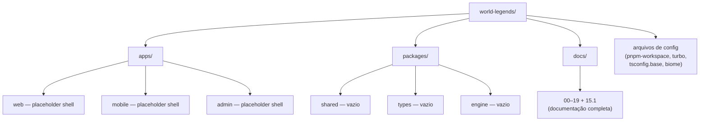
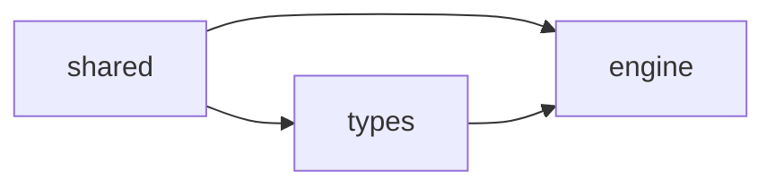

# 20 — Monorepo Bootstrap Master Document (World Legends)

> Registro da **Tarefa T001** (`docs/19-implementation-strategy-master.md`, §18) — a primeira tarefa que escreve código e arquivos reais no disco, não apenas documentação. Este documento descreve exatamente o que foi criado, por quê, e o que vem a seguir.

## 1. Objetivo desta Tarefa

Criar a casca física do monorepo World Legends: workspaces do pnpm, orquestração via Turborepo, TypeScript, Vitest, Biome, Node 22 — com `packages/shared`, `packages/types` e `packages/engine` **intencionalmente vazios**, e `apps/web`, `apps/mobile`, `apps/admin` como placeholders estruturais. Nenhuma regra de jogo, nenhum schema SQL, nenhum endpoint e nenhum frontend foram criados — exatamente como especificado em `docs/19-implementation-strategy-master.md`, T001, e confirmando seu critério de aceitação: o pipeline completo (Lint→Typecheck→Test→Build) roda com sucesso sobre um repositório sem nenhum código de domínio.

---

## 2. Estrutura Criada

```
world-legends/
├── .gitignore
├── .node-version              # "22"
├── README.md
├── package.json               # raiz — orquestra tudo via Turborepo
├── pnpm-workspace.yaml
├── turbo.json
├── tsconfig.base.json
├── biome.json
│
├── apps/
│   ├── web/        { src/, tests/, package.json, tsconfig.json, README.md }
│   ├── mobile/      { src/, tests/, package.json, tsconfig.json, README.md }
│   └── admin/       { src/, tests/, package.json, tsconfig.json, README.md }
│
├── packages/
│   ├── shared/      { src/, tests/, package.json, tsconfig.json, README.md }
│   ├── types/       { src/, tests/, package.json, tsconfig.json, README.md }
│   └── engine/      { src/, tests/, package.json, tsconfig.json, README.md }
│
└── docs/
    └── 00-INDICE.md … 19-implementation-strategy-master.md, 15.1, e este (20)
```

Todo package/app segue exatamente a mesma forma (`src/`, `tests/`, `package.json`, `tsconfig.json`, `README.md`) — uniformidade deliberada (Seção 6) para que nenhum package seja uma excecão estrutural que exija raciocínio especial.



---

## 3. Árvore de Diretórios (arquivos reais)

```
.gitignore
.node-version
README.md
package.json
pnpm-workspace.yaml
turbo.json
tsconfig.base.json
biome.json
apps/
  admin/  {README.md, package.json, src/index.ts, tests/index.test.ts, tsconfig.json}
  mobile/ {README.md, package.json, src/index.ts, tests/index.test.ts, tsconfig.json}
  web/    {README.md, package.json, src/index.ts, tests/index.test.ts, tsconfig.json}
packages/
  engine/ {README.md, package.json, src/index.ts, tests/index.test.ts, tsconfig.json}
  shared/ {README.md, package.json, src/index.ts, tests/index.test.ts, tsconfig.json}
  types/  {README.md, package.json, src/index.ts, tests/index.test.ts, tsconfig.json}
docs/
  00-INDICE.md
  01-arquitetura-geral.md … 19-implementation-strategy-master.md
  11-balanceamento-plano-de-testes-master.md (segundo doc "11", mantido separado)
  15.1-sync-report-dd01-dd02.md
  20-monorepo-bootstrap-master.md  (este documento)
```

41 arquivos de código/configuração + 22 documentos = 63 arquivos no total desta entrega.

---

## 4. Dependências entre Packages

Apenas três packages de domínio existem nesta tarefa — a Matriz de Dependências completa (`docs/18-monorepo-architecture-master.md`, §3) só se manifesta totalmente a partir da Fase 4 em diante. Por ora:

| Package | Depende de (declarado em `package.json`) |
|---|---|
| `@world-legends/shared` | nenhum |
| `@world-legends/types` | `@world-legends/shared` (`workspace:*`) |
| `@world-legends/engine` | `@world-legends/shared`, `@world-legends/types` (`workspace:*`) |
| `apps/web`, `apps/mobile`, `apps/admin` | nenhum ainda — placeholders sem composição real |



Esta é exatamente a ordem de construção das Fases 1–3 (`docs/19-implementation-strategy-master.md`, §2): `shared` não depende de nada porque tudo depende dele; `types` depende só de `shared`; `engine` depende dos dois. Nenhuma dependência circular existe — verificável desde já, mesmo com os packages vazios, porque a declaração em `package.json` já está correta e pronta para quando o código real chegar.

---

## 5. Decisões de Cada Arquivo de Configuração

| Arquivo | Decisão | Por quê |
|---|---|---|
| `pnpm-workspace.yaml` | `apps/*` e `packages/*` como workspaces | Padrão mínimo necessário — nenhum workspace adicional (como `packages/config`) foi criado, pois não foi solicitado nesta tarefa |
| `turbo.json` | Esquema de `tasks` do Turborepo 2.x (não o antigo `pipeline`) | `build`, `typecheck` e `test` declaram `dependsOn: ["^build"]` — um package só builda/testa depois que suas dependências de workspace já buildaram, espelhando a Matriz de Dependências; `lint` não depende de nada porque análise estática independe de build |
| `tsconfig.base.json` | `strict: true` + `noUncheckedIndexedAccess` + `exactOptionalPropertyTypes` + `noImplicitOverride` | Rigor máximo desde o primeiro arquivo — `engine` em particular (doc 09) não pode tolerar um estado de atributo `undefined` silencioso se manifestando como `NaN` em uma fórmula de Overall |
| `biome.json` | `suspicious.noConsoleLog: "error"` | Enforça, no nível de lint de todo o repositório, a regra de `docs/19-implementation-strategy-master.md`, §16 ("nenhum package de domínio escreve em console.log") — não como convenção de time, mas como falha de CI |
| `package.json` (raiz) | `engines.node: ">=22.0.0"`, `packageManager: "pnpm@9.15.0"` | Fixa a versão exigida de forma verificável por ferramentas (`pnpm install` recusa rodar com Node/pnpm incompatível) |
| `.node-version` | `22` | Permite que ferramentas de gerenciamento de versão de Node (`fnm`, `nvm` com plugin compatível) troquem de versão automaticamente ao entrar no diretório |
| `.gitignore` | `node_modules/`, `dist/`, `.turbo/`, `coverage/`, `.env*` | Nada além do estritamente necessário para um monorepo TypeScript — nenhuma regra específica de Supabase/Next.js ainda, pois nenhum dos dois foi inicializado |

---

## 6. Convenções Aplicadas

- **Todo package/app tem a mesma forma exata** — `src/`, `tests/`, `package.json`, `tsconfig.json`, `README.md` — incluindo os três apps, mesmo sendo placeholders. Uniformidade total elimina a necessidade de lembrar "qual app é diferente".
- **Um único `tsconfig.json` por package, incluindo `src` e `tests`.** Decisão deliberada: testes são verificados com o mesmo rigor de tipo que o código de produção. O efeito colateral (o `build` também emite `dist/tests/`) é aceito como tradeoff — `vitest` nunca depende desse output, então é inofensivo.
- **Nenhum `vitest.config.ts` por package.** O padrão de descoberta de teste do Vitest (`tests/**/*.test.ts`) já cobre a estrutura escolhida — criar um arquivo de configuração adicional agora seria configuração sem necessidade real, contrariando a filosofia de bootstrap mínimo.
- **`src/index.ts` de cada package vazio contém apenas `export {}`** — o mínimo necessário para ser um módulo ES válido, nunca um placeholder de função ou tipo "para não ficar vazio".
- **Todo `tests/index.test.ts` é um teste de fumaça idêntico em espírito** — confirma que o Vitest está conectado ao Turborepo para aquele package, nada mais. Nenhum teste de comportamento real existe ainda, porque nenhum comportamento real existe ainda.
- **Nomes de package**: `@world-legends/<nome>`, kebab-case, exatamente como fixado em `docs/18-monorepo-architecture-master.md`, §2.
- **Todo README explica três coisas e nada mais nesta fase**: o que o package será, por que está vazio agora, e qual tarefa futura o preenche — sempre citando o documento de origem.

---

## 7. Decisões que Merecem Destaque

**Apps como placeholders estruturalmente idênticos aos packages.** `apps/web`, `apps/mobile` e `apps/admin` não têm nenhuma dependência real ainda (sem Next.js, sem Capacitor, sem nada) — mas têm exatamente a mesma forma de `package.json`/`tsconfig.json`/testes que `shared`/`types`/`engine`. Isso significa que `pnpm ci` já passa, hoje, em todos os seis workspaces simultaneamente, sem nenhum tratamento especial — o monorepo inteiro está "verde" antes de uma única linha de regra de negócio existir.

**`noConsoleLog` no Biome como mecanismo, não como lembrete.** A regra do doc 19 §16 ("nenhum domínio loga diretamente") agora falha o CI automaticamente se violada — a primeira vez que qualquer pessoa escrever um `console.log` dentro de `packages/engine/src`, por exemplo, o lint quebra antes mesmo de chegar a revisão de código.

**Dependências de workspace já declaradas, mesmo sem uso real.** `types` já declara depender de `shared`, e `engine` já declara depender de `shared` e `types`, mesmo que nenhum `import` real exista ainda nos arquivos vazios. Isso significa que `pnpm install` já resolve o link simbólico de workspace corretamente desde agora — quando o primeiro `import { Result } from '@world-legends/shared'` for escrito (Tarefa T012 em diante), ele já vai funcionar sem nenhum passo de configuração adicional.

---

## 8. Como Validar Localmente

```bash
pnpm install
pnpm ci   # turbo run lint typecheck test build, nesta ordem
```

Resultado esperado nesta tarefa: todos os seis workspaces (`shared`, `types`, `engine`, `web`, `mobile`, `admin`) passam em lint, typecheck, test (1 teste de fumaça cada) e build — produzindo um `dist/` vazio (apenas `index.js`/`index.d.ts` de um módulo vazio) para cada um.

---

## 9. Próximos Passos

A partir daqui, a Tarefa **T002** (`docs/19-implementation-strategy-master.md`, §18) inicia o conteúdo real do package `shared`: o Value Object `Result`, primeiro item da ordem fixada em §9 do mesmo documento, seguido de `Option`, `Money`, `Percentage`, `Seed` e `DateRange` — cada um entrando por um ciclo completo de Red-Green-Refactor (§12), nunca todos de uma vez.

Nenhuma funcionalidade de jogo, nenhum schema SQL, nenhum endpoint e nenhum frontend real serão adicionados antes de `shared`, `types` e `engine` estarem prontos segundo a Definition of Done (`docs/19-implementation-strategy-master.md`, §3) — esta é a Regra Mais Importante do Projeto (§20 do mesmo documento), e o bootstrap desta tarefa não abre exceção a ela.
